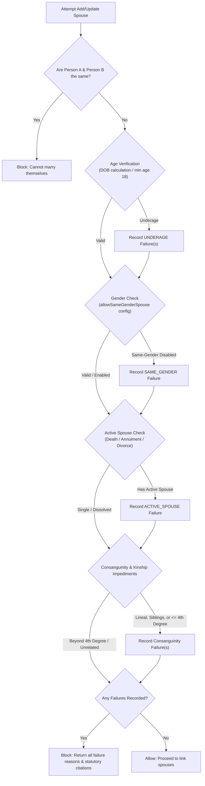
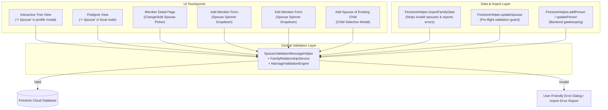
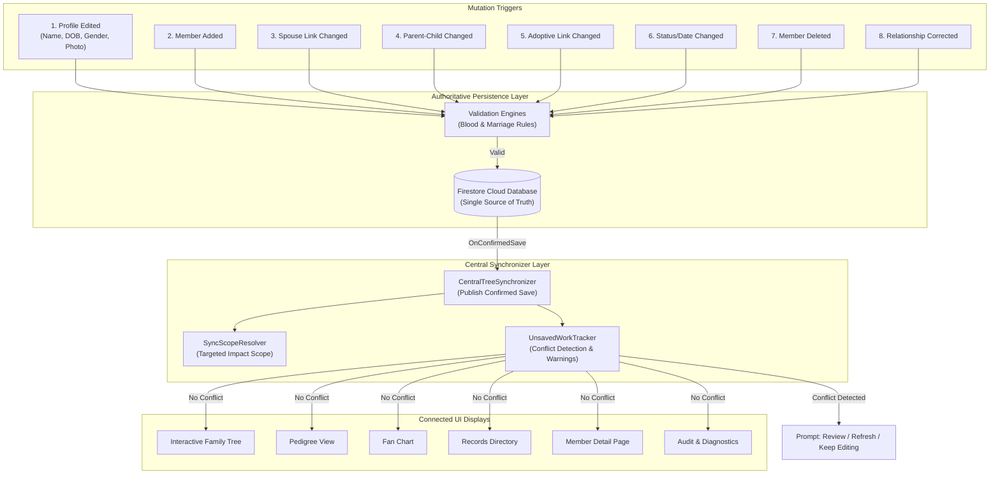

# KinTrace: Mobile-Based Genealogical Bloodline Tracing System
**Capstone Project Proposal Documentation**
*STI College Marikina — Bachelor of Science in Information Technology*
*Proponents: Renzy A. Bugarin & Ackerley Gabriel C. Doromal*
*Adviser: Dr. Frederic Yulo*

---

## 1. Executive Summary & Purpose

KinTrace is an Android-based genealogical information system designed to solve the challenges of organizing family records, determining biological bloodlines, computing consanguinity degrees under Philippine law, and generating clear step-by-step relationship explanations.

Unlike conventional genealogy tools (e.g., Ancestry.com, MyHeritage) which are subscription-driven, web-focused, or research-oriented, KinTrace is tailored for everyday Filipino families. It provides:
1. **Automated Bloodline Tracing & MRCA Identification**: Uses Breadth-First Search (BFS) on biological parent-child links to identify the Most Recent Common Ancestor (MRCA).
2. **Philippine Civil Code Consanguinity Calculation**: Automatically calculates relationship degrees using the **Roman Civil Method** (Article 963 of the Civil Code of the Philippines).
3. **Step-by-Step Natural Language Explanations**: Clearly explains how two individuals are related (e.g., *"Maria is the daughter of Rosa, who is the daughter of Juan. Carlos is the son of Pedro, who is also a son of Juan. Since they share the same grandfather, they are first cousins."*).
4. **Data Privacy Act Compliance (RA 10173)**: Granular privacy controls (hide birthdates, notes, deceased status) and role-based access control (Owner, Editor, Viewer).
5. **Interactive Family Tree Visualizations**: Pedigree hierarchy, Fan Chart, and Trace-Highlighted path visualization.
6. **Data Quality & Duplicate Detection**: Real-time validation for biological plausibility and duplicate detection comparison screen.

---

## 2. System Architecture & Tech Stack

| Component | Technology / Platform | Purpose |
| :--- | :--- | :--- |
| **Operating System** | Android (Min SDK 24, Target SDK 36) | Target mobile client |
| **Programming Language** | Kotlin | Core application logic & UI |
| **IDE** | Android Studio | Development, debugging & profiling |
| **Authentication** | Firebase Authentication | Email/password login, registration, password recovery |
| **Cloud Database** | Google Cloud Firestore | Real-time NoSQL storage for trees, persons, relationships, notifications |
| **Image Storage** | Firebase Storage | Profile photos & avatars |
| **Graph Algorithm** | Breadth-First Search (BFS) | Shortest biological path & MRCA determination |
| **Legal Framework** | Roman Civil Method (Art. 963 NCC) | Consanguinity degrees (1st, 2nd, 3rd, 4th degree, lineal vs collateral) |

---

## 3. Module Specifications & Functional Requirements

### Module 1: User Management & Security (`FR-01`)
- **Registration & Login**: Secure email and password authentication via Firebase Auth.
- **Password Recovery**: In-app password reset email dispatch.
- **Account Management**: Update basic user profile (display name, profile image).
- **Tree Ownership & Invite Code System**:
  - Tree creator is the **Owner**.
  - Users can join existing trees via a unique 6-character **Invite Code** (e.g. `DC2488`).
  - Owner reviews and **Approves** or **Rejects** access requests.
- **Role-Based Access Control (RBAC)**:
  - **Owner**: Full access — manage tree, approve/reject requests, assign roles, toggle privacy, merge branches, delete records.
  - **Editor**: Can add members, edit existing allowed records, trace bloodlines.
  - **Viewer**: Read-only browsing; cannot edit, delete, or invite.
- **System Admin Role (`FR-11`)**:
  - Developer/Super Admin access level to broadcast maintenance notices, monitor usage, and review premium tree expansion requests.
- **Freemium Limits & Upgrade Requests**:
  - Free tier: Up to 50 family members and limited branch merges.
  - In-app request to System Admin for expanded limits.

---

### Module 2: Dashboard & Family Insights (`FR-02`, `FR-07`)
- **Dashboard States**:
  - *Empty State*: Prompts new users with **Create Family Tree** or **Join Existing Tree**.
  - *Populated State*: Displays tree overview counters (Total Members, Living, Deceased, Generations, Branches, Relationships count).
- **Quick Action Menu**:
  - Add Member (`AddMemberActivity`)
  - Family Records (`FamilyRecordsActivity`)
  - Trace Relationship (`TraceActivity`)
  - Family Tree (`FamilyTreeActivity`)
  - Merge Branches (`MergeBranchesActivity`)
  - Privacy & User Access (`PrivacyControlsActivity`)
- **Recent Activity Feed**: Logs recent actions (e.g. *"Added Rosa Santos"*, *"Traced Maria — Carlos"*).
- **Family Insights Screen (`InsightsActivity`)**:
  - Tree Health Score & Validation status.
  - Generational breakdown (Gen 1 Great-grandparents, Gen 2 Grandparents, Gen 3 Parents, Gen 4 Current).
  - Gender distribution percentages (Male vs Female).

---

### Module 3: File Maintenance & Family Records (`FR-02`, `FR-03`, `FR-09`, `FR-10`)
- **Profile Fields**:
  - First Name, Middle Name, Last Name, Suffix
  - Gender (`Male` / `Female`)
  - Birthdate (DatePicker with max date validation) & Birthplace
  - Living Status (`Living` / `Deceased`)
  - Marital Status (`Single`, `Married`, `Widowed`, `Separated`)
  - Notes / Biography
  - Optional profile image upload
- **Relationship Links**:
  - Biological Mother & Father (used in bloodline calculation)
  - Spouse (reciprocal marriage linking)
  - Adoptive & Step relationships (marked for display only)
- **Data Validation (`FR-10`)**:
  - No future birthdates.
  - Biological parent age gap validation (parent must be ≥ 12 years older than child).
  - Cycle/loop prevention in ancestry graph (a person cannot be their own ancestor).
  - Biological parent limit (max 1 father and 1 mother).
  - **Universal Genealogical & Consanguinity Rules (Family Code of the Philippines)**:
    - **Lineal Ascendant/Descendant Prohibition (Art. 37(1))**: Ascendants and descendants of any degree cannot be co-parents (e.g. mother and son, father and daughter).
    - **Generational Leap / Grandparent-as-Parent Guard**: Grandparents cannot be registered as the direct biological or legal parents of their grandchildren.
    - **Collateral / Uncle-Aunt Parent Guard**: Uncles and aunts cannot be registered as the direct parents of their nieces or nephews.
    - **Two-Parents Biological Cap & Error Messaging**: A person who already has two parents defined in the family tree cannot be added as another member's child. If selected in the "Add Member" flow, the operation is blocked and a detailed notification/dialog displays the real names of the existing parents (e.g. *“It’s not possible to add [Person] as a child of the new member. [Person] already has parents defined in this family tree: [Father] and [Mother]”*).
    - **Single-Role Slot Guard**: A child cannot be linked to a second father or second mother; existing biological parent slots cannot be overwritten.
    - **Self-Healing Tree Sanitization (`sanitizeTreeRecords`)**: Automatically repairs historical or corrupted tree graphs upon loading into memory or Firestore, disengaging prohibited parent/co-parent links and restoring legitimate bonds.
- **Duplicate Detection & Compare View (`FR-09`)**:
  - Detects matching or similar name, birthdate, and birthplace.
  - **Duplicate Alert Screen**: Informs user of existing record.
  - **Duplicate Compare View Screen**: Side-by-side comparison of *New Entry* vs *Existing Record* with options:
    - *Use existing record*
    - *Add as new member*
    - *Cancel*
- **Form Debouncing & Safety**:
  - Disable "Save Member" immediately on tap (`"Saving..."`).
  - Clear all form fields upon save and display `"Family member saved"` notification toast.
- **Delete Confirmation**:
  - Confirmation dialog with warning about impact on relationships before deletion.

---

### Module 4: Relationship Analysis & Bloodline Tracing (`FR-04`, `FR-05`)
- **Relative Selection**: Pick Person A and Person B from the family tree.
- **BFS Biological Path Traversal**:
  - Traces parent links upward to find all ancestors of Person A and Person B.
  - Identifies the **Closest Shared Biological Ancestor** (Most Recent Common Ancestor - MRCA).
- **Consanguinity Calculation (Roman Civil Method - Art. 963)**:
  - Degree = (Generations from Person A to MRCA) + (Generations from Person B to MRCA).
  - Direct/Lineal Line (degrees: Parent-Child = 1st, Grandparent-Grandchild = 2nd, Great-grandparent = 3rd).
  - Collateral Line (degrees: Siblings = 2nd, Uncle/Aunt-Nephew/Niece = 3rd, First Cousins = 4th, First Cousin Once Removed = 5th, Second Cousins = 6th).
- **Lineal vs Collateral Classification**:
  - Explicitly states whether relationship is Lineal or Collateral.
- **Step-by-Step Natural Language Explanation**:
  - Generates clear narrative tracing the path through parents up to the common ancestor and down to the relative.
- **Visual Relationship Path (`RelationshipPathActivity`)**:
  - **Consanguinity Summary Hero Card**: Highlights civil degree badge (e.g., `[ 2ND DEGREE ]`), relationship classification (`[ COLLATERAL LINE ]` vs `[ LINEAL LINE ]`), explanation of the Roman Civil Method under Articles 963–966 of the Civil Code of the Philippines, and a direct action button: `🌿 View Highlight on Tree Canvas`.
  - **Rich Step Cards & Visual Path Ladder**: Modular step cards displaying step count, role labels (`STEP 1 · STARTING INDIVIDUAL`, `★ MOST RECENT COMMON ANCESTOR`, `TARGET INDIVIDUAL`), circular avatars with gender-tinted borders, full names, lifespans, age calculation, verified documents checkmarks (`✓ Verified Docs`), and directional connector pipes (`▲ Biological Child of` / `▼ Biological Parent of`).
  - **Live Inline Route Preview Banner (`TraceActivity`)**: Instant real-time preview showing the route (`Person A ➔ ★ MRCA ➔ Person B`) with generational steps and legal degree calculation immediately upon selecting two relatives.
  - **Zero-Latency In-Memory Tracing**: Cached tree data in `FirestoreHelper` enables instant 0ms BFS path traversal without requiring redundant cloud database roundtrips.

---

### Module 5: Tree Visualization (`FR-06`)
- **Family Tree Main View**: Generational grouped tree of family members.
- **Interactive Family Tree Canvas (`InteractiveTreeActivity`)**:
  - **Unified Rectangular Card Architecture**: Modern, cohesive node cards (`CARD_W = 150dp`, `CARD_H = 172dp`, `corner = 14dp`) featuring subtle elevation drop shadows and dark forest theme styling.
  - **Circular Avatar Node**: Integrated top-half circular portrait (`NODE_RADIUS = 36dp`) supporting high-resolution circular photo bitmaps or gender-tinted initial circles with deceased memorial dove (`🕊️`) and document verification checkmark (`✓`) badges.
  - **Structured Typography & Kinship Bar**: Cleanly formatted First Name, Last Name, and lifespan years above an enclosed bottom Kinship Title pill bar (`[ FATHER ]`, `[ MOTHER ]`, `[ SELF ]`, etc.) dynamically computed by `KinshipTitleHelper`.
  - **Docked Quick Action**: Rounded `+` button docked seamlessly at the bottom center of cards for rapid single-tap child creation.
  - **Full-Bound Card Tap Handling**: Tapping anywhere within the rectangular card boundary activates the full Profile Reveal Dialog with document attachments, verification PDFs, photos, kinship re-orientation, and member editing.
  - **Clean Orthogonal Bus Routing**: Connector lines drop strictly from parent card bottom (or marital union center) to a horizontal bus bar (`yBus`) and drop directly into the top edge of each child card with zero text or avatar collisions.
  - **Marital Union Indicators**: Centered `[ 💍 ]` badges between legally married spouses.
  - **Trace-Highlighted View**:
    - **Double-Pass Glowing Route Line**: In `TRACE_HIGHLIGHT` mode, a 16f gold glow stroke (`pGoldPathGlow`) with `CornerPathEffect(18f)` runs underneath a 6f solid gold path line (`pGoldPathLine`).
    - **Bloodline Role Badges**: Distinct floating pills positioned over cards in trace mode (`🚩 PERSON A`, `🎯 PERSON B`, `★ COMMON ANCESTOR`, `⚡ BLOODLINE`).
    - **Automated Viewport Framing (`frameTracePath`)**: Automatically bounds, scales, and centers the camera view onto the highlighted bloodline path upon entering trace mode.
  - **High-Performance Zero-Allocation Rendering Pipeline**:
    - Pre-allocated paint objects, avoiding garbage collection pauses during pan and zoom.
    - Reusable `RectF` and `Path` objects (using `.rewind()`) eliminating frame-by-frame memory allocations.
    - **Kinship Title Caching (`cardDisplayCache`)**: Kinship titles and spouse names are resolved once during layout pass rather than running repeated BFS operations inside `onDraw` (~1,800 BFS traces/sec &rarr; 0 per frame).
    - **Asynchronous Background Avatar Decoding**: Base64 image decoding and circular cropping occur off the main UI thread with an in-memory LRU cache (`avatarCache`), maintaining a silky smooth 60 FPS.
  - **Universal Family Tree Generation & Hierarchy Engine (`GenerationHierarchyEngine`)**:
    - **Topological Longest-Path Ancestor Depth**: Determines each member's visual generation level globally using directed acyclic graph (DAG) topological sorting.
    - **Strict Parent-Child Hierarchy Enforcement**: Formulates and enforces the rule:
      $$\text{parentGeneration} < \text{childGeneration}$$
      Ensures that a parent (e.g. Jose) is strictly positioned above all of their children (e.g. Clara and Pedro) on the vertical Y-axis.
    - **Iterative Couple & Co-Parent Relaxation**: Married spouses and co-parents sharing biological children are aligned to the exact same generation level ($\text{gen}(A) == \text{gen}(B)$), even when one spouse enters the tree without parents.
    - **Automatic Reorganization on Link Updates**: Whenever a member is registered as a parent of existing members, the entire tree automatically reorganizes: the new parent occupies the top generation and all descendants are shifted down cleanly.
    - **Pre-Render Hierarchy Validation**: Before drawing to canvas, the engine validates all parent-child connections. If any inversion ($\text{parentGeneration} \ge \text{childGeneration}$) is detected, it recalculates and pushes descendants downward before the first frame is displayed.
    - **Shared Generation Sibling Alignment**: Siblings sharing parent(s) are grouped on the same horizontal generation level across all viewing modes.
- **Fan Chart View**: Dynamic HTML5/Canvas fan wheel rendering generational rings from roots to descendants.
- **Ancestor Pedigree View**: Direct biological ancestral tree (Ahnentafel binary tree) for any selected member.
- **Tree Legend**: Explains color codes (Male = Green/Teal, Female = Blue/Pink, Deceased = Gray, Common Ancestor = Gold/Yellow) and line types (Solid = Biological, Dashed = Spousal/Adoptive).
- **Empty State**: Friendly illustration and call-to-action when the tree has 0 members.

---

### Module 6: Family Branch Integration / Merge Branches (`FR-08`)
- **Branch Selection**: Select Member from Branch A and Member from Branch B.
- **Relationship Type**: Specify connection (e.g. Spouse, Biological Parent, Child).
- **Merge Preview**: Visual mini-diagram demonstrating the connection before committing.
- **Conflict Checking**: Ensures connection does not violate generational consistency or create circular biological loops.

---

### Module 7: Privacy Controls & Security (`FR-01`)
- **Tree Visibility**: Toggle between *Public* (within invited members) and *Private*.
- **Selective Redaction (Data Privacy Act of 2012)**:
  - Toggle *Hide birth dates*
  - Toggle *Hide notes / biography*
  - Toggle *Hide deceased status*
- **Role Gate Screen**: Non-owners attempting to access restricted settings see a friendly lock gate (*"Owner access required"*).

---

### Module 8: Notification & In-App Alerts (`FR-08`)
- **Notification Center**:
  - Categories: *All*, *Access*, *Records*, *Security*.
  - Unread indicators.
- **Alert Types**:
  - Access request pending & approval updates.
  - Possible duplicate record detected.
  - Data validation issues.
  - Inactivity reminders for invited editors.
  - Password reset updates.
  - Action restricted popup messages.

---

## 4. Current Implementation Status & Roadmap

| Feature / Screen | Mockup (Fig) | Implementation Status | Notes |
| :--- | :--- | :--- | :--- |
| **Splash & Welcome** | Fig. 2 | ✅ Completed | `SplashActivity`, `WelcomeActivity` |
| **Register & Login** | Fig. 2, 3 | ✅ Completed | `RegisterActivity`, `LoginActivity` with Firebase Auth |
| **Password Recovery** | Fig. 3 | ✅ Completed | `ForgotPasswordActivity` with reset email dispatch |
| **Empty Dashboard** | Fig. 4 | ✅ Completed | Dynamic Empty State card with "Create Tree", "Join Tree", and "Add First Member" |
| **Create Family Tree** | Fig. 4 | ✅ Completed | `CreateTreeActivity` with 6-char code & initial member |
| **Join Tree & 6-digit Code** | Fig. 5 | ✅ Completed | `JoinTreeActivity` with 6-char code & pending approval |
| **Home Dashboard** | Fig. 6 | ✅ Completed | `HomeActivity` with statistics, health banner & dynamic Recent Activity feed (FR-07) |
| **Family Insights** | Fig. 6 | ✅ Completed | `InsightsActivity` wired to stats header & health banner with generational breakdown |
| **Family Records Directory** | Fig. 7, 10 | ✅ Completed | `FamilyRecordsActivity` with search & filter |
| **Add Member** | Fig. 8 | ✅ Completed | Full candidate validation, two-parents cap (with existing parent names), and biological conflict notifications |
| **Data Validation Alerts** | Fig. 8 | ✅ Completed | Universal cross-channel enforcement (Family Code Arts. 37 & 38), biological siblings (Renzy & Clara), age feasibility & loop checks |
| **Duplicate Compare View** | Fig. 9 | ✅ Completed | `dialog_duplicate_compare.xml` with side-by-side comparison and 3-way resolution |
| **Member Profile & Details**| Fig. 11 | ✅ Completed | `MemberDetailActivity` with timeline, documents, and live multi-parent validation |
| **Delete Member** | Fig. 11 | ✅ Completed | Added with confirmation dialog & Firestore deletion |
| **Edit Member** | Fig. 11 | ✅ Completed | `EditMemberActivity` with full attributes, validation, and spinner synchronizers |
| **Bloodline Tracing** | Fig. 12 | ✅ Completed | `TraceActivity` with 0ms in-memory BFS, live inline route preview, and civil degree calculation |
| **Relationship Result & Path**| Fig. 12 | ✅ Completed | `RelationshipPathActivity` with Consanguinity summary hero card, rich step cards with verified badges, directional pipes, and tree highlight shortcut |
| **Tree Views (Main & Fan)**| Fig. 12, 13 | ✅ Completed | `InteractiveTreeActivity` with 60–120 FPS zero-allocation GPU pipeline, precomputed connectors, frustum culling, `GenerationHierarchyEngine`, child unit claiming, direct biological connector drop, and bloodline trace |
| **Tree Legend** | Fig. 13 | ✅ Completed | `dialog_tree_legend.xml` with full symbol reference modal |
| **Merge Branches** | Fig. 13 | ✅ Completed | `MergeBranchesActivity` with preview, cycle check, and branch union |
| **Privacy & Access** | Fig. 14 | ✅ Completed | `PrivacyControlsActivity` (Owner View & Owner Gate) |
| **Owner/Editor/Viewer RBAC**| Fig. 15 | ✅ Completed | Role enforcement in Tree, AddMember & MemberDetail |
| **Notification Center** | Fig. 16 | ✅ Completed | `NotificationsActivity` with tabbed list, filters, and real-time conflict logging |

---

## 5. High-Performance Graphics & Bloodline Tracing Pipeline

To deliver a fluid 60–120 FPS experience across low-end and high-end Android hardware, the rendering and consanguinity tracing engines utilize the following optimizations:

### 5.1 Zero-Allocation GPU Canvas Pipeline (`InteractiveTreeActivity.kt`)
1. **Precomputed Connectors & Geometry**:
   - Marital lines, orthogonal family buses, biological child drops, and safety fallback lines are computed once during `computeLayout()` into flat data structures (`PrecomputedMaritalLine`, `PrecomputedFamilyBus`, `PrecomputedFallbackLine`, `PrecomputedPedigreeConnector`).
   - `onDraw()` performs **0 heap allocations** on touch/pan/pinch frames, eliminating Garbage Collection (GC) pauses.
2. **GPU Hardware Acceleration**:
   - Removed `CornerPathEffect` from line and glow paints (`pLine`, `pGoldPathLine`, `pGoldPathGlow`), allowing Android's RenderThread to execute hardware line shaders directly on the GPU without CPU path tessellation or CPU rasterization.
3. **Viewport Frustum Culling**:
   - Dynamically calculates the visible world coordinate bounds (`cullLeft`, `cullRight`, `cullTop`, `cullBottom`) using the inverse canvas transform.
   - Any member cards or connectors outside the viewport are skipped entirely, reducing draw calls from hundreds to only the visible subset.
4. **Hit-Testing Isolation**:
   - `HitArea` coordinates are pre-registered during `computeLayout()` rather than cleared and re-instantiated on every frame in `onDraw()`.

### 5.2 Optimized Bloodline Consanguinity Tracing (`TraceActivity.kt` & `RelationshipPathActivity.kt`)
1. **Single-Pass Cache Dispatch**:
   - Instant in-memory graph traversal using the cached tree model.
   - Network fetches occur only as a fallback when selected individuals are not in the local cache, eliminating duplicate queries, double view inflation, and redundant Firestore activity logs.
2. **Flicker-Free UI**:
   - Direct inline lineage preview updates in a single layout pass without UI layout churn.

### 5.3 Memory & Bitmap Optimization (`DocumentHelper.kt`)
1. **Targeted Subsampling**:
   - `decodeBase64Bitmap(base64, targetSize = 256)` applies `inSampleSize` calculations to load avatars at display resolution rather than full camera sensor resolutions.
2. **Immediate Intermediate Recycling**:
   - Scaled square bitmaps created during circular cropping in `getCircularBitmap` are immediately recycled (`intermediate.recycle()`), preventing native heap growth.
3. **View Lifecycle Cleanup**:
   - `onDetachedFromWindow()` in `FamilyTreeView` recycles all cached avatar bitmaps when exiting the tree viewer.

---

## 6. Philippine Family Connection & Marriage Validation Architecture

The application enforces Philippine Family Law and Roman Civil Law consanguinity rules to maintain genealogical integrity and prevent invalid relationships before they are saved to Firestore.

### 6.1 Primitive Storage vs. Derived Discovery
1. **Direct Database Storage**: Only three primitive connection types are stored directly:
   - Biological parent and child (`fatherId`, `motherId` with `relationshipType = "Biological"`)
   - Adoptive parent and child (`fatherId`, `motherId` with `relationshipType = "Adoptive"`)
   - Spouse or partner (`spouseId`)
2. **Dynamic Automatic Discovery**: Derived relationships (siblings, grandparents, grandchildren, uncles/aunts, nieces/nephews, cousins, in-laws) are dynamically resolved via BFS traversal over primitive pointers, preventing synchronization and update anomalies.

### 6.2 Consanguinity & Legal Impediments (`MarriageValidationEngine.kt`)
Enforces the 8 core Philippine family tree rules:

| Rule | Description | Legal Basis | Result & Degree |
| :--- | :--- | :--- | :--- |
| **Rule 1: Lineal Relatives** | Prohibits marriage between direct ascendants & descendants to ANY degree (Parent-Child, Grandparent-Grandchild). | Art. 37 (1), Family Code | **Prohibited**, Lineal ($N \ge 1$), void ab initio |
| **Rule 2: Siblings** | Prohibits marriage between full or half siblings. | Art. 37 (2), Family Code | **Prohibited**, 2nd degree collateral, void ab initio |
| **Rule 3: Collateral $\le$ 4th Degree** | Prohibits marriage between collateral blood relatives up to 4th civil degree (Uncle/Aunt & Niece/Nephew [3rd], First Cousins [4th], Great-Uncle & Grandniece [4th]). | Art. 38 (1), Family Code | **Prohibited**, 3rd or 4th degree collateral, void ab initio |
| **Rule 4: Collateral $\ge$ 5th Degree** | Allows collateral blood relatives from 5th civil degree onward (First Cousin Once Removed [5th], Second Cousins [6th]) with civil legal explanation. | Arts. 37 & 38, Family Code | **Allowed**, 5th+ degree collateral, no legal impediment |
| **Rule 5: Parent & Spouse Conflict** | A person cannot be linked as both biological parent and spouse of the same person. | Art. 37 (1) & Genealogical Integrity | **Prohibited**, 1st degree lineal/affinity conflict |
| **Rule 6: Self-Relationships** | A person cannot marry themselves or be their own parent/ancestor. | Individual Identity Principle | **Prohibited**, 0 degree, self-cycle |
| **Rule 7: Impossible Cycles** | Family connections must not create directed circular loops (e.g. child becoming parent of their own parent). | Graph Integrity (Cycle Prevention) | **Prohibited**, cycle loop path returned |
| **Rule 8: In-Law Child Prohibition** | A son-in-law or daughter-in-law must be connected as the spouse of an existing child, never as a biological child of the parent-in-law. | Art. 38 (4), Family Code (Affinity) | **Prohibited**, 1st degree affinity |

### 6.3 Standardized Result Format
Every validation check returns a `RelationshipValidationResult`:
- `isAllowed`: Boolean (true if allowed, false if prohibited)
- `reason`: Comprehensive explanation of the outcome
- `legalBasis`: Statutory citation under Philippine Law
- `relationshipType`: Specific genealogical classification with civil degree
- `degree`: Civil consanguinity degree (or 0)
- `familyPath`: Ordered sequence of `Person` nodes causing the problem or connecting the individuals

---

## 7. Central Family-Relationship Service (`FamilyRelationshipService.kt`)

The central family-relationship service acts as the single authoritative gateway for all graph mutations and audits.

### 7.1 Architectural Gatekeeping
- **Universal Single Entry Point**: Direct relationship updates to database or tree structures outside of this service are strictly prohibited.
- **Operations Supported**:
  1. `checkProposedRelationship()`: Non-mutating pre-flight validation.
  2. `addBiologicalParent()`: Adds biological parent enforcing two-parent cap, co-parent feasibility, cycles, and age gaps.
  3. `addBiologicalChild()`: Adds biological child, strictly blocking son-in-law / daughter-in-law (Rule 8).
  4. `addAdoptiveParent()` & `addAdoptiveChild()`: Sets `"Adoptive"` type, preserving legal ties while excluding from blood consanguinity.
  5. `addSpouse()`: Enforces bigamy and consanguinity impediments (Arts. 37 & 38).
  6. `addSpouseOfExistingChild()`: Connects in-laws by marriage to existing children.
  7. `removeRelationship()`: Safely unlinks spouse, father, mother, or child connections.
  8. `auditFamilyTree()`: Comprehensive whole-tree audit returning `TreeAuditReport` with `CRITICAL_ERROR` and `WARNING` classifications.

### 7.2 Application-Wide Gatekeeping & Flow Enforcement
All application entry points pass through `FamilyRelationshipService`:

1. **Add Child Dual-Option Flow**:
   - Every "Add Child" entry point (Interactive Tree, Pedigree View, Member Detail) presents two explicit choices:
     1. *Add a biological or adoptive child*
     2. *Add the spouse of an existing child*
   - If *Add the spouse of an existing child* is selected, the application prompts to select which existing child they are married to. The new member is registered with `spouseId` linked to that child, and is **never** attached as a child to the parent-in-law (Rule 8).
2. **Interactive Tree & Pedigree View**:
   - Node drag/attachment actions, dialog additions (Add Parent, Add Child, Add Spouse) run pre-flight proposal checks and display clear, human-readable error messages explaining the statutory impediment if blocked.
3. **Member Detail Profile**:
   - Pickers for Father, Mother, Spouse, and Children validate proposals in real-time. Incompatible selections are rejected with modal explanations and validation notifications.
4. **Member Creation & Editing Forms**:
   - `AddMemberActivity` and `EditMemberActivity` validate all parental and marital assignments before initiating Firestore writes.
5. **Bulk Import & Data Integration**:
   - `FirestoreHelper.importFamilyData()` runs `auditFamilyTree()` across the entire imported dataset before committing. If any critical violation exists, the entire batch is aborted atomically.

### 7.3 Tree Audit & Integrity Screen (`TreeAuditActivity.kt`)
The Tree Audit Screen provides an administrative and genealogical health dashboard:
- Scans all tree records against the 8 core rules.
- Categorizes findings into:
  - **Critical Violations**: Lineal marriages (Art. 37(1)), sibling marriages (Art. 37(2)), collateral marriages $\le$ 4th degree (Art. 38(1)), parent-child circular loops, self-ancestry, in-law incorrectly saved as biological child (Rule 8), impossible parent age gaps.
  - **Warnings**: Large or anomalous age differences.
- Filter chips allow toggling between All, Critical, and Warnings.
- Tapping any issue card routes directly to the affected person's detail profile for correction.

---

## 8. High-Performance Graph & Rendering Architecture

To deliver fluid 60fps/120fps canvas rendering and responsive interactions across complex multi-generational family trees, the application incorporates systematic performance optimizations across graph processing, data synchronization, and Android hardware-accelerated canvas pipelines:

### 8.1 Graph Traversal & Depth Memoization (`GenerationHierarchyEngine.kt`)
- **Exponential Complexity Elimination**: Raw ancestor DFS traversal suffered from $O(2^N)$ worst-case explosion when multiple branches converge. The engine implements a visited memoization map `memo[personId]`, reducing depth calculation to linear $O(V + E)$ time.
- **Topological Relaxation Bounds**: Multi-parent cross-marriage leveling uses bounded iterative relaxation (`minOf(persons.size, 10)` passes) and validation guards (`minOf(persons.size, 5)` passes) with early termination when no further depth shifts occur, preventing runaway cycles.

### 8.2 Single-Pass Kinship Resolution (`KinshipTitleHelper.kt`)
- **Indexed Map Lookups**: Member titles are resolved using `resolveAllTitles(allMembers, focal)`, pre-indexing parent and child associations once in $O(N)$ upfront. This prevents $O(N^2)$ repetitive map allocations on the main UI thread during profile list rendering.

### 8.3 Viewport Frustum Culling & Bitmap Memory Management (`InteractiveTreeActivity.kt`)
- **Frustum Culling**: The interactive family tree canvas calculates the current visible viewport in world coordinates during `onDraw()`. Pedigree connectors, horizontal bus bars, parent drop lines, and child drop lines lying outside the viewport are culled prior to dispatching draw calls to the hardware canvas.
- **Native Bitmap Recycling**: Avatars decoded from base64 strings explicitly call `raw.recycle()` after scaling, preventing heap bloat and eliminating garbage collection pauses during touch-driven panning and pinch-to-zoom.
- **Atomic Single-Pass Layout Calculation**: Through `setDataAndMode(persons, mode)`, tree layout coordinates are computed exactly once per data load. Multiple redundant layout triggers from spinner programmatic events and double network/cache dispatches are guarded against.

### 8.4 Network & Cache Redundancy Suppression (`FirestoreHelper.kt`)
- **Divergence Verification**: `hasListDiverged(cached, fresh)` compares incoming Firestore server responses against in-memory cached datasets. When data has not changed, second callback dispatches are suppressed, eliminating unwanted UI rebuilds and layout flashes.

---

## 9. Spouse-Relationship Validation Framework (Family Code & RA 11596)

The application enforces a rigorous, multi-factor spouse validation pipeline within [`MarriageValidationEngine.kt`](file:///c:/Users/Renzy/AndroidStudioProjects/BTProject2/app/src/main/java/com/example/btproject2/engine/MarriageValidationEngine.kt) before any spouse connection can be created or updated.

### 9.1 Multi-Dimensional Validation Pipeline

### 9.2 Validation Rules & Statutory Basis

| Category | Validation Rule | Statutory / Legal Citation | Failure Message Behavior |
| :--- | :--- | :--- | :--- |
| **Identity** | Self-marriage prohibited | General Jurisprudence | Emits `SELF_MARRIAGE` |
| **Age** | Minimum age requirement (default: 18) calculated via `birthDate` | **Republic Act No. 11596** (Prohibition of Child Marriage) & **Family Code Art. 5** | • Both underage: *"Both members do not meet the minimum age requirement of 18 years (Republic Act No. 11596 / Family Code Art. 5)."* • Single underage: Identifies the exact underage member. |
| **Gender** | Opposite-sex marriage requirement (configurable via `allowSameGenderSpouse`) | **Family Code Arts. 1 & 2** | Explains that same-gender spouse relationships are not allowed under current gender relationship rules unless explicitly toggled in configuration. |
| **Existing Spouse** | Bigamy / Polygamy prohibition | **Family Code Arts. 35(4) & 40** | Blocks if either party has an active spouse. Allows remarriage only if previous spouse is deceased or marriage ended via Divorce, Annulment, Separation, or Widowhood. |
| **Consanguinity** | Direct ascendants/descendants (Lineal consanguinity) | **Family Code Art. 37(1)** | Prohibited to any degree; traces lineal ancestor/descendant pathway. |
| **Consanguinity** | Full or half siblings (2nd degree collateral) | **Family Code Art. 37(2)** | Prohibited; identifies shared biological parent(s). |
| **Consanguinity** | Collateral relatives up to 4th civil degree (uncles/aunts, nephews/nieces, 1st cousins) | **Family Code Art. 38(1)** | Prohibited; calculates civil degree via closest shared biological ancestor. |
| **Parent-Spouse** | Biological parent of candidate cannot also be spouse | Rule 5 / Anti-Cycle Guard | Strictly prohibited; returns cycle explanation. |
| **Affinity** | Step-parents & step-children | **Family Code Art. 38(3)** | Prohibited. |
| **Affinity** | Parents-in-law & children-in-law | **Family Code Art. 38(4)** | Prohibited. |

### 9.3 Multi-Error Aggregation
Rather than aborting on the first failure, `validateSpouseConnection` evaluates all criteria and populates:
- `failedValidations: List<SpouseValidationFailureReason>`: Strongly-typed failure reasons for programmatic handling.
- `failureMessages: List<String>`: Detailed explanations with relevant statutory citations.
- `reason: String`: Formatted concatenation of all applicable reasons so users and administrators receive a complete, actionable diagnostic without masked errors.

### 9.4 Universal Spouse Validation Integration & 9-Step Verification Pipeline

Every feature across the application that creates, updates, or imports spouse links must pass through the central validation engine before writing to Firestore.

#### The 9-Step Spouse Verification Sequence
Whenever a user selects **Add Spouse** or updates a spouse link:
1. **Fetch Profiles**: Retrieve full `Person` profiles for both individuals from the local tree map or Firestore.
2. **Identity Verification**: Confirm both parties are distinct individuals (`personA.id != personB.id`).
3. **DOB Age Calculation**: Calculate both ages using recorded `birthDate` (supporting standard date formats and fallback to year) or fallback age.
4. **Minimum Age Gate**: Verify both parties meet the statutory minimum marriage age (18 years under R.A. 11596 & Family Code Art. 5).
5. **Gender Policy**: Verify gender compatibility against the application's configured marital policy (requiring opposite sexes by default under Family Code Arts. 1 & 2).
6. **Active Spouse Check**: Verify neither individual has an active spouse (allowing remarriage only if the previous spouse is marked deceased or the previous marriage was terminated by divorce, annulment, or legal separation).
7. **Consanguinity & Affinity**: Evaluate the genealogical graph for direct blood relationships (lineal consanguinity, full/half siblings, collateral relatives up to the 4th civil degree) and prohibited affinity links (parents-in-law, step-relations).
8. **Rejection & Messaging**: If any validation fails, abort the transaction and display standardized, user-friendly error alerts:
   - *"Unable to add this person as a spouse because both members do not meet the minimum age requirement."*
   - *"Unable to add this person as a spouse because this relationship is not allowed under the current gender relationship rules."*
   - *"Unable to add this person as a spouse because one member already has an active spouse relationship."*
   - *"Unable to add this person as a spouse because they are directly related by blood."*
9. **Persistence & Refresh**: If all validations pass, commit the reciprocal relationship (`updateSpouse`) to Firestore and trigger an immediate tree/pedigree layout update.

#### Integration Touchpoints

1. **Interactive Family Tree & Pedigree View** ([`InteractiveTreeActivity.kt`](file:///c:/Users/Renzy/AndroidStudioProjects/BTProject2/app/src/main/java/com/example/btproject2/ui/activities/InteractiveTreeActivity.kt)):
   - Added `+ Spouse` button and row click listener to member profile sheet (`dialog_tree_member_profile.xml`).
   - Executes 9-step pipeline via `promptAddSpouse()` and `promptSelectExistingMemberForSpouse()`.
   - In "Add Spouse of Existing Child", checks if selected child already has an active spouse before proceeding.
2. **Person Record Page** ([`MemberDetailActivity.kt`](file:///c:/Users/Renzy/AndroidStudioProjects/BTProject2/app/src/main/java/com/example/btproject2/ui/activities/MemberDetailActivity.kt)):
   - Provides tree-wide candidate picker with pre-flight spouse validation before triggering Firestore updates.
3. **Add & Edit Member Forms** ([`AddMemberActivity.kt`](file:///c:/Users/Renzy/AndroidStudioProjects/BTProject2/app/src/main/java/com/example/btproject2/ui/activities/AddMemberActivity.kt), [`EditMemberActivity.kt`](file:///c:/Users/Renzy/AndroidStudioProjects/BTProject2/app/src/main/java/com/example/btproject2/ui/activities/EditMemberActivity.kt)):
   - Validates selected spouse from dropdown; displays standardized error dialog if invalid and blocks form submission.
4. **Bulk Import Data Engine** ([`FirestoreHelper.kt`](file:///c:/Users/Renzy/AndroidStudioProjects/BTProject2/app/src/main/java/com/example/btproject2/firebase/FirestoreHelper.kt)):
   - Prior to importing, scans every record with a proposed spouse. If invalid, detaches the invalid spouse relationship, records the entry in `BulkImportReport.importErrorReports` with exact failure reasons, and imports the valid remaining relationships.
5. **Backend Database Gatekeepers** ([`FirestoreHelper.kt`](file:///c:/Users/Renzy/AndroidStudioProjects/BTProject2/app/src/main/java/com/example/btproject2/firebase/FirestoreHelper.kt)):
   - `addPerson`, `updatePerson`, and `updateSpouse` strictly validate proposed spouse connections via `FamilyRelationshipService.canLinkSpouses()`, preventing invalid links from bypassing UI checks.

---

## 10. Central Data Synchronization Process (KinTrace)

### 10.1 Architectural Overview
KinTrace enforces an authoritative, reactive data synchronization pipeline where every confirmed change propagates automatically to connected screens without requiring full page reloads, tab reopening, or manual refreshes.

### 10.2 The 8 Supported Synchronization Triggers

| Trigger | Description | Scope & Impact Behavior | Structural Relayout |
| :--- | :--- | :--- | :---: |
| **`PROFILE_EDITED`** | Name, date of birth, gender, photo, biography, or living status edited. | Notifies `MEMBER_DETAIL`, `RECORDS_LIST`, `INTERACTIVE_TREE`, `FAN_CHART`, `PEDIGREE_VIEW`. Updates individual node card/photo in-place without recalculating full tree geometry. | **No** |
| **`MEMBER_ADDED`** | New family member saved to tree. | Allocates new node position; updates counts in `INSIGHTS_DASHBOARD`, `HOME_OVERVIEW`, `RECORDS_LIST`, and `TREE_AUDIT`. | **Yes** |
| **`SPOUSE_RELATIONSHIP_CHANGED`** | Spouse added, modified, or dissolved. | Updates reciprocal partner records, resets/reconnects marriage bus connectors on `INTERACTIVE_TREE` and `MEMBER_DETAIL`. | **Yes** |
| **`PARENT_CHILD_RELATIONSHIP_CHANGED`** | Biological parent-child link added, edited, or removed. | Recomputes generation levels, vertical bus bars, lineal consanguinity degrees, and kinship titles across `PEDIGREE_VIEW`, `FAN_CHART`, and `RELATIONSHIP_PATH`. | **Yes** |
| **`ADOPTIVE_RELATIONSHIP_CHANGED`** | Adoptive parent or child link added, edited, or removed. | Updates legal adoptive links while distinguishing civil from biological lineage under Philippine Family Code. | **Yes** |
| **`RELATIONSHIP_METADATA_CHANGED`** | Marital status (Married/Divorced/Widowed) or marriage date updated. | Updates status pills and date badges in `MEMBER_DETAIL` and `RECORDS_LIST` without altering graph layout positions. | **No** |
| **`MEMBER_DELETED`** | Member deleted from database. | Broadcasts `ALL_SCREENS` to remove member cards, re-route connected branches, and close viewing screens. | **Yes** |
| **`RELATIONSHIP_CORRECTED`** | Graph cycle, illegal consanguinity, or parentage misalignment corrected. | Clears audit diagnostics in `TREE_AUDIT` and refreshes tree layout with corrected topology. | **Yes** |

### 10.3 Single Source of Truth & Save Confirmation
- Screens and forms never broadcast unconfirmed optimistic states directly to other screens.
- Back-end services (`FirestoreHelper` / `FamilyRelationshipService`) validate all rules and write the confirmed data.
- The central synchronizer publishes confirmed events (`isConfirmedSave = true`), ensuring memory cache and cloud storage are always in 100% agreement.

### 10.4 Unsaved Work Protection & Conflict Resolution
- Mandate: *"Do not overwrite a user’s unsaved work without warning."*
- Screens register uncommitted drafts via `registerUnsavedWork(screenKey, personId, treeId, description, draftSnapshot)`.
- When a confirmed event arrives affecting a member with unsaved local changes, `UnsavedWorkTracker` emits a `SyncConflictEvent` offering three options:
  1. **`REVIEW`**: Compare the local draft against the newly confirmed saved record.
  2. **`REFRESH`**: Discard local uncommitted changes and adopt the authoritative server state.
  3. **`KEEP_EDITING`**: Retain local unsaved modifications and continue editing without being overwritten.

### 10.5 Main Interactive Family Tree Synchronization (`InteractiveTreeActivity`)

The central synchronization process is directly connected to the main interactive family tree canvas:

- **Component**: [`InteractiveTreeActivity.kt`](file:///c:/Users/Renzy/AndroidStudioProjects/BTProject2/app/src/main/java/com/example/btproject2/ui/activities/InteractiveTreeActivity.kt) & [`InteractiveTreeSyncCoordinator.kt`](file:///c:/Users/Renzy/AndroidStudioProjects/BTProject2/app/src/main/java/com/example/btproject2/sync/InteractiveTreeSyncCoordinator.kt).
- **Subscription**: Registers as a [`SyncEventListener`](file:///c:/Users/Renzy/AndroidStudioProjects/BTProject2/app/src/main/java/com/example/btproject2/sync/SyncEventListener.kt) with `screenType = AffectedScreen.INTERACTIVE_TREE` on `onStart()`, and unregisters on `onDestroy()` to prevent memory leaks.
- **Immediate Reactive Updating (All 8 Triggers)**:
  1. **Profile Edits**: In-place node update without re-layout; evicts stale avatar bitmaps; re-renders active profile modal if open.
  2. **Member Additions**: Dynamically appends new member to `allPersonsList` and recomputes tree layout.
  3. **Spouse Changes**: Immediately places spouses adjacent or unlinks them into individual cards with status updated to `"Single"`.
  4. **Parent-Child Changes**: Immediately links children under parental family units or breaks vertical child connectors.
  5. **Adoptive Links**: Reflects adoptive parent-child bonds with updated relationship labels.
  6. **Relationship Metadata**: Updates marriage dates and status chips without disrupting node layout coordinates.
  7. **Member Deletions**: Immediately removes the deleted card, unlinks broken parent and spouse references, dismisses active profile sheet if the open member was deleted, and safely resets focal selection.
  8. **Relationship Corrections**: Ingests corrected topology and re-scans tree conflicts via `ConflictScanner`, automatically hiding conflict warning banners once resolved.
- **Zero Manual Reload**: Users never need to press refresh buttons or reopen the activity to observe real-time family tree updates.

### 10.6 Pedigree View & Fan Chart Synchronization (`FamilyTreeActivity`)

The central synchronization process is directly connected to both the direct lineal **Pedigree View** and the semicircular generation **Fan Chart**:

- **Component**: [`FamilyTreeActivity.kt`](file:///c:/Users/Renzy/AndroidStudioProjects/BTProject2/app/src/main/java/com/example/btproject2/ui/activities/FamilyTreeActivity.kt) & [`PedigreeFanChartSyncCoordinator.kt`](file:///c:/Users/Renzy/AndroidStudioProjects/BTProject2/app/src/main/java/com/example/btproject2/sync/PedigreeFanChartSyncCoordinator.kt).
- **Dual-Channel Subscription**:
  - Primary listener registers with `screenType = AffectedScreen.PEDIGREE_VIEW`.
  - Secondary listener registers with `screenType = AffectedScreen.FAN_CHART`.
  - Built-in deduplication prevents redundant dual-executions when an event impacts both screens.
  - Automatically registers in `onStart()` and unregisters in `onDestroy()`.
- **Immediate Reactive Updating (All 8 Triggers)**:
  1. **Profile Edits**: Merges updated member details (name, birth date, gender, photo) and refreshes both the Pedigree generation cards and Fan Chart node labels immediately.
  2. **Member Additions**: Ingests new ancestors or descendants, recomputes 1-based generation hierarchies via `GenerationHierarchyEngine`, and positions them in the correct generation tier.
  3. **Parent-Child Changes**: Links biological parents and children; promotes children to generation `max(gen(father), gen(mother)) + 1`; updates `parentId` connections in Fan Chart.
  4. **Adoptive Links**: Ingests adoptive parent-child relationships and updates generation levels.
  5. **Spouse Changes**: Aligns spouses on the exact same generation level in both Pedigree view and Fan Chart sectors; breaks marriage links upon dissolution.
  6. **Relationship Metadata**: Updates marital status chips without triggering unnecessary network fetches.
  7. **Member Deletions**: Removes deleted individuals, cleans up dangling parent (`fatherId`, `motherId`) and spouse (`spouseId`) pointers on relatives, and shifts generations dynamically.
  8. **Relationship Corrections**: Ingests corrected topology, resolves impossible cycles, and refreshes generation items and sectors.
- **State & Scroll Preservation**:
  - **Pedigree View (RecyclerView)**: Captures layout manager scroll state prior to adapter submission and restores it immediately after, preserving the user's scroll position.
  - **Fan Chart (WebView)**: Integrates `window.updateFanChart(newPersons)` in JavaScript to redraw the HTML5 canvas in-place via `evaluateJavascript` without reloading the page, completely preserving user pinch-to-zoom level and pan/scroll position.
- **Single Source of Truth**: Resolves all unsaved work conflicts with `ConflictChoice.REFRESH` to maintain authoritative alignment with backend persistence.

### 10.7 Records Section & Member-Related Screens Synchronization

The central synchronization process is directly connected to the **Records section**, **Person record page**, **Add Member form**, **Relationship linking actions**, **Search & lookup**, and **Family member cards**:

- **Records Section & Search/Lookup**:
  - **Component**: [`FamilyRecordsActivity.kt`](file:///c:/Users/Renzy/AndroidStudioProjects/BTProject2/app/src/main/java/com/example/btproject2/ui/activities/FamilyRecordsActivity.kt) & [`RecordsSyncCoordinator.kt`](file:///c:/Users/Renzy/AndroidStudioProjects/BTProject2/app/src/main/java/com/example/btproject2/sync/RecordsSyncCoordinator.kt).
  - Subscribes with `screenType = AffectedScreen.RECORDS_LIST`.
  - Automatically updates `allMembersList` on any of the 8 mutation triggers.
  - Automatically re-applies `filterMembers(query)` in real time, guaranteeing that search and member lookup always match the latest records without reloading.
  - Member deletion removes records instantly and unlinks dangling spouse/parent references.

- **Person Record Page & Relationship Actions**:
  - **Component**: [`MemberDetailActivity.kt`](file:///c:/Users/Renzy/AndroidStudioProjects/BTProject2/app/src/main/java/com/example/btproject2/ui/activities/MemberDetailActivity.kt) & [`MemberDetailSyncCoordinator.kt`](file:///c:/Users/Renzy/AndroidStudioProjects/BTProject2/app/src/main/java/com/example/btproject2/sync/MemberDetailSyncCoordinator.kt).
  - Subscribes with `screenType = AffectedScreen.MEMBER_DETAIL` tracking active `personId`.
  - **Add Spouse Action**: Instantly resolves `getResolvedSpouse()`, updates status to `"Married"`, and populates the spouse card.
  - **Add Child Action**: Instantly resolves `getResolvedChildren()` and refreshes dynamic child cards.
  - **Add Parent Action**: Instantly resolves `getResolvedFather()` / `getResolvedMother()` and populates parental cards.
  - **Add Spouse of an Existing Child**: Connects the new spouse to the child's profile and updates affinity lineage.
  - **Member Deletion Safety**: Safely finishes and dismisses the record page if the active individual was deleted from the tree, and cleans dangling pointers if a relative was deleted.

- **Add Member Form & Candidate Selection**:
  - **Component**: [`AddMemberActivity.kt`](file:///c:/Users/Renzy/AndroidStudioProjects/BTProject2/app/src/main/java/com/example/btproject2/ui/activities/AddMemberActivity.kt) & [`AddMemberSyncCoordinator.kt`](file:///c:/Users/Renzy/AndroidStudioProjects/BTProject2/app/src/main/java/com/example/btproject2/sync/AddMemberSyncCoordinator.kt).
  - Subscribes with `screenType = AffectedScreen.ALL_SCREENS`.
  - Automatically refreshes candidate father, mother, and spouse spinners as members are added, edited, or removed in real time.
  - Automatically evicts deleted children from multi-selection dialogs.

