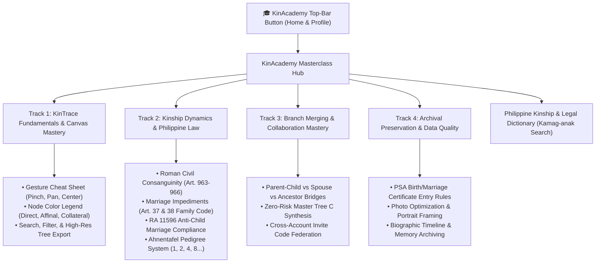
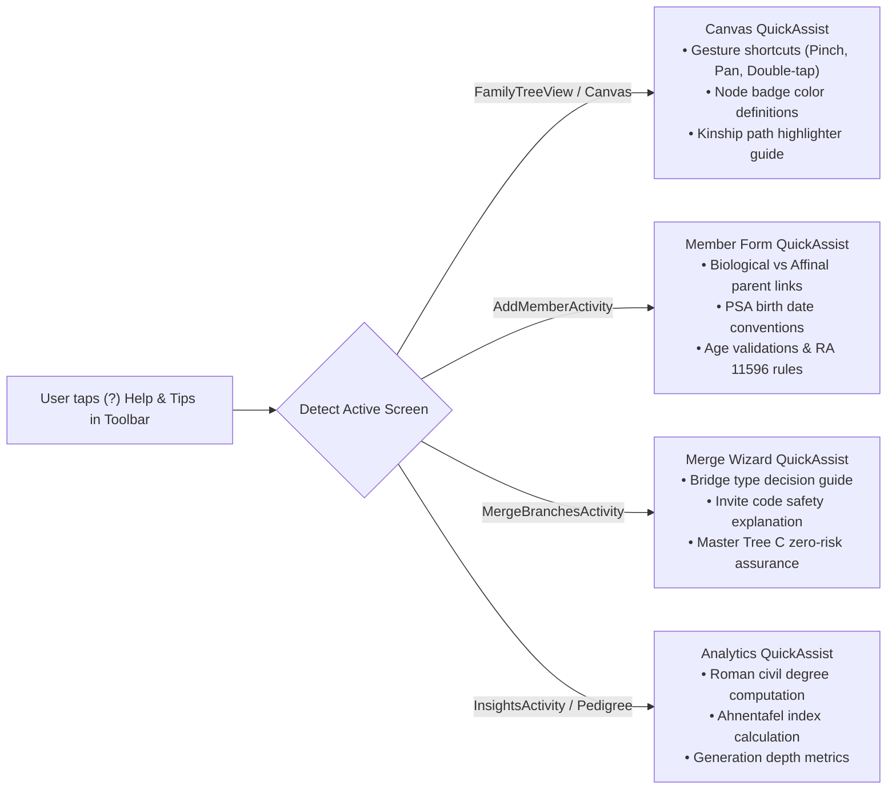
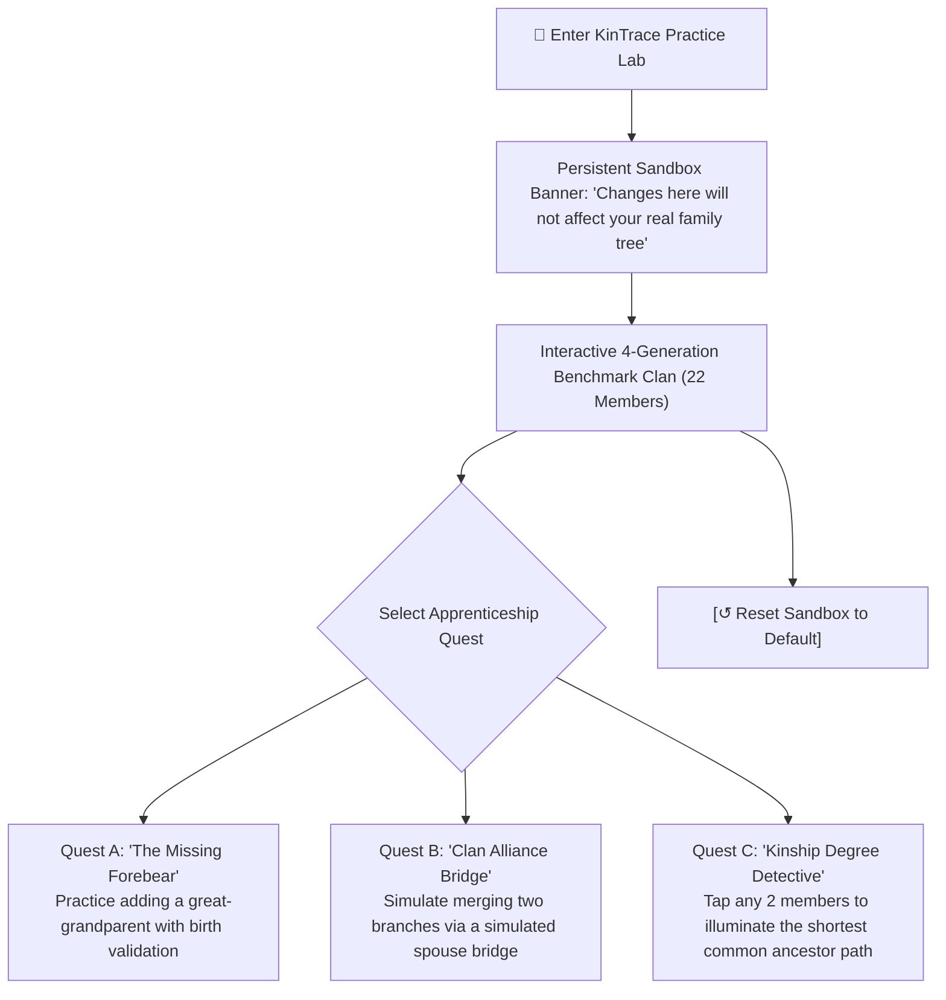
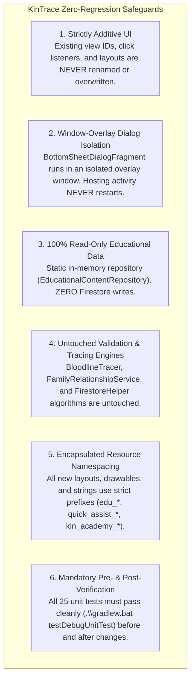

# KinTrace: Future Roadmap & Proposal Ideas (Phase 2 / Post-Capstone)

> **Living Backlog & Standing Directive**:  
> This document serves as the permanent, living repository of advanced features, architectural proposals, and future-phase improvements for **KinTrace (Mobile-Based Genealogical Bloodline Tracing System)**.  
> **Rule of Baseline Integrity**: The core capstone scope, system architecture, data models, and Philippine legal compliance rules are 100% finalized and approved. All items documented here represent strictly optional, high-impact Phase 2 / post-capstone expansions. Whenever new suggestions or enhancements are requested, they will be systematically structured and logged into this document.

---

## 1. Summary Matrix of Proposal Ideas

| # | Proposal Concept | Category | Target Phase | Primary Architectural Impact |
| :-: | :--- | :--- | :-: | :--- |
| **01** | **GEDCOM 5.5.1 / 7.0 Interchange** | Interoperability | Phase 2.1 | Bidirectional translator (`GedcomParser`) with audit gatekeeper |
| **02** | **On-Device ML Kit OCR for PSA & Parish Records** | Intelligent Capture | Phase 2.2 | Google ML Kit text recognition with field mapping & confidence scores |
| **03** | **Autosomal DNA Correlation (cM to Civil Degrees)** | Genetic Genealogy | Phase 2.3 | Shared cM probability engine mapped to Roman Civil degrees ($1^\circ$ to $6^\circ$) |
| **04** | **GIS Ancestral Migration & Province Heatmaps** | Cultural & Spatial | Phase 2.4 | Philippine Standard Geographic Code (PSGC) coordinates & timeline map |
| **05** | **Offline-First Room SQLite & WorkManager Mesh** | Reliability & Access | Phase 2.5 | Local Room DAO persistence with auto-sync queue for remote areas |
| **06** | **Client-Side Encrypted Proof Vault (AES-GCM-256)** | Security & RA 10173 | Phase 2.6 | End-to-end PBKDF2 + AES-GCM encryption for court decrees & vital IDs |
| **07** | **Philippine Regional Dialect Localization** | Accessibility | Phase 2.7 | Multilingual narrative engine for Ilocano, Bisaya, Hiligaynon, Bikol, Waray |
| **08** | **Collaborative 3-Way Branch Merge Wizard** | Collaboration | Phase 2.8 | Visual side-by-side branch comparison with interactive conflict resolver |
| **09** | **Oral History & Voice Memories Archive** | Multimedia Heritage | Phase 2.9 | AAC audio recorder with waveforms attached to member timeline events |
| **10** | **Kinship-Aware Reunion & Milestone Planner** | Community & Family | Phase 2.10 | Calendar integration generating proximity-based invitations & reminder feeds |
| **11** | **Multi-Tree Anchor-Bridge Merger** | Cross-Tree Integration | Phase 2.11 | Select target & incoming trees; link via Spouse, Parent-Child, or Shared Ancestor bridge |
| **12** | **Non-Destructive Clan Synthesis** | Safety & Data Integrity | Phase 2.12 | Generates new combined Master Tree C while keeping original trees 100% intact |
| **13** | **Cross-Account Collaborative Tree Merge** | Social & Clan Federation | Phase 2.13 | Merge with external family trees via Invite Code handshake and dual-owner approval |
| **14** | **Automated Graph Overlap & 3-Way Diff Engine** | Graph Intelligence | Phase 2.14 | Bipartite duplicate detection, side-by-side field conflict picker, and cycle/legal pre-commit audit |
| **15** | **Safe Master Tree Synthesis (Zero-Risk Clan Fusion Engine)** | Non-Destructive Synthesis | **Immediate / Executable** | Deep-clones Tree A & Tree B (or via Invite Code) into new Master Tree C; original trees 100% untouched |
| **16** | **Dedicated "Merged Clan Space" & Separate Sandbox Viewer** | Architectural Isolation | **Immediate / Executable** | Houses merged trees exclusively inside the "Merge Branches" portal; user's "View Tree" stays 100% pure |
| **17** | **Multi-Generational Benchmark Tree Seeder (20-Member Clan Suite)** | Testing & Simulation | Developer Utility / Immediate | Topological 4-generation 20-member benchmark via FamilyRelationshipService & CentralTreeSynchronizer |
| **18** | **Interactive Spotlight & Coachmark Pathfinder Tour** | User Onboarding & In-Situ Guidance | **Immediate / Phase 2 Candidate** | Real-time target cutouts over Home UI elements with contextual step bubbles and skip/replay controls |
| **19** | **3-Slide Illustrated Welcome Storybook Modal & Direct Action Launchpad** | Visual Onboarding & Initiation | **Immediate / Phase 2 Candidate** | First-login heritage modal with direct shortcuts ("Plant Tree" / "Join Clan") and legal/cultural orientation |
| **20** | **Gamified "Clan Builder Quest" Persistent Milestone Checklist HUD** | Engagement & Activation | **Immediate / Phase 2 Candidate** | Dismissible top dashboard widget with live progress bar (0/4), deep-link tasks, and real-time reactive sync |
| **21** | **Unified Onboarding Engine (Hybrid Storybook Launchpad + Clan Quest HUD)** | Complete Onboarding Suite | **Immediate / Priority Execution** | Two-phase onboarding: 3-slide cultural modal with direct action fork + reactive top-docked quest HUD (0/4) |
| **22** | **"KinAcademy" Dedicated Genealogical Knowledge Hub & Masterclass Screen** | Educational Platform & Knowledge Base | Phase 2 / Post-Capstone | Dedicated screen (`KinAcademyActivity`) with 4 self-paced mastery tracks, visual gesture guides, and Philippine kinship glossary |
| **23** | **Contextual In-Situ "Smart Helper" & Feature Deep-Dive Drawer (`KinTrace QuickAssist Bottom Sheet`)** | In-Situ Contextual Guidance | Phase 2 / Post-Capstone | Universal top-bar `(?)` button popping dynamic contextual bottom sheet (`KinTraceQuickAssistBottomSheet`) tailored to current screen |
| **24** | **Gamified "KinTrace Lab": Interactive Sandbox Simulation & Apprenticeship Quests** | Interactive Simulation & Practice | Phase 2 / Post-Capstone | Isolated sandbox environment (`SandboxTreeActivity`) pre-seeded with sample clan for hands-on interactive guided practice |
| **25** | **The Unified KinTrace 360° Educational Suite (KinAcademy Hub + Universal QuickAssist)** | Complete Educational Suite | **✅ Completed (7/7 Phases Verified)** | Comprehensive 360° educational system: 10-module Masterclass Hub + searchable Kamag-anak Lexicon + universal in-situ `(?)` QuickAssist sheet covering all 10 app modules |
| **26** | **Account Profile & Clan Identity Redesign** | UI / UX Modernization | **✅ Completed (Globally Integrated)** | Modern BottomSheet overhaul with Gold Crest Avatar, verified badge, grouped credential cards, and responsive headers |
| **27** | **Auth Flow Navigation Modernization (Login Header Clean & Register Back Redesign)** | Auth UI / UX Refinement | **Phase 2 / Immediate Execution** | Removal of redundant Login back button (100% preservation of auth forms) + 3 modern redesign styles for Create Account back navigation |

---

## 2. Detailed Proposal Specifications

### Proposal 01: International GEDCOM 5.5.1 / 7.0 Standard File Interchange
- **Concept & Purpose**: Enable KinTrace users to import and export family tree files using the universal **GEDCOM (GEnealogical Data COMmunication)** format, allowing seamless interoperability with global platforms such as FamilySearch, WikiTree, MyHeritage, and Gramps.
- **Architectural Fit**:
  - Implement a dedicated `GedcomParser` and `GedcomSerializer` module.
  - When importing a `.ged` file, the parser translates `INDI` (Individual) and `FAM` (Family) records into KinTrace `Person` entities.
  - **Mandatory Safety Guard**: All imported relationships must pass through `FamilyRelationshipService.auditFamilyTree()` to ensure imported records comply with Philippine marriage laws, minimum marriage age (RA 11596), and cycle prevention before saving to Firestore.
- **Value Proposition**: Eliminates platform lock-in, facilitates family data migration from existing desktop software, and establishes KinTrace as a globally compatible genealogical tool.

---

### Proposal 02: On-Device ML Kit OCR for Philippine Civil & Parish Records
- **Concept & Purpose**: Allow users to point their smartphone camera at physical Philippine vital documents—such as PSA/NSO Birth Certificates, Marriage Certificates, Local Civil Registry copies, and Catholic Parish baptismal certificates—and automatically populate member creation forms.
- **Architectural Fit**:
  - Integrate **Google ML Kit Text Recognition** for on-device processing without cloud latency or subscription fees.
  - Implement an extraction pattern matcher trained on standard Philippine civil registry forms (identifying Child Name, Father's Full Name, Mother's Maiden Name, Date of Birth, Place of Birth, Registry Number).
  - Pre-fill `AddMemberActivity` with editable text fields, accompanied by field confidence badges (`✓ High Confidence`, `⚠ Review Needed`).
- **Value Proposition**: Drastically lowers data entry barrier for non-tech-savvy users and elders, speeds up large family onboarding, and preserves aging paper records digitally.

---

### Proposal 03: Autosomal DNA Segment Correlation (cM to Civil Degrees)
- **Concept & Purpose**: Bridge biological civil consanguinity under Philippine law with empirical molecular genetics by correlating shared centiMorgan (cM) data from DNA testing services (e.g. 23andMe, AncestryDNA) with predicted civil degrees of consanguinity.
- **Architectural Fit**:
  - Extend `BloodlineTracer` and `RelationshipExplainer` with a `DnaConsanguinityCalculator`.
  - Ingest shared cM values and segment counts; cross-reference against the **Shared cM Project** probability distributions.
  - Display dual output:
    1. **Empirical Genetic Match**: Expected shared DNA percentage (e.g., 12.5% shared DNA $\approx$ 850 cM).
    2. **Civil Law Equivalent**: Predicted legal relationship degrees (e.g., 3rd Degree Collateral [Uncle/Niece] or 4th Degree Collateral [First Cousins]).
- **Value Proposition**: Empowers users solving unknown parentage cases, adoption searches, or disputed lineages with scientifically grounded genealogical analysis.

---

### Proposal 04: Geographic GIS Historical Migration & Province Heatmaps
- **Concept & Purpose**: Visualize the historical and geographical journey of a Filipino family clan over decades by plotting birthplaces and residences on an interactive map of the Philippine archipelago.
- **Architectural Fit**:
  - Map `birthPlace` strings to normalized **Philippine Standard Geographic Code (PSGC)** coordinates (Region, Province, Municipality/City, Barangay).
  - Integrate Android Google Maps SDK or OpenStreetMap with heatmaps and animated trajectory vectors.
  - Provide a generational timeline slider: stepping through Gen 1 $\rightarrow$ Gen 4 animates migration lines from ancestral origin provinces (e.g., Ilocos, Batangas, Iloilo, Leyte) to urban centers (Metro Manila, Cebu, Davao) and international overseas diaspora hubs.
- **Value Proposition**: Adds historical and cultural depth, transforming dry family data into a compelling visual narrative of family heritage and migration.

---

### Proposal 05: Offline-First Room SQLite Cache with WorkManager Mesh Sync
- **Concept & Purpose**: Provide uninterrupted, full-featured family tree viewing, adding, and editing even in rural Philippine areas with weak or absent cellular connectivity.
- **Architectural Fit**:
  - Introduce an embedded **Room SQLite database** mirroring Firestore entities locally (`LocalPersonEntity`, `LocalTreeEntity`).
  - Read operations serve from local SQLite with 0ms latency.
  - Write operations commit locally and register pending mutations in a sync queue.
  - Android `WorkManager` monitors network connectivity; upon detecting an active internet connection, it flushes queued operations to `CentralTreeSynchronizer` and Firestore via idempotent batch writes.
- **Value Proposition**: Guarantees zero downtime and complete usability during provincial family reunions, cemetery visits, and remote rural field research.

---

### Proposal 06: Client-Side Encrypted Proof Vault (AES-GCM-256)
- **Concept & Purpose**: Provide enterprise-grade security and confidentiality for sensitive civil documents (Court Adoption Decrees, Annulment / Divorce Judgments, Government IDs) attached to family members.
- **Architectural Fit**:
  - Implement client-side cryptographic storage in `DocumentHelper`.
  - When a user uploads a sensitive document classified as "Private Legal Proof", the file is encrypted on the device using **AES-GCM-256** with a key derived from the user's master passcode using **PBKDF2** with a unique salt.
  - The ciphertext is stored in Firebase Storage; only authorized tree members who hold the decryption key can view the decrypted document.
- **Value Proposition**: Strengthens compliance with the **Data Privacy Act of 2012 (RA 10173)**, assuring users that sensitive legal records remain strictly confidential even from backend administrators.

---

### Proposal 07: Philippine Regional Dialect Kinship Localization
- **Concept & Purpose**: Generate natural language kinship explanations and UI titles in major Philippine regional languages to celebrate regional Filipino heritage.
- **Architectural Fit**:
  - Extend `RelationshipExplainer` and `KinshipTitleHelper` with language-specific string bundles.
  - Supported regional languages:
    - **Ilocano** (*Manong*, *Manang*, *Apo*, *Kasinsin*, *Kayong*, *Ipat*)
    - **Cebuano / Bisaya** (*Manoy*, *Manay*, *Apohan*, *Paryente*, *Ugangan*)
    - **Hiligaynon / Ilonggo** (*Toto*, *Inday*, *Lolo*, *Lola*, *Pakaisa*)
    - **Kapampangan** (*Koya*, *Achi*, *Ingkung*, *Apu*, *Pisan*)
    - **Bikol** (*Manoy*, *Manay*, *Lolo*, *Lola*, *Pinsan*)
    - **Waray** (*Mano*, *Mana*, *Apohan*, *Patod*)
  - User can toggle between English, Filipino (Tagalog), and regional dialects in app settings.
- **Value Proposition**: Increases emotional resonance, inclusivity, and pride in indigenous regional roots across diverse Filipino households.

---

### Proposal 08: Collaborative 3-Way Branch Merge Wizard
- **Concept & Purpose**: Provide a guided visual diff and merge interface when two independent family tree owners discover they belong to the same overarching clan and wish to merge branches.
- **Architectural Fit**:
  - Enhance `MergeBranchesActivity` with a three-column interactive conflict resolver:
    - Left: *Branch A (Source)*
    - Right: *Branch B (Incoming)*
    - Center: *Merged Result*
  - Automatically identifies overlapping members using fuzzy name matching and birthdate proximity.
  - Highlights discrepancies (e.g. differing middle names, contradictory birthplaces) and lets the tree owner choose which attribute to retain on a field-by-field basis before committing.
- **Value Proposition**: Enables large clans to federate their decentralized trees into an authoritative master genealogy without data corruption or accidental duplicate creation.

---

### Proposal 09: Oral History & Voice Memories Archive
- **Concept & Purpose**: Preserve the spoken voices, stories, folk songs, and personal memories of elderly family members directly attached to their genealogical record.
- **Architectural Fit**:
  - Add an audio recording widget to `MemberDetailActivity` utilizing Android `MediaRecorder` (AAC/M4A format).
  - Generates waveform previews and allows tagging recordings by topic (*"World War II Memories"*, *"How Jose and Maria Met"*, *"Lola's Traditional Recipe Story"*).
  - Audio files upload to Firebase Storage with streaming playback support.
- **Value Proposition**: Elevates KinTrace from a static genealogical chart into an emotional living archive of family oral history.

---

### Proposal 10: Kinship-Aware Reunion & Milestone Planner
- **Concept & Purpose**: Transform genealogical relationships into actionable family connections by automatically calculating milestones, birth anniversaries, and generating kinship-aware reunion invitation lists.
- **Architectural Fit**:
  - Background notification worker calculates upcoming milestones (Golden Wedding Anniversaries, 80th Birthdays, Deceased Memorials / *Babang Luksa*).
  - "Plan a Reunion" tool allows an owner to select a patriarch/matriarch and automatically generates a complete guest list of all living descendants, grouped by branch and generation.
  - Exports PDF invitation rosters with RSVP tracking.
- **Value Proposition**: Directly strengthens Filipino family solidarity and clan reunions (*angkan* gatherings) using the structured tree data.

---

### Proposal 11: Multi-Tree Anchor-Bridge Merger (Target-Absorptive Model)

#### 11.1 Concept & Genealogical Motivation
- **Primary Function**: Transforms the "Merge Branches" tool from an intra-tree duplicate finder into a true **Inter-Tree Merger** that merges two distinct family trees in the app.
- **The Core Problem**: A user frequently builds two separate family trees—for example, *Tree A: Paternal Dela Cruz Tree* (15 members) and *Tree B: Maternal Santos Tree* (12 members), or one spouse built their side and the other built theirs. The user now wants to merge them into a single, comprehensive family tree without manually re-typing 12 people.
- **The Model**: Tree A is chosen as the **Target (Recipient) Tree**, and Tree B is designated as the **Incoming Tree**. Tree B is absorbed into Tree A, resulting in a single expanded tree with 27 members.

```
[ Tree A: Dela Cruz Tree (15 members) ] ──┐
                                          ├─► [ Unified Tree A (27 members) ]
[ Tree B: Santos Tree (12 members)    ] ──┘   (Linked via Genealogical Anchor Bridge)
```

---

#### 11.2 The Three Genealogical "Anchor Bridge" Mechanisms
In graph theory, two disconnected acyclic directed graphs (DAGs) cannot be unified without establishing at least one connecting edge. Approach 1 introduces **3 Anchor Bridge Types**:

##### A. 💍 Spousal Union Bridge (Horizontal Link)
- **User Story**: *"My father is in Tree A, and my mother is in Tree B. I want to connect the two trees by marrying them."*
- **Mechanism**:
  1. User selects `Person A` from Tree A (e.g., Father) and `Person B` from Tree B (e.g., Mother).
  2. The system sets `Person A.spouseId = Person B.id` and `Person B.spouseId = Person A.id`.
  3. All of Tree B's maternal ancestors (maternal grandparents, great-grandparents, aunts/uncles) are imported into Tree A, perfectly rooted through Mother's horizontal marriage link to Father.
- **Graph Transformation**: Paternal branch and maternal branch align side-by-side on the generation canvas with a connecting marriage ring badge.

##### B. 👶 Parent-Child Bridge (Vertical Link)
- **User Story**: *"My uncle created a separate tree containing his children and grandchildren. I want to attach his branch under his profile in our main family tree."*
- **Mechanism**:
  1. User selects `Person A` in Tree A (Uncle) and `Person B` in Tree B (his eldest Child, or the root of the sub-branch).
  2. User specifies the direction: *"Person A is Parent of Person B"* (or *"Person B is Parent of Person A"*).
  3. The system assigns `Person B.fatherId` (or `motherId`) to `Person A.id`.
  4. Tree B's descendants are attached vertically underneath Person A.

##### C. 👥 Shared Ancestor Bridge (Anchor Node Fusion)
- **User Story**: *"Both my tree and my cousin's tree already contain our common grandfather Don Ramon Dela Cruz. I want to fuse his two records into one so the branches join together."*
- **Mechanism**:
  1. User selects `Person A` in Tree A and `Person B` in Tree B as representing the **exact same individual**.
  2. The system fuses the two records into a single canonical record in Tree A.
  3. All children, parents, and siblings from Tree B that pointed to `Person B` are re-wired to point to canonical `Person A`.
  4. Both lineages converge cleanly at that common ancestor.

---

#### 11.3 Handling Overlapping & Duplicate Members (Field-by-Field Conflict Resolution)
When two trees are merged, several people might exist in both trees (e.g., common children, cousins, or in-laws).
- **Automated Overlap Detection**:
  - The engine runs a bipartite similarity scan comparing all nodes in Tree A against Tree B using Jaro-Winkler full name scoring and birthdate equality.
  - Matches with $>85\%$ confidence are flagged as candidate duplicate pairs.
- **Field-by-Field Conflict Resolution UI**:
  - If attributes differ (e.g., Tree A says birthdate is *May 10, 1965* while Tree B says *May 12, 1965*), the user is presented with an interactive conflict card:

```
┌────────────────────────────────────────────────────────┐
│  ⚠️ Duplicate Candidate: Jose Dela Cruz               │
│  Similarity Score: 92% Match                           │
├────────────────────────────────────────────────────────┤
│  Birth Date:                                           │
│  (●) May 10, 1965  [Tree A: Dela Cruz Tree]            │
│  (○) May 12, 1965  [Tree B: Santos Tree]               │
│                                                        │
│  Birth Place:                                          │
│  (○) Manila        [Tree A: Dela Cruz Tree]            │
│  (●) Quezon City   [Tree B: Santos Tree]               │
│                                                        │
│  Profile Photo:                                        │
│  (●) Keep Tree A Photo     (○) Use Tree B Photo        │
└────────────────────────────────────────────────────────┘
```
- The user taps their preferred value for each conflicting field before the merge executes.

---

#### 11.4 Original Tree B Retention Strategies
What happens to Tree B after its records are absorbed into Tree A? Three distinct strategies are proposed:

1. **Option 1: Archived Snapshot (Recommended for Safety)**:
   - Tree B remains in the database and user account, but its metadata is updated: `isArchived = true` and `mergedIntoTreeId = TreeA.id`.
   - In the tree selector, it appears with a subtle badge: `📁 Santos Tree (Merged into Dela Cruz Tree)`.
   - **Advantage**: 100% fail-safe. The user can still open Tree B as a historical standalone snapshot or manually delete it later when satisfied.
2. **Option 2: Auto-Clean / Complete Deletion**:
   - Once the merge transaction commits, the system deletes Tree B and its member records from Firestore.
   - **Advantage**: Tree switcher remains clean with zero duplicate tree entries.
   - **Disadvantage**: Irreversible; cannot be undone if the user regrets the merge.
3. **Option 3: Automated Pre-Merge JSON/GEDCOM Backup**:
   - Before executing the merge, the app automatically generates and exports an offline JSON/GEDCOM backup snapshot of Tree B to device storage (`Downloads/KinTrace_Backups/TreeB_backup.json`).
   - Ensures user data is never permanently lost.

---

#### 11.5 Detailed 5-Step UI/UX Wizard Walkthrough (`MergeBranchesActivity`)

```
Step 1: Select Trees
├── Primary / Target Tree Dropdown: [ Dela Cruz Family Tree (15 members) ▼ ]
└── Secondary / Incoming Tree Dropdown: [ Santos Family Tree (12 members) ▼ ]
      [ Button: "Scan & Proceed to Bridge Connection ➔" ]

Step 2: Choose Anchor Bridge Mode
├── (●) 💍 Spousal Union Bridge ("Member in Tree A married to Member in Tree B")
├── (○) 👶 Parent-Child Bridge ("Member in Tree A is parent/child of Member in Tree B")
└── (○) 👥 Shared Ancestor Bridge ("Same person exists in both trees")

Step 3: Select Anchor Members
├── Select Person from Dela Cruz Tree: [ Juan Dela Cruz (Father) ▼ ]
└── Select Person from Santos Tree:   [ Maria Santos (Mother) ▼ ]
      [ Visual Link Preview Card showing relationship badge: "Spouse Link" ]

Step 4: Review Overlaps & Conflicts
├── Duplicate Scanner: "2 duplicate children detected across trees"
├── Conflict Resolver: Interactive radio cards to pick winning birthdate/photos
└── Affected Sub-branches: "10 new relatives will be attached to Maria Santos"

Step 5: Safety Audit & Final Merge
├── System Validation Check:
│     ✓ Cycle Check: 0 circular parentage detected
│     ✓ Legal Consanguinity: Philippine Family Code Arts. 37 & 38 satisfied
│     ✓ Permissions: User is verified Owner of both trees
├── Retention Choice: [●] Keep Tree B as Archived Snapshot   [○] Delete Tree B
└── [ Big Action Button: "Confirm & Execute Inter-Tree Merge" ]
      └── Progress indicator ──► CentralTreeSynchronizer updates app in real time
```

---

#### 11.6 Technical Data Flow & Backend Transaction Mechanics
1. **ID Translation & Relational Pointer Mapping**:
   - When Tree B members are ingested into Tree A:
     - Each person in Tree B can retain their original ID or receive a mapped UUID.
     - A translation dictionary `idMap: Map<String, String>` maps every Tree B person ID to their new Tree A person ID.
     - For every incoming person:
       - `treeId` is updated to `treeA.id`.
       - `fatherId = idMap[fatherId] ?: fatherId`
       - `motherId = idMap[motherId] ?: motherId`
       - `spouseId = idMap[spouseId] ?: spouseId`
2. **Anchor Edge Application**:
   - If Spousal Bridge: `personA.spouseId = personB.id` and `personB.spouseId = personA.id`.
   - If Parent-Child Bridge: `personB.fatherId` (or `motherId`) = `personA.id`.
   - If Shared Ancestor Bridge: Canonical record created with merged attributes; duplicate record deleted.
3. **Atomic Firestore Batch Transaction**:
   - Written using Firestore `WriteBatch` (up to 500 operations per batch) ensuring that either all members and relational pointers are committed successfully, or no change is made at all.
4. **Activity Logging & Notification**:
   - Creates an entry in `activity_logs`: `"Tree Merger: Santos Family Tree absorbed into Dela Cruz Family Tree (12 members merged)"`.
   - Emits an in-app notification confirming successful tree union.
5. **Real-Time Reactive Notification**:
   - Calls `CentralTreeSynchronizer.notifyTreeDataChanged(treeA.id)`.
   - Active tree canvas (`InteractiveTreeActivity`), records list (`FamilyRecordsActivity`), and dashboard counters (`HomeActivity`) immediately reload with the new 27-member tree graph.

---

#### 11.7 Legal & Topological Safety Guardrails
1. **Cycle Prevention Engine**:
   - Executes topological cycle detection (`FamilyRelationshipService.detectCycles()`) on the unified graph before the database write is committed.
   - Prevents paradoxes where a person could become their own ancestor.
2. **Philippine Family Code Consanguinity Compliance**:
   - If a Spousal Bridge is selected, `MarriageValidationEngine.validateMarriage()` verifies that the couple does not violate **Executive Order No. 209 (Family Code of the Philippines)**:
     - **Article 37 (Incestuous Marriages)**: No marriages between ascendants and descendants of any degree, or between brothers and sisters (full or half blood).
     - **Article 38 (Against Public Policy)**: No marriages between collateral relatives within the fourth civil degree (first cousins, uncle/niece, aunt/nephew).
   - If an invalid marriage is attempted, the merge is blocked with an explicit legal alert.
3. **Owner Authorization Gate**:
   - Verifies that the current user has `Owner` role on both Tree A and Tree B, ensuring no unauthorized tree takeovers can occur.

---

### Proposal 12: Non-Destructive Clan Synthesis (Master Tree Generator)
- **Concept & Purpose**: Eliminates the danger of data loss or tree corruption. Instead of modifying Tree A or Tree B directly, this approach synthesizes data from both trees into a **brand-new, independent Master Tree C** (e.g., *"Dela Cruz – Santos Master Clan Tree"*).
- **Architectural Fit**:
  - Creates a new document in the `trees` collection (`masterClanTreeId`).
  - Deep-clones all `Person` records from Tree A and Tree B into Tree C with new UUIDs, utilizing an in-memory translation lookup map (`oldId -> newId`) to preserve all existing marital and parent-child edges.
  - Applies the selected Anchor Bridge (Spousal, Parent-Child, or Shared Ancestor) within the new Tree C.
  - **100% Fail-Safe & Reversible**: Both original trees (Tree A and Tree B) remain completely untouched and fully functional. If the user makes an error or is dissatisfied with the merged layout, they can simply delete Tree C with zero consequence to their original trees.
- **Value Proposition**: Provides users with maximum confidence and psychological safety when executing complex family mergers.

---

### Proposal 13: Cross-Account Collaborative Tree Merge via Invite Code & Handshake
- **Concept & Purpose**: Extends tree merging across different user accounts. Allows two different KinTrace users (e.g., distant cousins, or a husband and wife who each built their own family tree on separate phones) to merge their family trees collaboratively.
- **Architectural Fit**:
  - **Step 1: Code Verification**: Initiator enters the 6-character Invite Code of the external tree. `FirestoreHelper.getInviteCodeRecord()` validates the code and fetches the target tree metadata.
  - **Step 2: Merge Proposal Draft**: Initiator selects the Anchor Bridge (e.g., "Person X in my tree is married to Person Y in your tree") and previews potential duplicates.
  - **Step 3: Handshake Protocol**: Rather than merging unilaterally, the app creates a document in `tree_merge_proposals` with status `"PENDING"`.
  - **Step 4: Dual-Owner Authorization**: The owner of the external tree receives an in-app notification (*"Juan Dela Cruz has requested to merge his tree with yours"*). They can open an interactive review modal displaying the bridge proposal and duplicate preview.
  - **Step 5: Mutual Approval & Federation**: Upon approval, the merge executes (either as Target Absorption or Master Tree C), and both users are granted Co-Owner / Editor roles in `tree_members`.
- **Value Proposition**: Enables decentralized clan federation across large extended families without requiring password sharing or manual double-entry.

---

### Proposal 14: Automated Graph Overlap & 3-Way Topological Diff Engine
- **Concept & Purpose**: When merging two established trees containing dozens or hundreds of relatives, manually searching for duplicate entries is impractical. This engine executes automated bipartite matching across both trees and presents an interactive 3-way reconciliation interface.
- **Architectural Fit**:
  - **Bipartite Detection**: Compares all nodes of Tree A against Tree B using multi-attribute similarity (Jaro-Winkler full name scoring, birth/death date matching, and parent/spouse topological context).
  - **3-Way Visual Reconciliation Interface**:
    - **Identical Nodes**: Automatically grouped and merged (marked green).
    - **Conflicting Attributes**: For records with matching identities but divergent data (e.g., Birthdate: "1965-03-12" vs "1965-03-15", or different middle names/birthplaces), the UI renders side-by-side radio chips allowing the user to select which field value wins on a field-by-field basis.
    - **Unique Lineages**: Visualized as incoming branches that will attach to the anchor node.
  - **Mandatory Pre-Commit Legal & Graph Audit**:
    - Feeds the combined proposed graph into `FamilyRelationshipService.auditFamilyTree()`.
    - Enforces cycle prevention (ensures no node becomes their own ancestor).
    - Enforces Philippine Family Code marriage rules (Articles 37 & 38: no direct ascendant/descendant marriages, no sibling marriages, no collateral marriages within the 4th civil degree).
    - If any legal or topological violation is detected, merge execution is strictly blocked with clear error badges explaining the issue.
- **Value Proposition**: Guarantees that large, complex tree mergers result in clean, non-duplicated, legally compliant genealogical data.

---

### Comparative Analysis of Tree-Merging Architectural Paradigms

| Paradigm | Target Tree Impact | Reversibility | Data Duplication | Complexity | Best Suited For |
| :--- | :--- | :--- | :--- | :--- | :--- |
| **Approach 1: Target-Absorptive (Tree B $\rightarrow$ Tree A)** | Tree A grows; Tree B absorbed | Low (requires manual rollback or backup restore) | None (single expanded tree) | Moderate | Consolidating personal sub-branches into one definitive tree |
| **Approach 2: Clan Synthesis (Tree A + B $\rightarrow$ Tree C)** | None (Tree A & B untouched) | High (simply delete Tree C if not satisfied) | Moderate (nodes cloned into Tree C) | Moderate | Risk-free experimentation, major multi-family weddings/unions |
| **Approach 3: Cross-Account Handshake** | Dependent on chosen model (1 or 2) | High (requires dual consent before write) | None to Moderate | High | Distant relatives, cousins, or in-laws collaborating across accounts |
| **Approach 4: Automated 3-Way Overlap Diff** | Applied atop Approach 1, 2, or 3 | High (explicit user confirmation per conflict) | N/A | High | Large family trees with multiple overlapping generations |

---

### Proposed 5-Step UI/UX Wizard for `MergeBranchesActivity`

```
[ Step 1: Select Trees ]
   ├── Pick Primary Tree (Tree A: e.g. "Dela Cruz Family Tree")
   └── Pick Second Tree (Tree B: From "My Trees" OR "Enter 6-Char Invite Code")
             │
             ▼
[ Step 2: Choose Anchor Bridge Mode ]
   ├── 💍 Spousal Union Bridge ("Member in Tree A married to Member in Tree B")
   ├── 👶 Parent-Child Bridge ("Member in Tree A is parent/child of Member in Tree B")
   └── 👥 Shared Ancestor Bridge ("Same person exists in both trees")
             │
             ▼
[ Step 3: Select Anchor Members ]
   ├── Tree A Member Picker (Searchable autocomplete dropdown)
   └── Tree B Member Picker (Searchable autocomplete dropdown)
             │
             ▼
[ Step 4: Overlap & Conflict Review ]
   ├── Automated Duplicate Detection Scan (Bipartite Jaro-Winkler)
   ├── Side-by-side Field Conflict Resolver (Choose Name, Birthdate, Photos)
   └── Affected Children / Relatives Preview
             │
             ▼
[ Step 5: Pre-Commit Audit & Execution ]
   ├── Choose Output Mode: ( ) Absorb into Tree A   ( ) Create New Master Tree C
   ├── System Validation: Philippine Family Code & Cycle Check (FamilyRelationshipService)
   └── [ Confirm & Execute Merge ] ──► CentralTreeSynchronizer triggers real-time refresh
```

---

### Architectural Scope & Connected Modules Mapping (KinTrace Standard)

When implementing the multi-tree merge feature, the following core architectural layers will be integrated:
1. **Cloud Firestore Persistence & Repository (`FirestoreHelper.kt`)**:
   - New batch transaction for cross-tree cloning, person ID re-mapping, and anchor edge creation.
   - Support for `tree_merge_proposals` collection for cross-account handshake requests.
2. **Real-Time Tree Synchronizer (`CentralTreeSynchronizer.kt`)**:
   - Emits `TreeSyncEvent.TreeDataChanged` or `TreeSyncEvent.TreeCreated` to notify active screens.
3. **Central Relationship Validation Pipeline (`FamilyRelationshipService.kt`, `MarriageValidationEngine.kt`)**:
   - Pre-commit audit ensures that connecting the two trees creates no graph cycles and violates no Philippine civil consanguinity laws (Articles 37 & 38).
4. **Interactive Family Tree Canvas (`FamilyTreeView.kt`, `InteractiveTreeActivity.kt`)**:
   - Redraws the new unified hierarchical graph with proper generational tiering and spouse bridges.
5. **Dashboard, Records & Insights (`HomeActivity.kt`, `FamilyRecordsActivity.kt`, `InsightsActivity.kt`)**:
   - Member counters, generation depths, and surname distributions update dynamically without requiring manual reload or app restart.

---

### Proposal 15: Safe Master Tree Synthesis (Zero-Risk Clan Fusion Engine)

#### 15.1 Executive Summary & Why It Is Immediately Executable
This proposal synthesizes the best strengths of **Proposal 12 (Non-Destructive Master Tree Generator)** and **Proposal 13 (Invite Code External Tree Connection)** into a **workable, production-ready, zero-risk solution** that can be built and run right now without requiring complex backend migrations.

- **The Core Innovation**: Instead of modifying, overwriting, or deleting either family tree (which risks corrupting existing genealogies), the system leaves Tree A and Tree B **100% untouched and strictly read-only**. It synthesizes both trees into a **brand-new Master Tree C** (e.g., *"Dela Cruz – Santos Master Clan Tree"*).
- **Zero Risk / Effortless Rollback**: Because original trees are never written to, there is literally zero possibility of data loss or corrupted lineages. If the user dislikes the merged outcome or made a mistake, they simply delete Tree C. Both Tree A and Tree B remain completely intact.
- **Immediate Workability**: It builds entirely upon KinTrace's existing and proven architecture:
  - Fetches existing trees via `FirestoreHelper.getUserTrees()`.
  - Fetches external trees via `FirestoreHelper.getInviteCodeRecord()` / `getTreeByInviteCode()`.
  - Validates marriage consanguinity via `MarriageValidationEngine.validateMarriage()`.
  - Prevents graph cycles via `FamilyRelationshipService.auditFamilyTree()`.
  - Broadcasts immediate UI canvas updates via `CentralTreeSynchronizer.notifyTreeDataChanged()`.

---

#### 15.2 Dual Input Sources: Merging Own Trees or via 6-Digit Invite Code
Users can synthesize Master Tree C from two flexible sources:

```
[ Tree 1: Source A ] ───► Pick from "My Family Trees" (e.g. Dela Cruz Tree)
                                 │
                                 ├──► [ Master Tree C: "Dela Cruz – Santos Clan" ]
                                 │    (Original Trees Remain 100% Untouched!)
[ Tree 2: Source B ] ───► Toggle:
                          ├── Option 1: Pick from "My Trees" (e.g. Santos Tree)
                          └── Option 2: Enter 6-Char Invite Code (e.g. "5SRQJU" from a relative)
```

1. **Local Merge**: User owns both Tree A (paternal) and Tree B (maternal) under their own account.
2. **Collaborative / Cross-Account Merge**: User enters the 6-character Invite Code of a relative's tree. The app reads the public/shared tree records of Tree B and merges them with Tree A to produce Tree C in the user's account.

---

#### 15.3 The Three Anchor Link Types
When synthesizing Master Tree C, the user specifies how the two families connect:

1. **💍 Marriage Link (Spousal Union Bridge)**
   - *Example*: Juan Dela Cruz (Tree A) is married to Maria Santos (Tree B).
   - In Tree C, the cloned Juan and cloned Maria are linked as spouses (`spouseId`). Their respective ancestral trees branch out horizontally beside each other.
2. **👶 Parent-Child Link (Ancestral Bridge)**
   - *Example*: Jose Dela Cruz (Tree A) is the father of Pedro Dela Cruz (Tree B, a sub-branch created separately).
   - In Tree C, cloned Jose is assigned as the `fatherId` of cloned Pedro.
3. **👥 Shared Duplicate Ancestor Fusion**
   - *Example*: Both trees contain the common grandfather *Ramon Dela Cruz*.
   - In Tree C, *Ramon* is created as a single canonical person. Relatives from both sides point to this single node.

---

#### 15.4 The 3-Step Instant Execution Wizard (`MergeBranchesActivity`)

A clean, distraction-free 3-step flow designed for speed and clarity:

```
┌────────────────────────────────────────────────────────┐
│ STEP 1: Select Trees to Combine                        │
├────────────────────────────────────────────────────────┤
│ Primary Tree:                                          │
│ [ Dela Cruz Family Tree (15 members)                ▼ ]│
│                                                        │
│ Secondary Tree:                                        │
│ (●) From My Trees      (○) Enter 6-Char Invite Code    │
│ [ Santos Family Tree (12 members)                   ▼ ]│
│                                                        │
│ Master Tree Name:                                      │
│ [ Dela Cruz - Santos Master Clan Tree                 ]│
│                                   [ Next: Link Trees ➔ ]
└────────────────────────────────────────────────────────┘
                           │
                           ▼
┌────────────────────────────────────────────────────────┐
│ STEP 2: Establish the Anchor Connection                │
├────────────────────────────────────────────────────────┤
│ How are these two families connected?                  │
│ [●] 💍 Married Couple (Spouse Link)                    │
│ [ ] 👶 Parent & Child                                  │
│ [ ] 👥 Shared Same Relative (Duplicate Ancestor)       │
│                                                        │
│ Member from Dela Cruz Tree:                            │
│ [ Juan Dela Cruz (Father)                           ▼ ]│
│                                                        │
│ Member from Santos Tree:                               │
│ [ Maria Santos (Mother)                             ▼ ]│
│                                   [ Next: Review ➔ ]   │
└────────────────────────────────────────────────────────┘
                           │
                           ▼
┌────────────────────────────────────────────────────────┐
│ STEP 3: Zero-Risk Safety Review & Create               │
├────────────────────────────────────────────────────────┤
│ 🛡️ Zero-Risk Guarantee:                                │
│ Dela Cruz Tree and Santos Tree will NOT be modified.   │
│ All records are safely copied into Master Tree C.     │
│                                                        │
│ 📊 Synthesis Summary:                                  │
│ • Dela Cruz Tree: 15 members                           │
│ • Santos Tree: 12 members                              │
│ • Master Tree C: 27 total members                      │
│ • Bridge: Juan Dela Cruz 💍 Maria Santos               │
│ • Validation: ✓ 0 Cycles  ✓ Philippine Law Compliant  │
│                                                        │
│ [  GENERATE MASTER TREE C (ZERO RISK)  ]               │
└────────────────────────────────────────────────────────┘
```

---

#### 15.5 Technical Algorithm & Execution Blueprint

```kotlin
// Step 1: Read source records (STRICTLY READ-ONLY)
val membersA = firestoreHelper.getPersonsByTree(treeAId)
val membersB = firestoreHelper.getPersonsByTree(treeBId)

// Step 2: Build UUID Remapping Dictionary (prevents ID collisions)
val idMap = mutableMapOf<String, String>()
for (person in membersA + membersB) {
    idMap[person.id] = UUID.randomUUID().toString()
}

// Step 3: Create Master Tree C record
val masterTreeId = UUID.randomUUID().toString()
val masterTree = FamilyTree(
    id = masterTreeId,
    name = masterTreeName,
    ownerId = currentUserId,
    ownerName = currentUserName,
    memberCount = membersA.size + membersB.size,
    createdAt = System.currentTimeMillis()
)

// Step 4: Deep-clone members into Tree C with re-mapped relational pointers
val clonedMembersC = mutableListOf<Person>()

fun clonePerson(p: Person): Person {
    return p.copy(
        id = idMap[p.id]!!,
        treeId = masterTreeId,
        fatherId = idMap[p.fatherId] ?: p.fatherId,
        motherId = idMap[p.motherId] ?: p.motherId,
        spouseId = idMap[p.spouseId] ?: p.spouseId,
        createdBy = currentUserId,
        createdAt = System.currentTimeMillis()
    )
}

for (p in membersA) clonedMembersC.add(clonePerson(p))
for (p in membersB) clonedMembersC.add(clonePerson(p))

// Step 5: Apply the Anchor Bridge on the cloned records in Tree C
val clonedAnchorA = clonedMembersC.first { it.id == idMap[anchorPersonAId] }
val clonedAnchorB = clonedMembersC.first { it.id == idMap[anchorPersonBId] }

when (bridgeMode) {
    BridgeMode.SPOUSE -> {
        // Enforce Philippine Family Code consanguinity validation
        val validation = MarriageValidationEngine.validateMarriage(clonedAnchorA, clonedAnchorB, clonedMembersC)
        if (!validation.isValid) throw IllegalStateException(validation.errorMessage)

        clonedAnchorA.spouseId = clonedAnchorB.id
        clonedAnchorB.spouseId = clonedAnchorA.id
    }
    BridgeMode.PARENT_CHILD -> {
        clonedAnchorB.fatherId = clonedAnchorA.id // or motherId based on gender
    }
    BridgeMode.SHARED_ANCESTOR -> {
        // Fuse records: retain Anchor A's record, re-point Anchor B's children to Anchor A, remove duplicate Anchor B
        clonedMembersC.filter { it.fatherId == clonedAnchorB.id }.forEach { it.fatherId = clonedAnchorA.id }
        clonedMembersC.filter { it.motherId == clonedAnchorB.id }.forEach { it.motherId = clonedAnchorA.id }
        clonedMembersC.remove(clonedAnchorB)
    }
}

// Step 6: Verify topological graph integrity
val cycleDetected = FamilyRelationshipService.detectCycles(clonedMembersC)
if (cycleDetected) throw IllegalStateException("Cycle detected in merged graph")

// Step 7: Atomic Firestore Commit
firestoreHelper.saveMasterTreeAndMembers(masterTree, clonedMembersC, onSuccess = {
    // Notify reactive synchronizer
    CentralTreeSynchronizer.notifyTreeDataChanged(masterTreeId)
    TreePreferences.setActiveTreeId(context, masterTreeId)
    // Open the new master tree on canvas!
})
```

---

#### 15.6 Comparison: Why Proposal 15 is Superior for Immediate Execution

| Dimension | Approach 1 (Absorb into Tree A) | Proposal 15 (Safe Master Tree Synthesis) |
| :--- | :--- | :--- |
| **Risk to Original Data** | ⚠️ Moderate risk: Tree A and B are mutated | 🛡️ **Zero Risk**: Tree A and B are strictly read-only |
| **Reversibility** | Difficult; requires complex rollback logic | **Effortless**: User simply deletes Tree C |
| **Invite Code Compatibility** | Difficult: Cannot easily mutate someone else's tree | **Seamless**: Reads external tree data and clones it locally |
| **User Psychological Safety** | High anxiety about breaking existing records | **Complete Confidence**: Original trees are 100% guaranteed safe |
| **Implementation Complexity** | High (must handle mutations, soft-deletes, rollbacks) | **Clean & Modular**: Read $\rightarrow$ Clone $\rightarrow$ Write new tree |

---

### Proposal 16: Dedicated "Merged Clan Space" & Separate Sandbox Viewer (Preserving Original Family Tree)

#### 16.1 Concept & User Motivation: Preserving the Pure Original Family Tree
- **The Core User Insight**: A user's personal family tree is sacred. When a user explores connecting their paternal tree with their maternal tree, or linking their tree with their spouse’s or cousin’s tree, they **do not want their main personal tree polluted, distorted, or crowded out** by dozens of in-laws and collateral branches.
- **The Pitfall of Traditional Genealogy Merges**: In conventional applications, merging forces all incoming members into the primary tree view. As a result, the primary tree canvas becomes overwhelming, difficult to navigate, and the user's direct line of ancestors gets buried among new relatives.
- **The KinTrace Solution (Separate Space Architecture)**:
  - **"View Tree" on Home Dashboard**: Always opens the user's pure, direct **Personal Family Tree** in `InteractiveTreeActivity`. It remains 100% untouched, clean, and unpolluted.
  - **"Merge Branches" Action Card on Home Dashboard**: Acts as the dedicated entrance to an **isolated "Merged Clan Space"**.
  - Merged clan trees (synthesized Master Trees) exist and are explored **exclusively inside this separate space**, completely quarantined from the user's primary tree.

---

#### 16.2 Navigation & Architectural Flow

```
                                  [ Home Dashboard ]
                                    │             │
              ┌─────────────────────┘             └─────────────────────┐
              ▼                                                         ▼
     [ "View Tree" Button ]                               [ "Merge Branches" Action Card ]
              │                                                         │
              ▼                                                         ▼
 [ Pure Personal Family Tree ]                            [ Dedicated "Merged Clan Space" ]
 • Screen: InteractiveTreeActivity                        • Screen: MergeBranchesActivity (Clan Hub)
 • Displays only user's primary bloodline                 • Tab 1: "My Merged Clan Trees"
 • 100% Preserved & Pristine                                └── View synthesized clan trees
 • Zero in-law or cross-family clutter                      └── [ 👁️ Open Merged Clan Canvas ]
 • Active tree ID stays personal                          • Tab 2: "Synthesize New Clan Tree"
                                                            └── 3-Step Zero-Risk Fusion Wizard
```

---

#### 16.3 The "Merged Clan Space" Screen Experience
When the user taps the **Merge Branches** action card from the Home dashboard:

1. **Header & Context**:
   - Title: *"Merged Clan Space"*
   - Subtitle: *"Multi-Family Clan Unions & Cross-Tree Synergies"*
   - Info Pill: *"🛡️ Separate Sandbox: Viewing or creating clan trees here never alters your personal family tree."*

2. **State A: Empty State (No Merged Trees Yet)**:
   - Illustrative welcome card: *"Connect two family trees (e.g. Paternal & Maternal, or a Spouse's tree) into a unified clan view without touching your original family trees."*
   - Action Button: `[ + Synthesize New Clan Tree ]` $\rightarrow$ Launches the 3-step synthesis wizard (Proposal 15).

3. **State B: Active Merged Clan Trees List**:
   - Displays cards for all synthesized clan trees in the user's account:
     ```
     ┌────────────────────────────────────────────────────────────┐
     │  🏛️ Dela Cruz & Santos Master Clan Tree                    │
     │  27 Total Members • 4 Generations                          │
     │  Bridge: Juan Dela Cruz 💍 Maria Santos (Spouse Union)     │
     │  Created: Sep 2026 • Status: Active Clan Sandbox           │
     ├────────────────────────────────────────────────────────────┤
     │  [ 👁️ View Clan Canvas ]       [ 🗑️ Delete Clan Tree ]     │
     └────────────────────────────────────────────────────────────┘
     ```
   - **`[ 👁️ View Clan Canvas ]`**: Launches the dedicated **Merged Clan Sandbox Viewer**.
   - **`[ 🗑️ Delete Clan Tree ]`**: Effortlessly deletes the synthesized Master Tree C. Both original trees remain 100% intact.
   - **Floating Action Button**: `[ + Merge Another Tree ]`.

---

#### 16.4 Dedicated "Merged Clan Sandbox Viewer"
When the user opens a clan tree from the Merged Clan Space:
- **Visual Family Lineage Differentiation**:
  - **Family A Nodes**: Rendered with subtle Slate Blue borders and badges (*"Dela Cruz Line"*).
  - **Family B Nodes**: Rendered with subtle Emerald Green borders and badges (*"Santos Line"*).
  - **Anchor Bridge Node**: Highlighted with an illuminated Golden Ring badge (indicating the marital or ancestral union point).
- **Session Independence**:
  - Navigating and interacting with the Merged Clan Canvas does **not overwrite the user's active personal tree preference** (`TreePreferences.getActiveTreeId()`).
  - Pressing "Back" returns the user cleanly to the Merged Clan Space, and tapping Home returns to their personal tree without any session contamination.

---

#### 16.5 Data Segregation Standard
- In `FamilyTree` model and Firestore documents:
  - Add attribute: `treeType: String = "PERSONAL"` (default for standard family trees) or `"MERGED_CLAN"` (for synthesized trees).
  - `HomeActivity` and `FamilyRecordsActivity`: Query `treeType == "PERSONAL"`, ensuring merged trees never appear in the primary personal tree dropdowns.
  - `MergeBranchesActivity`: Queries `treeType == "MERGED_CLAN"` for its list, maintaining complete architectural separation.

---

### Proposal 17: Multi-Generational Benchmark Tree Seeder (20-Member Clan Suite)

#### 17.1 Concept & Genealogical Motivation
- **Primary Function**: Provides an automated, topologically valid mechanism to generate a comprehensive 20-member, 4-generation family tree benchmark suite directly into a designated tree.
- **The Core Problem Solved**: Validating high-level architectural features—specifically the **Merged Clan Space (Proposal 16)**, **Master Tree Synthesis (Proposal 15)**, Ahnentafel pedigree traversals, Fan Charts, and Dashboard Insights—requires a rich, interconnected multi-generational tree. Manually creating 20 members through the mobile UI requires 15–20 minutes of repetitive typing and dropdown selections.
- **Genealogical Benchmark Standard**: The dataset is deliberately structured to include all major genealogical relationships:
  - Direct ancestral lineage (Great-Grandparents $\rightarrow$ Grandparents $\rightarrow$ Parents $\rightarrow$ Children)
  - Horizontal spousal unions with reciprocal partner links
  - Collateral branches (Aunts, Uncles, Nieces, Nephews, First Cousins)
  - In-laws and marriage ties across family lines

---

#### 17.2 The 20-Member 4-Generation Benchmark Blueprint

```mermaid
graph TD
    subgraph Gen 1: Patriarch & Matriarch (Great-Grandparents)
        G1["1. Mateo Guaniso (b. 1945)"] ---|Married| G2["2. Elena Ramos (b. 1948)"]
    end

    subgraph Gen 2: Parents, Aunts/Uncles & In-Laws
        G1 & G2 --> P1["3. Roberto Guaniso (b. 1970)"]
        G1 & G2 --> P2["4. Maria Guaniso (b. 1973)"]
        G1 & G2 --> P3["5. Antonio Guaniso (b. 1978)"]
        P1 ---|Married| P4["6. Carmen Santos (b. 1972)"]
        P2 ---|Married| P5["7. Danilo Cruz (b. 1971)"]
    end

    subgraph Gen 3: Target Generation, Siblings, Cousins & Spouses
        P1 & P4 --> C1["8. Gabriel Guaniso (b. 1995)"]
        P1 & P4 --> C2["9. Sophia Guaniso (b. 1998)"]
        P1 & P4 --> C3["10. Lucas Guaniso (b. 2002)"]
        P2 & P5 --> C4["11. Andrea Cruz (b. 1999)"]
        P2 & P5 --> C5["12. Marco Cruz (b. 2004)"]
        P3 --> C6["13. Juan Guaniso (b. 2008)"]
        C1 ---|Married| C7["14. Isabella Reyes (b. 1996)"]
        C2 ---|Married| C8["15. Miguel Torres (b. 1997)"]
    end

    subgraph Gen 4: Descendants (Great-Grandchildren of Gen 1)
        C1 & C7 --> GG1["16. Liam Guaniso (b. 2020)"]
        C1 & C7 --> GG2["17. Maya Guaniso (b. 2022)"]
        C2 & C8 --> GG3["18. Noah Torres (b. 2021)"]
        C2 & C8 --> GG4["19. Emma Torres (b. 2023)"]
        C2 & C8 --> GG5["20. Leo Torres (b. 2025)"]
    end
```

---

#### 17.3 Architectural Compliance Pipeline & Technical Workflow
The seeder enforces the KinTrace Global Integration Standard at every layer:

1. **Topological Generation Sequencing**:
   - In graph theory, child nodes cannot reference nonexistent parent keys.
   - Generation executes strictly top-down: Generation 1 roots $\rightarrow$ Generation 2 $\rightarrow$ Generation 3 $\rightarrow$ Generation 4.
2. **Central Relationship Validation (`FamilyRelationshipService.kt`)**:
   - Each proposed relationship is validated through `FamilyRelationshipService` before persistence.
   - Enforces Philippine Family Code (Arts. 37 & 38) incest prohibitions.
   - Prevents cyclical ancestry graphs (nobody can be their own ancestor).
   - Enforces 2-biological-parent maximum cap and bi-directional spousal links (`spouseId` reciprocity).
3. **Central Cloud Firestore Persistence (`FirestoreHelper.kt`)**:
   - Records are committed to `trees/{treeId}/members/{memberId}` with complete metadata:
     - Full names, gender (`MALE` / `FEMALE`), birth dates, vital status (`isLiving = true/false`, death dates where applicable).
     - Relational pointers (`fatherId`, `motherId`, `spouseId`).
4. **Reactive Synchronization (`CentralTreeSynchronizer.kt`)**:
   - Emits `TreeEvent.TreeGraphMutated` upon batch completion.
   - Automatically updates all connected views without restarting the app:
     - **Interactive Tree Canvas**: Renders the complete 4-generation canvas with connection vectors and status badges.
     - **Pedigree & Fan Chart Views**: Populates full Ahnentafel generational tiers.
     - **Family Records Screen**: Lists all 20 searchable and filterable profiles.
     - **Dashboard & Insights**: Instantly updates member counts, generation depths, and demographic ratios.

---

#### 17.4 Permission Gate & Execution Safety
- **Strict Authorization Rule**: The benchmark seeder is strictly gated; it never creates, modifies, or deletes database records without explicit user confirmation and architectural scope approval.
- **Target Selection**: Requires explicit designation of the destination tree (e.g. active `"Guaniso Family"` tree or a newly created test tree).
- **Zero-Pollution Guarantee**: Can be safely tested in isolation or paired with the **Merged Clan Space** to verify inter-clan synthesis against an incoming second tree.

---

### Proposal 18: Interactive Spotlight & Coachmark Pathfinder Tour (In-Situ Guided UI Walkthrough)

#### 18.1 Concept & Genealogical Motivation
- **Primary Function**: Delivers an interactive, contextual overlay directly on top of the live `HomeActivity` interface, illuminating key actionable components while dimming the surrounding screen with a semi-transparent scrim (`0xCC000000`).
- **The Core User Problem Solved**: When a newly registered, email-verified user lands on `HomeActivity` for the first time, they encounter an empty state with options ("Create new family tree", "Join tree with invite code", "Add first family member"). Without contextual orientation, new users often experience "canvas paralysis" or confusion over whether they should create a tree or join an existing one, and what role they will assume (Patriarch, Matriarch, or Member).
- **In-Situ Learning Philosophy**: Rather than forcing the user to read an abstract slideshow, the Pathfinder Tour educates the user directly on the actual buttons they will interact with, reinforcing spatial muscle memory and interface layout.

---

#### 18.2 Complete 5-Step In-Situ Walkthrough & User Journey

```
[ Step 1: Center Greeting ] ──► [ Step 2: Empty State Fork ] ──► [ Step 3: Role Guidance ]
           │                                                                 │
           └───────────────────────────┬─────────────────────────────────────┘
                                       ▼
                     [ Step 4: Bottom Nav & Canvas ] ──► [ Step 5: Profile & Replay ]
```

1. **Step 1: Welcome & Mission Briefing (Center Spotlight Card)**
   - **Visual**: The background dims. A luminous golden card appears centered on the screen featuring the KinTrace heritage seal.
   - **Headline**: *"Mabuhay & Welcome to KinTrace!"*
   - **Body Copy**: *"Preserve your ancestral lineage and explore bloodlines with automated Philippine legal consanguinity validation. Let's get you oriented in 60 seconds."*
   - **Controls**: `[ Start Tour (1/5) ]` • `[ Skip Tour ]`

2. **Step 2: Choose Your Starting Path (Target: Empty State Card)**
   - **Visual**: A rounded cutout spotlights `btnEmptyCreateTree` and `btnEmptyJoinTree`. A tooltip bubble anchors directly below the buttons with an upward-pointing indicator needle.
   - **Headline**: *"Two Ways to Begin"*
   - **Body Copy**: *"• Plant a Tree: Tap 'Create new family tree' if you are founding your family's records.\n• Join a Clan: Tap 'Join tree with invite code' if a parent or relative gave you a 6-character clan code."*
   - **Controls**: `[ ‹ Back ]` • `[ Next (2/5) › ]`

3. **Step 3: Root Role & Legal Age Orientation (Target: Create Tree Context)**
   - **Visual**: The spotlight focuses on the "Create new family tree" button while a contextual rule callout displays an amber info badge.
   - **Headline**: *"Patriarch, Matriarch, or Founding Member"*
   - **Body Copy**: *"When creating a tree, users aged 18+ can automatically assume the honored role of Patriarch or Matriarch based on gender to anchor the bloodline. Younger founders are adaptively enrolled as Family Members."*
   - **Controls**: `[ ‹ Back ]` • `[ Next (3/5) › ]`

4. **Step 4: The Canvas & Navigation Hub (Target: Bottom Navigation Bar)**
   - **Visual**: A horizontal spotlight cutout illuminates `navHome`, `navTree`, and `navRecords`.
   - **Headline**: *"Explore Your Living Tree"*
   - **Body Copy**: *"Tap 'Family Tree' anytime to pan and pinch-to-zoom through your visual bloodline vectors, or tap 'Records' to inspect searchable profiles and legal degree metrics."*
   - **Controls**: `[ ‹ Back ]` • `[ Next (4/5) › ]`

5. **Step 5: Completion & Replay Guarantee (Target: Profile Avatar Button)**
   - **Visual**: A circular spotlight highlights `tvProfileInitial` (top left header).
   - **Headline**: *"You're Ready to Build Your Legacy!"*
   - **Body Copy**: *"Tap your profile avatar anytime to view your invite codes, toggle light/dark theme, or replay this guided tour whenever you need a refresher."*
   - **Controls**: `[ Finish & Start Exploring (5/5) ]`

---

#### 18.3 UI Wireframe & Spotlight Scrim Architecture

```
┌────────────────────────────────────────────────────────┐
│  (●) Profile Avatar [SPOTLIGHT STEP 5]                 │
│  Welcome back, Maria!                                  │
├────────────────────────────────────────────────────────┤
│ ░░░░░░░░░░░░░░░░░░░░░░░░░░░░░░░░░░░░░░░░░░░░░░░░░░░░░░ │
│ ░░░░░░░░░░░░░░░ DARK SCRIM (0xCC000000) ░░░░░░░░░░░░░░ │
│ ░░░░░░░░┌────────────────────────────────────┐░░░░░░░░ │
│ ░░░░░░░░│ 🌟 CLEAR CUTOUT (Luminous Border) │░░░░░░░░ │
│ ░░░░░░░░│ [ Create new family tree ]         │░░░░░░░░ │
│ ░░░░░░░░│ [ Join tree with invite code ]     │░░░░░░░░ │
│ ░░░░░░░░└────────────────────────────────────┘░░░░░░░░ │
│ ░░░░░░░░░░░░░░░░░░░░░▲░░░░░░░░░░░░░░░░░░░░░░░░░░░░░░░░ │
│ ░░░░░░░░┌────────────┴───────────────────────┐░░░░░░░░ │
│ ░░░░░░░░│ 💡 Step 2 of 5: Choose Your Path   │░░░░░░░░ │
│ ░░░░░░░░│ Plant a new tree as founder, or     │░░░░░░░░ │
│ ░░░░░░░░│ enter a 6-character clan code!     │░░░░░░░░ │
│ ░░░░░░░░│                                    │░░░░░░░░ │
│ ░░░░░░░░│ [ Skip ]      [ ‹ Back ]  [ Next › ]│░░░░░░░░ │
│ ░░░░░░░░└────────────────────────────────────┘░░░░░░░░ │
│ ░░░░░░░░░░░░░░░░░░░░░░░░░░░░░░░░░░░░░░░░░░░░░░░░░░░░░░ │
├────────────────────────────────────────────────────────┤
│ [ Home ]  [ Family Tree ]  [ Records ]  [ Settings ]   │
└────────────────────────────────────────────────────────┘
```

---

#### 18.4 Technical Architecture & State Machine
1. **Target View Resolution**:
   - `CoachmarkManager` captures target `View.getLocationOnScreen()` coordinates dynamically, supporting various screen densities, aspect ratios, and foldable displays.
2. **Persistence State Machine**:
   - Stored in `SharedPreferences` via `TreePreferences`:
     - `KEY_HAS_COMPLETED_HOME_TOUR: Boolean` (default: `false`).
     - `KEY_TOUR_LAST_DISMISSED_STEP: Int` (enables resuming if the user is interrupted).
   - Synced to Firestore under `users/{userId}`: `hasCompletedTour: true`.
3. **Execution Condition**:
   - Evaluated in `HomeActivity.onResume()`:
     ```kotlin
     if (!TreePreferences.hasCompletedHomeTour(this) && userOwnedTrees.isEmpty()) {
         coachmarkManager.startTour(step = 1)
     }
     ```
4. **Replay Hook**:
   - `HomeActivity.showAccountProfileDialog()` includes an explicit action row: `[ 📖 Replay App Tour ]` which resets the flag and launches step 1 immediately.

---

### Proposal 19: 3-Slide Illustrated Welcome Storybook Modal & Direct Action Launchpad

#### 19.1 Concept & Cultural Orientation ("Pamana at Lahi")
- **Primary Function**: Presents a rich, high-aesthetic, swipeable modal dialog or bottom sheet immediately upon the user's first successful entry into `HomeActivity` after email verification.
- **Genealogical & Cultural Narrative**: Kinship in the Philippines is deeply rooted in respect, family lineage, and legal order. Proposal 19 establishes an emotional and cultural connection (*"Pamana at Lahi"*), framing family tree building not as data entry, but as honoring one's heritage and descendants.
- **Action-Oriented Design**: Unlike traditional passive welcome carousels where users simply tap "Next, Next, Done", **Slide 2 embeds live interactive action cards** allowing the user to launch directly into creating a tree or joining an existing clan without navigating through the empty dashboard.

---

#### 19.2 3-Slide Narrative & Interactive Fork Walkthrough

1. **Slide 1: "Pamana: Preserving Your Family Legacy" (Vision & Purpose)**
   - **Visual Illustration**: Glowing deep forest green and gold illustration of a generational banyan tree with illuminated ancestral root nodes.
   - **Cultural Tagline**: *"Ang hindi lumingon sa pinanggalingan, hindi makakarating sa paroroonan."*
   - **Key Highlights**:
     - Philippine Civil Code consanguinity tracking ($1^\circ$ to $6^\circ$).
     - Prevention of generational cycle anomalies and incest prohibitions (Arts. 37 & 38).
     - Secure, permanent cloud preservation for your clan.
   - **Navigation**: `[ Next: Get Started ➔ ]`

2. **Slide 2: "How Will You Begin Your Bloodline?" (Direct Action Fork)**
   - **Visual**: Two high-contrast, clickable card containers with amber border highlights:
     - **Card A: [ 🌱 Plant a New Family Tree ]**
       - Subtitle: *"Found your clan tree as Patriarch, Matriarch, or Founding Member. You name the tree and hold full administrative ownership."*
       - Direct Action: Tapping this card closes the modal, sets onboarding as viewed, and immediately opens `CreateTreeActivity`!
     - **Card B: [ 🤝 Join an Existing Clan Tree ]**
       - Subtitle: *"Did a family member give you a 6-character clan code? Join your living tree instantly."*
       - Direct Action: Tapping this card closes the modal and opens `JoinTreeActivity`!
   - **Secondary Action**: `[ I'll Explore the App First ]` (advances to Slide 3 or dismisses to Home).

3. **Slide 3: "Smart Relational Intelligence" (How KinTrace Works)**
   - **Visual**: Mini relational infographic:
     - `Juan + Maria (Spouse Union)` $\rightarrow$ `Pedro (Child)` $\rightarrow$ Automatic calculation of Uncle/Aunt/Cousin degrees.
     - Pedigree View, Fan Chart View, and Interactive Graph Canvas.
   - **Final Action**: `[ Enter KinTrace Dashboard ]`

---

#### 19.3 UI Wireframe & Dialog/BottomSheet Layout

```
┌────────────────────────────────────────────────────────┐
│                     KinTrace 🌿                        │
│             PAMANA: YOUR FAMILY LEGACY                 │
├────────────────────────────────────────────────────────┤
│                                                        │
│                  ┌──────────────────┐                  │
│                  │  [🌳 HERITAGE   ] │                  │
│                  │  [  ILLUSTRATION ]│                  │
│                  └──────────────────┘                  │
│                                                        │
│           How will you begin your bloodline?           │
│                                                        │
│  ┌──────────────────────────────────────────────────┐  │
│  │ 🌱 Plant a New Family Tree                       │  │
│  │ Name your tree and establish yourself as root.   │  │
│  │ [ Tap to Create Tree ➔ ]                         │  │
│  └──────────────────────────────────────────────────┘  │
│                                                        │
│  ┌──────────────────────────────────────────────────┐  │
│  │ 🤝 Join an Existing Clan Tree                    │  │
│  │ Enter your family's 6-character invite code.     │  │
│  │ [ Tap to Enter Code ➔ ]                          │  │
│  └──────────────────────────────────────────────────┘  │
│                                                        │
│                      ●   ○   ○                         │
│             [ Skip / Explore Dashboard ]               │
└────────────────────────────────────────────────────────┘
```

---

#### 19.4 Technical Architecture & Direct Deep-Linking
- **Component**: `WelcomeStoryDialogFragment : DialogFragment` using Android Jetpack `ViewPager2` and `TabLayoutMediator`.
- **Presentation Logic**:
  - Gated by `TreePreferences.hasSeenWelcomeStory(context)`.
  - Displayed in `HomeActivity.onCreate()` via `supportFragmentManager` only after `currentUser != null` and `currentUser.isEmailVerified`.
- **Direct Launch Handlers**:
  - `btnPlantTree.setOnClickListener`: Marks `setSeenWelcomeStory(true)` $\rightarrow$ `startActivity(Intent(this, CreateTreeActivity::class.java))`.
  - `btnJoinClan.setOnClickListener`: Marks `setSeenWelcomeStory(true)` $\rightarrow$ `startActivity(Intent(this, JoinTreeActivity::class.java))`.
- **Replayability**:
  - Added to Profile Settings / Navigation Drawer: "Quickstart Storybook Guide" allows any user to revisit the 3 slides at any time.

---

### Proposal 20: Gamified "Clan Builder Quest" Persistent Milestone Checklist HUD

#### 20.1 Concept & The "Zero-Lost-User" Retention Philosophy
- **Primary Function**: Rather than an ephemeral modal or coachmark that can be accidentally dismissed and forgotten in 2 seconds, Proposal 20 embeds a **persistent, reactive, and dismissible Milestone Checklist Card** docked prominently at the top of `HomeActivity`.
- **The Core User Problem Solved**: First-time users often create an empty tree, add zero or one member, and then abandon the app because they have not reached the "Aha!" moment—the moment where two relatives connect, the kinship algorithm calculates collateral degrees, and the interactive canvas springs to life.
- **Gamified Goal Gradient Effect**: By showing an explicit `0 / 4 Completed (0%)` progress bar, users are psychologically compelled to complete the onboarding steps to reach full clan activation.

---

#### 20.2 4 Progressive Clan Quest Milestones & Reactive Triggers

```
[ Quest 1: Establish Roots ] ──► [ Quest 2: Add 2 Relatives ]
              │                               │
              ▼                               ▼
[ Quest 3: Inspect Canvas ]  ──► [ Quest 4: Share Clan Code ] ──► [ 🎉 100% Clan Activated ]
```

1. **Milestone 1: 🌿 Establish Your Family Roots**
   - **Goal**: Create your first family tree or join an existing tree with a code.
   - **Initial State**: `[ ] Pending` (with action button `[ Plant / Join Tree ]`).
   - **Trigger**: Automatically checks off `[✓ Completed]` the instant a valid `treeId` is created or joined.

2. **Milestone 2: 👥 Add Your First 2 Immediate Relatives**
   - **Goal**: Add at least 2 relatives (e.g., Mother & Father, or Self & Spouse).
   - **Dynamic Counter**: Displays live sub-progress: `(0/2 added)` $\rightarrow$ `(1/2 added)` $\rightarrow$ `[✓ Completed]`.
   - **Action Shortcut**: Tapping the task opens `AddMemberActivity(treeId)`.
   - **Trigger**: Reactive listener queries `memberCount >= 2`.

3. **Milestone 3: 🗺️ Inspect the Interactive Tree Canvas**
   - **Goal**: Open the Canvas to witness the automated layout engine render bloodline vectors and generation tiers.
   - **Action Shortcut**: Tapping the task launches `FamilyTreeActivity(treeId)`.
   - **Trigger**: Fires when `InteractiveTreeActivity` or `FamilyTreeActivity` is launched for $\ge 3$ seconds.

4. **Milestone 4: 🔑 Share Your Clan Invite Code**
   - **Goal**: View and copy your tree's unique 6-character invite code to connect family members.
   - **Action Shortcut**: Tapping opens the Tree Invite Code sheet with one-tap copy and WhatsApp/Viber/SMS sharing.
   - **Trigger**: Fires when the user taps "Copy Code" or "Share Code".

5. **Completion Celebration & Dismissal**:
   - Upon reaching 4/4 (100%): The progress bar turns radiant gold (`#D4AF37`) with a celebratory message: *"🎉 Clan Foundations Established! You've unlocked the full power of KinTrace."*
   - A `[ Dismiss Checklist ]` button appears, allowing the user to permanently remove the HUD card and enjoy their clean dashboard.

---

#### 20.3 UI Wireframe & Dashboard Docking Behavior

```
┌────────────────────────────────────────────────────────┐
│  KinTrace Home                                Maria ⚙️ │
├────────────────────────────────────────────────────────┤
│ ┌────────────────────────────────────────────────────┐ │
│ │ 🌱 Clan Builder Quest          [ 50% ] [ ▼ Hide ]  │ │
│ │ ══════════════════════════════════════════════════ │ │
│ │ Progress: [████████████████░░░░░░░░░░░░░░░░] 2/4   │ │
│ │                                                    │ │
│ │  ✓  1. Establish Family Roots (Dela Cruz Clan)     │ │
│ │  ✓  2. Add 2 Relatives (2/2 Added)                 │ │
│ │  ○  3. Inspect Living Tree Canvas  [ Open Canvas ] │ │
│ │  ○  4. Share Clan Invite Code      [ Share Code ]  │ │
│ └────────────────────────────────────────────────────┘ │
│                                                        │
│  [ Quick Action Cards / Populated Tree Overview ]      │
│  • View Tree                                           │
│  • Add Member                                          │
│  • Records                                             │
└────────────────────────────────────────────────────────┘
```

---

#### 20.4 Real-Time Reactive Architecture (`CentralTreeSynchronizer` & Firestore)
- **Centralized Event Binding**:
  - The quest card does not poll or require manual screen refreshes. It registers with `CentralTreeSynchronizer`:
    ```kotlin
    override fun onSyncEvent(event: TreeSyncEvent) {
        if (event.changeType in listOf(SyncChangeType.TREE_CREATED, SyncChangeType.PERSON_ADDED)) {
            refreshQuestMilestones()
        }
    }
    ```
- **State Persistence**:
  - Tracked in `QuestPreferences` and synced to Firestore `users/{userId}/questStatus`:
    - `milestoneRoots: Boolean`
    - `milestoneTwoMembers: Boolean`
    - `milestoneCanvasInspected: Boolean`
    - `milestoneCodeShared: Boolean`
    - `isQuestDismissed: Boolean`
- **Collapsible Behavior**:
  - Users can tap the chevron `[ ▼ / ▲ ]` to collapse the card into a slim 36dp progress strip (`"🌱 Quest: 2/4 Completed"`) if they want to view dashboard stats without permanently dismissing the checklist.

---

#### 20.5 Comparative Architecture Matrix & Synergy Recommendation

| Dimension | Proposal 18: Spotlight Tour | Proposal 19: Welcome Storybook | Proposal 20: Clan Quest HUD |
| :--- | :--- | :--- | :--- |
| **Learning Style** | In-situ live UI highlighting | Visual narrative & direct fork | Gamified progressive milestones |
| **Time to First Value** | Immediate (~60 seconds) | Instant (direct launch chips) | Ongoing (sustained engagement) |
| **Accidental Dismissal Risk** | Moderate (skip button) | Low (slide sequence) | **Zero (persists until completed)** |
| **Cognitive Load** | Low (step-by-step) | Low (rich imagery) | Very Low (bite-sized tasks) |
| **Implementation Complexity** | Medium (dynamic coordinate cutouts) | Low-Medium (standard ViewPager2) | Medium (reactive synchronizer binding) |
| **Long-Term Retention Impact**| Moderate | Moderate | **Highest (guides to 2+ members)** |

#### 20.6 The Optimal Hybrid Recommendation: "The Welcome Launchpad + Clan Quest"
- **Best Practice Synthesis**: The most powerful genealogical onboarding experience combines **Proposal 19** and **Proposal 20**:
  1. **At First Launch (Proposal 19)**: The user is greeted by the 3-slide Welcome Storybook Modal explaining KinTrace's heritage vision and offering the direct 2-choice fork (`[ Plant Tree ]` vs `[ Join Clan ]`).
  2. **On the Dashboard (Proposal 20)**: The persistent Clan Builder Quest HUD guides the user through completing their first 2 members, inspecting the interactive canvas, and sharing their invite code. Once completed, the user dismisses the card with full mastery of the app!

---

### Proposal 21: The Unified Onboarding Engine (Hybrid Storybook Launchpad + Reactive Clan Quest HUD)

#### 21.1 Executive System Concept & Two-Phase Behavioral Psychology
- **Primary Function**: Synthesizes the emotional visual storytelling of Proposal 19 with the persistent, gamified retention mechanics of Proposal 20 into a single, cohesive **Two-Phase Onboarding Engine**.
- **The Core Psychological Problem Solved**:
  - *Phase 1 Problem (Orientation Anxiety)*: When users first open a genealogy app, they are disoriented by database jargon (Trees, Roots, Ahnentafel tiers, Consanguinity degrees). A cold empty screen induces cognitive overload and abandonment.
  - *Phase 2 Problem (Premature Abandonment)*: A standalone modal or slideshow is dismissed in 5 seconds and instantly forgotten. If users don't add at least 2 relatives, they never experience the app's real magic—the automated calculation of kinship relationships, legal degrees, and canvas vectors.
- **The Two-Phase Architecture**:
  1. **Phase 1: Initiation ("Pamana at Lahi" Storybook Launchpad)**: A 3-slide cultural modal greeting the user on very first login. It explains the mission of KinTrace, introduces Philippine legal degree calculation, and provides an **action-oriented fork** allowing them to immediately launch into creating a tree or joining an existing clan.
  2. **Phase 2: Activation ("Clan Builder Quest" HUD)**: A persistent, collapsible dashboard card docked at the top of `HomeActivity`. It guides the user step-by-step through adding their first 2 relatives, inspecting the interactive canvas, and sharing their invite code with a live `0 / 4 (0%)` progress bar wired directly into `CentralTreeSynchronizer`.

---

#### 21.2 Full End-to-End User Experience & Walkthrough (10 Sequential Steps)

```
[ Step 1: Email Verified ] ──► [ Step 2: Welcome Storybook Modal (Phase 1) ]
                                             │
             ┌───────────────────────────────┴───────────────────────────────┐
             ▼                                                               ▼
   [ Card A: Plant Tree ]                                          [ Card B: Join Clan ]
             │                                                               │
             ▼                                                               ▼
   [ CreateTreeActivity ]                                          [ JoinTreeActivity ]
             │                                                               │
             └───────────────────────────────┬───────────────────────────────┘
                                             ▼
                        [ Step 5: Home Dashboard with Quest HUD (Phase 2) ]
                                             │
   ┌─────────────────────────────────────────┼─────────────────────────────────────────┐
   ▼                                         ▼                                         ▼
[ Milestone 2: Add 2 Relatives ]  [ Milestone 3: Inspect Canvas ]   [ Milestone 4: Share Code ]
   │                                         │                                         │
   └─────────────────────────────────────────┼─────────────────────────────────────────┘
                                             ▼
                        [ Step 9: 🎉 100% Celebration & Clean Dismissal ]
                                             ▼
                        [ Step 10: Permanent Replay via Profile Menu ]
```

1. **Step 1: Gated Entry from Verification**:
   - The user registers in `RegisterActivity`, verifies their email in `VerifyEmailActivity`, and is redirected cleanly to `HomeActivity`.
2. **Step 2: Phase 1 Modal Trigger**:
   - `HomeActivity.onResume()` checks `OnboardingPreferences.hasSeenWelcomeStory()`. Since this is their first visit, a semi-transparent scrim appears and the **"Pamana: Preserving Your Family Legacy"** Storybook Modal animates smoothly into view.
3. **Step 3: Cultural Storytelling (Slide 1)**:
   - The user is greeted with a luminous ancestral banyan tree illustration in Forest Green & Amber.
   - Tagline: *"Ang hindi lumingon sa pinanggalingan, hindi makakarating sa paroroonan."*
   - Bullet points explain automated Philippine Family Code consanguinity tracking, 0-cycle validation, and permanent cloud security.
   - User taps `[ Next: Get Started ➔ ]` to slide to Slide 2.
4. **Step 4: The Direct Action Fork (Slide 2)**:
   - The user is presented with two interactive high-contrast action cards:
     - **Card A: [ 🌱 Plant a New Family Tree ]**: For users building their family lineage from scratch.
     - **Card B: [ 🤝 Join an Existing Clan Tree ]**: For users invited by a relative with a 6-character code.
     - Secondary link: `[ Explore Dashboard First ]` (allows advancing to Slide 3 or browsing empty home).
5. **Step 5: Immediate Transition to Action**:
   - If the user taps **`[ 🌱 Plant a New Family Tree ]`**:
     - The modal marks `hasSeenWelcomeStory = true` and immediately opens `CreateTreeActivity`.
     - The user enters their family tree name and birthdate. Because of KinTrace's Founder Role validation, if they are 18+, their role is automatically selected as Patriarch or Matriarch based on gender!
     - User taps "Create Tree". The tree is saved to Cloud Firestore via `FirestoreHelper`.
6. **Step 6: Landing on Home with Phase 2 Quest HUD Docked**:
   - The user returns to `HomeActivity`.
   - The top of the dashboard displays the **"🌱 Clan Builder Quest" HUD**:
     - Progress Bar: `[████████░░░░░░░░░░░░░░░░░░░░░░░░] 25% (1 of 4 Tasks Completed)`
     - `✓ 1. Establish Family Roots (Dela Cruz Clan)` is already checked off in radiant green!
     - `○ 2. Add Your First 2 Immediate Relatives (0/2 Added)` has a direct action button: `[ + Add Relative ]`.
7. **Step 7: Adding Immediate Relatives (Milestone 2)**:
   - The user taps `[ + Add Relative ]` $\rightarrow$ directly opens `AddMemberActivity(treeId)`.
   - The user adds their father or spouse.
   - Upon return, `CentralTreeSynchronizer` emits `PERSON_ADDED`. The Quest HUD updates automatically in real time to `(1/2 Added)`.
   - The user adds a second relative (e.g. mother or child).
   - The Quest HUD updates dynamically to `✓ 2. Add Your First 2 Immediate Relatives (2/2 Added)` and progress jumps to `50%`!
8. **Step 8: Inspecting the Interactive Tree Canvas (Milestone 3)**:
   - Milestone 3 displays: `○ 3. Inspect Living Tree Canvas [ Open Canvas ]`.
   - The user taps `[ Open Canvas ]` $\rightarrow$ opens `InteractiveTreeActivity`.
   - The user sees their nodes rendered on the canvas with smooth Bezier vectors, spousal rings, and kinship badges.
   - When the user presses "Back" to return to Home, Milestone 3 is checked off `✓` and progress jumps to `75%`!
9. **Step 9: Sharing Clan Invite Code & Golden Celebration (Milestone 4)**:
   - Milestone 4 displays: `○ 4. Share Clan Invite Code [ Share Code ]`.
   - The user taps `[ Share Code ]` $\rightarrow$ opens the Clan Code Dialog showing their unique 6-character invite code with a 1-tap "Copy Code" button.
   - Tapping "Copy Code" copies the code to the clipboard and marks Milestone 4 completed `✓`.
   - **🎉 Golden Celebration State**:
     - Progress reaches `[████████████████████████████████] 100% (4 of 4 Completed)`.
     - The card background illuminates with a warm amber gradient: *"🎉 Clan Foundations Established! You've unlocked the full power of KinTrace."*
     - A radiant action button appears: `[ Dismiss Checklist ]`.
     - Tapping dismisses the HUD card, leaving a clean, pristine dashboard.
10. **Step 10: Permanent Replay & Settings Access**:
    - If the user ever wants to review the storybook or reset the quest, they tap their profile avatar (`tvProfileInitial`) in `HomeActivity`.
    - The Account Profile dialog includes two permanent action rows:
      - `[ 📖 View Welcome Storybook ]` $\rightarrow$ Re-opens the 3-slide modal anytime.
      - `[ 🔄 Reset Onboarding Quest ]` $\rightarrow$ Allows re-docking the quest card.

---

#### 21.3 UI/UX Layout Specifications & Wireframes

##### Phase 1: Welcome Storybook Modal (Dialog / Bottom Sheet)
```
┌────────────────────────────────────────────────────────┐
│                     KinTrace 🌿                        │
│             PAMANA: YOUR FAMILY LEGACY                 │
├────────────────────────────────────────────────────────┤
│                                                        │
│                  ┌──────────────────┐                  │
│                  │  [🌳 HERITAGE   ] │                  │
│                  │  [  ILLUSTRATION ]│                  │
│                  └──────────────────┘                  │
│                                                        │
│           How will you begin your bloodline?           │
│                                                        │
│  ┌──────────────────────────────────────────────────┐  │
│  │ 🌱 Plant a New Family Tree                       │  │
│  │ Found your clan as Patriarch, Matriarch, or      │  │
│  │ Member. Name your tree & establish lineage.      │  │
│  │ [ Tap to Create Tree ➔ ]                         │  │
│  └──────────────────────────────────────────────────┘  │
│                                                        │
│  ┌──────────────────────────────────────────────────┐  │
│  │ 🤝 Join an Existing Clan Tree                    │  │
│  │ Connect with parents, siblings, or cousins       │  │
│  │ using a shared 6-character clan invite code.     │  │
│  │ [ Tap to Enter Code ➔ ]                          │  │
│  └──────────────────────────────────────────────────┘  │
│                                                        │
│                      ●   ○   ○                         │
│             [ Skip / Explore Dashboard ]               │
└────────────────────────────────────────────────────────┘
```

##### Phase 2: Docked Clan Quest HUD on Home Dashboard
```
┌────────────────────────────────────────────────────────┐
│  KinTrace Home                                Maria ⚙️ │
├────────────────────────────────────────────────────────┤
│ ┌────────────────────────────────────────────────────┐ │
│ │ 🌱 Clan Builder Quest          [ 50% ] [ ▼ Hide ]  │ │
│ │ ══════════════════════════════════════════════════ │ │
│ │ Progress: [████████████████░░░░░░░░░░░░░░░░] 2/4   │ │
│ │                                                    │ │
│ │  ✓  1. Establish Family Roots (Dela Cruz Clan)     │ │
│ │  ✓  2. Add 2 Relatives (2/2 Added)                 │ │
│ │  ○  3. Inspect Living Tree Canvas  [ Open Canvas ] │ │
│ │  ○  4. Share Clan Invite Code      [ Share Code ]  │ │
│ └────────────────────────────────────────────────────┘ │
│                                                        │
│ ┌────────────────────────────────────────────────────┐ │
│ │ 🌳 Dela Cruz Family Tree                           │ │
│ │ 2 Members • Gen 1-2 • Health: 85%                  │ │
│ └────────────────────────────────────────────────────┘ │
│  [ Quick Action Cards / Populated Tree Overview ]      │
│  • View Tree     • Add Member     • Records            │
└────────────────────────────────────────────────────────┘
```

##### Phase 2 (Collapsed HUD Strip):
```
┌────────────────────────────────────────────────────────┐
│ [🌱 Quest: 2/4 Completed (50%)              ▲ Expand ] │
└────────────────────────────────────────────────────────┘
```

##### Phase 2 (100% Completed Celebration Banner):
```
┌────────────────────────────────────────────────────────┐
│ 🌟 Clan Builder Quest Complete!         [ 100% ]       │
│ ══════════════════════════════════════════════════════ │
│ Progress: [████████████████████████████████] 4/4       │
│                                                        │
│ 🎉 Congratulations! Your family roots are securely     │
│ planted and connected.                                 │
│                                                        │
│               [  DISMISS CHECKLIST  ]                  │
└────────────────────────────────────────────────────────┘
```

---

#### 21.4 Comprehensive Technical Implementation Blueprint

##### A. Data Model & Entity Specifications
Create or extend the onboarding state within `UserProfile` in Firestore and local preferences:

```kotlin
package com.example.btproject2.models

import com.google.firebase.firestore.PropertyName

data class UserOnboardingState(
    @get:PropertyName("hasSeenWelcomeStory") @set:PropertyName("hasSeenWelcomeStory")
    var hasSeenWelcomeStory: Boolean = false,

    @get:PropertyName("questRootsCompleted") @set:PropertyName("questRootsCompleted")
    var questRootsCompleted: Boolean = false,

    @get:PropertyName("questTwoMembersCompleted") @set:PropertyName("questTwoMembersCompleted")
    var questTwoMembersCompleted: Boolean = false,

    @get:PropertyName("questCanvasInspected") @set:PropertyName("questCanvasInspected")
    var questCanvasInspected: Boolean = false,

    @get:PropertyName("questCodeShared") @set:PropertyName("questCodeShared")
    var questCodeShared: Boolean = false,

    @get:PropertyName("isQuestDismissed") @set:PropertyName("isQuestDismissed")
    var isQuestDismissed: Boolean = false,

    @get:PropertyName("isQuestCollapsed") @set:PropertyName("isQuestCollapsed")
    var isQuestCollapsed: Boolean = false,

    @get:PropertyName("lastUpdated") @set:PropertyName("lastUpdated")
    var lastUpdated: Long = System.currentTimeMillis()
) {
    fun getCompletedCount(): Int {
        var count = 0
        if (questRootsCompleted) count++
        if (questTwoMembersCompleted) count++
        if (questCanvasInspected) count++
        if (questCodeShared) count++
        return count
    }

    fun getProgressPercentage(): Int {
        return (getCompletedCount() / 4.0 * 100).toInt()
    }

    fun isAllCompleted(): Boolean = getCompletedCount() >= 4
}
```

##### B. Local Storage & Offline-First Cache (`OnboardingPreferences.kt`)
Provides sub-millisecond local reads in `HomeActivity.onCreate()` without waiting for network responses:
- Reads and caches `hasSeenWelcomeStory`, `isQuestDismissed`, `isQuestCollapsed`, and milestone flags.
- Asynchronously commits mutations to Cloud Firestore under `users/{userId}/onboardingState`.

##### C. Real-Time Reactive Integration (`CentralTreeSynchronizer.kt`)
`HomeActivity` implements `SyncEventListener`. When events occur across the app:
```kotlin
override fun onSyncEvent(event: TreeSyncEvent) {
    runOnUiThread {
        when (event.changeType) {
            SyncChangeType.TREE_CREATED, SyncChangeType.TREE_LOADED -> {
                updateQuestRootsMilestone()
            }
            SyncChangeType.PERSON_ADDED, SyncChangeType.TREE_MUTATED -> {
                evaluateTwoMembersMilestone()
            }
            else -> {}
        }
        rebindQuestHudUi()
    }
}
```

##### D. Layout Components Architecture
1. **`dialog_welcome_storybook.xml`**:
   - `MaterialCardView` root container with `24dp` corner radius, dark emerald background (`#15281E`), and amber stroke (`#D4AF37`).
   - `ViewPager2` (`id: vpWelcomeStory`) hosting the 3 slides.
   - Custom dot indicator using `TabLayout` or custom view (`id: tabDotsIndicator`).
   - Action buttons container for slide navigation and skip.
2. **`item_welcome_slide.xml`**:
   - Slide template for Slide 1 (Heritage vision) and Slide 3 (Relational intelligence).
   - Hero vector illustration, title header, subtitle, and bulleted features.
3. **`item_welcome_slide_fork.xml`**:
   - Slide 2 template embedding interactive Card A (`cardPlantTree`) and Card B (`cardJoinClan`).
4. **`layout_clan_quest_hud.xml`**:
   - Include-able in `activity_home.xml` right above `layoutEmptyState` / `layoutPopulatedState`.
   - Header with title, progress percentage pill (`tvQuestPercent`), and collapse button (`btnToggleQuestCollapse`).
   - Animated `LinearProgressIndicator` (`id: progressQuestBar`).
   - 4 milestone item rows with checkbox icons, task descriptions, and direct CTA buttons (`btnQuestAddMember`, `btnQuestOpenCanvas`, `btnQuestShareCode`).
   - Celebration state container (`layoutQuestCelebration`) with dismissal button (`btnDismissQuest`).

---

#### 21.5 Step-by-Step Implementation Roadmap

```
Phase 1: Models & Cache ──► Phase 2: Storybook Modal UI ──► Phase 3: Quest HUD UI
            │                                                      │
            ▼                                                      ▼
Phase 4: Reactive Event Wiring ──► Phase 5: Deep-Links & Replay ──► Phase 6: Unit & E2E Testing
```

- **Phase 1: Data Models & Persistence Layer**:
  - Implement `UserOnboardingState.kt` and `OnboardingPreferences.kt`.
  - Add `updateOnboardingState()` and `getOnboardingState()` to `FirestoreHelper.kt`.
- **Phase 2: Phase 1 Welcome Storybook Implementation**:
  - Create `dialog_welcome_storybook.xml`, `item_welcome_slide.xml`, and `item_welcome_slide_fork.xml`.
  - Create `WelcomeStoryDialogFragment.kt` and `WelcomeStoryAdapter.kt`.
  - Wire direct click listeners on Card A (`CreateTreeActivity`) and Card B (`JoinTreeActivity`).
- **Phase 3: Phase 2 Clan Quest HUD Implementation**:
  - Create `layout_clan_quest_hud.xml` and include it in `activity_home.xml`.
  - Wire expand/collapse logic and dynamic view binding in `HomeActivity.kt`.
- **Phase 4: Reactive Synchronizer & Milestone Evaluation**:
  - Wire `CentralTreeSynchronizer` events to automatically tick off milestones.
  - Implement live dynamic counter for Milestone 2 (`0/2` $\rightarrow$ `1/2` $\rightarrow$ `✓ 2/2`).
  - Wire canvas inspection trigger when returning from `FamilyTreeActivity` / `InteractiveTreeActivity`.
  - Wire clan code sharing trigger when copying tree invite code.
- **Phase 5: Celebration State, Dismissal & Profile Menu Replay**:
  - Add celebration banner and dismissal handler to save `isQuestDismissed = true`.
  - Add "📖 View Welcome Storybook" and "🔄 Reset Onboarding Quest" actions inside `HomeActivity.showAccountProfileDialog()`.
- **Phase 6: Verification & Automated Testing**:
  - Implement unit test suite `OnboardingStateTest.kt` verifying progress calculation and milestone toggling.
  - Verify seamless execution on physical/emulator devices in both Light and Dark modes.

---

#### 21.6 Edge Cases & Resilience Engineering
1. **Interrupted Storybook Modal**:
   - If user force-closes the app on Slide 1 or 2, `hasSeenWelcomeStory` remains `false`. Upon relaunch, the modal safely re-appears.
2. **External Tree Invitation**:
   - If a user skips creating a tree and accepts an invite code, Milestone 1 (`Establish Family Roots`) automatically marks as completed `✓`.
3. **Tree Deletion Resilience**:
   - If a user deletes their only tree before finishing the quest, Milestone 1 dynamically reverts to pending `○`, and the HUD adapts to prompt tree recreation without crashing.
4. **Offline Mode**:
   - Works 100% locally through `OnboardingPreferences`. When internet connectivity resumes, changes flush to Cloud Firestore asynchronously.
5. **Multi-Device Sync**:
   - Cloud Firestore synchronization ensures that once a user completes or dismisses the quest on their primary device, logging into a tablet or second phone respects the dismissed state.

---

#### 21.7 Test Strategy & Verification Matrix

| Test Case | Scenario | Expected Outcome |
| :--- | :--- | :--- |
| **TC-ONB-01** | Fresh user signs up and verifies email | `HomeActivity` launches and instantly presents the 3-slide Welcome Storybook Modal. |
| **TC-ONB-02** | User taps "Plant a New Tree" on Slide 2 | Modal dismisses, `hasSeenWelcomeStory` set to `true`, and `CreateTreeActivity` launches directly. |
| **TC-ONB-03** | User creates tree and returns to Home | Quest HUD displays `25%` with Milestone 1 marked `✓ Completed`. |
| **TC-ONB-04** | User adds 1st member then 2nd member | Milestone 2 dynamically updates to `(1/2 added)` then `✓ Completed (50%)`. |
| **TC-ONB-05** | User opens canvas from Milestone 3 CTA | `FamilyTreeActivity` opens; upon return, Milestone 3 marks `✓ Completed (75%)`. |
| **TC-ONB-06** | User copies invite code from Milestone 4 | Milestone 4 marks `✓ Completed (100%)`, progress turns gold, celebration banner appears. |
| **TC-ONB-07** | User taps "Dismiss Checklist" | Quest HUD permanently disappears from Home dashboard. |
| **TC-ONB-08** | User taps "View Welcome Storybook" in Profile | 3-slide modal re-opens smoothly for replay without corrupting existing tree data. |

---

### Proposal 22: "KinAcademy" Dedicated Genealogical Knowledge Hub & Masterclass Screen

#### 22.1 Concept & Executive Summary
- **Concept**: A dedicated, full-screen educational masterclass portal (`KinAcademyActivity`) built directly into KinTrace, engineered to transform novice users into proficient family historians and genealogical researchers.
- **Form Factor**: **Dedicated Screen**, launched via a prominent top-bar action button (`🎓 KinAcademy` / `💡 Guide`) on the Home dashboard, as well as permanently accessible from the Profile/Settings menu.
- **Core Philosophy**: Genealogy involves both complex software mechanics (canvas gestures, tree algorithms, branch merging) and intricate domain rules (Roman civil degrees of consanguinity, Philippine Family Code marriage impediments, and Republic Act 11596 child marriage prohibitions). Rather than burying these details in static text files or generic FAQs, KinAcademy provides an engaging, categorized masterclass with visual aids, gesture animations, and interactive reference tools.

#### 22.2 Core Educational Tracks & Curriculum Architecture



1. **Track 1: KinTrace Fundamentals & Canvas Mastery**:
   - **Interactive Gesture Cheat Sheet**: Visual cards showing gesture mechanics:
     - *Pinch-to-Zoom*: Scale tree canvas from bird's-eye 4-generation overview down to individual portrait details.
     - *Two-Finger Pan / Drag*: Smooth canvas navigation across expansive family branches.
     - *Double-Tap Recenter*: Instantly snap the viewport back to the tree root/focal ancestor.
     - *Long-Press Action Menu*: Direct shortcut to add spouse, child, parent, or view member details without navigating away.
   - **Visual Node Color & Badge Legend**:
     - *Primary Blue*: Direct Bloodline Ancestors / Progenitors.
     - *Emerald Green*: Affinal Spouses & Legal Partners.
     - *Amber / Warm Gold*: Collateral Relatives (Siblings, Uncles, Aunts, Cousins).
     - *Purple*: In-Law Extensions.
     - *Teal Accent*: Cross-Branch Bridge Nodes (Anchors).
   - **Export & Sharing Guide**: Step-by-step walkthrough on generating ultra-high-resolution PDF and PNG charts for family reunions, research portfolios, and archival framing.

2. **Track 2: Kinship Dynamics & Philippine Legal Compliance**:
   - **Roman Civil Consanguinity Computation**:
     - Visual ladder diagram explaining Philippine Civil Code Articles 963–966.
     - Direct line calculation: 1 generation = 1 degree ($1^\circ$ Parent, $2^\circ$ Grandparent, $3^\circ$ Great-Grandparent).
     - Collateral line calculation: Tracing up to common ancestor then down ($2^\circ$ Sibling, $3^\circ$ Uncle/Niece, $4^\circ$ First Cousin / Pinsan Buo, $6^\circ$ Second Cousin / Pinsan Makalawa).
   - **Philippine Family Code Marriage Impediments**:
     - *Article 37 (Incestuous Marriages)*: Void from the beginning (ascendants/descendants, brothers/sisters whether full or half blood).
     - *Article 38 (Public Policy)*: Collateral blood relatives up to the 4th civil degree (first cousins), step-parents/step-children, parents-in-law/children-in-law.
     - Explains *why* KinTrace's relationship validation engine flags or blocks specific unions during tree construction.
   - **Republic Act 11596 (Prohibition of Child Marriage Act)**:
     - Clear explanation of statutory age safeguards: KinTrace strictly enforces that marriage relationships require both spouses to be at least 18 years of age at the time of marriage, preserving both legal integrity and research accuracy.
   - **Ahnentafel Pedigree System Explained**:
     - Decodes the binary indexing system used in the Pedigree View and Fan Chart: Person = 1, Father = $2n$, Mother = $2n+1$.

3. **Track 3: Branch Merging & Collaboration Mastery**:
   - **The 3 Anchor-Bridge Types**:
     - *Spouse Bridge*: Connecting two unrelated family branches united by marriage.
     - *Parent-Child Bridge*: Connecting an offshoot branch to a discovered ancestor.
     - *Shared Ancestor Bridge*: Unifying two branches that share a common historical forebear.
   - **Zero-Risk Master Tree C Synthesis**:
     - Explains the non-destructive architecture: guarantees users that their original personal trees (Tree A and Tree B) remain 100% read-only, unpolluted, and preserved, while generating a unified Master Tree C inside the Merged Clan Space.
   - **Cross-Account Invite Federation**:
     - Tutorial on generating, sharing, and redeeming 6-character clan invite codes safely without exposing account credentials.

4. **Track 4: Archival Preservation & Data Quality**:
   - Guidelines for transcribing Philippine civil registry documents (PSA/NSO birth, marriage, and death records; parish baptismal libros).
   - Standardized Philippine naming conventions (handling maiden names, maternal middle names, compound surnames, and patronymics).
   - Historical date handling (circa dates, unknown birth years, and age-gap validation rules).

5. **Philippine Kinship & Heritage Glossary ("Kamag-anak Lexicon")**:
   - Interactive, searchable reference mapping traditional Filipino kinship terminology to civil degrees:
     - *Pinsan Buo* $\rightarrow$ 1st Cousin ($4^\circ$ Collateral)
     - *Pinsan Makalawa* $\rightarrow$ 2nd Cousin ($6^\circ$ Collateral)
     - *Bilas* $\rightarrow$ Spouse of one's sibling-in-law (Affinal, non-consanguineous)
     - *Balae* $\rightarrow$ Parents of one's son/daughter-in-law (Co-parents-in-law)
     - *Hipag / Bayaw* $\rightarrow$ Sister-in-law / Brother-in-law
     - *Ninong / Ninang / Inaanak* $\rightarrow$ Compadrazgo (Spiritual kinship)

#### 22.3 Architectural Fit & Module Integration
- **Activity**: `com.example.btproject2.KinAcademyActivity`
- **Layout**: `activity_kin_academy.xml` featuring Material 3 CollapsingToolbarLayout, search filter, tabbed category pager (`ViewPager2` + `TabLayout`), and expandable rich-content cards.
- **Data Model**: `KinAcademyLesson(id, title, category, summary, contentMarkdown, visualAssetRes, relatedScreenTarget)`.
- **Deep Linking**: Each lesson includes a "Try It Now" CTA button that deep-links directly to the relevant screen (e.g., Lesson on Canvas gestures opens `FamilyTreeActivity`, Lesson on Merging opens `MergeBranchesActivity`).

---

### Proposal 23: Contextual In-Situ "Smart Helper" & Feature Deep-Dive Drawer (`KinTrace QuickAssist Bottom Sheet`)

#### 23.1 Concept & Executive Summary
- **Concept**: A non-disruptive, context-aware micro-learning system triggered by a single universal button (`(?) Help & Tips` / `💡 QuickAssist`) placed directly on the top toolbar across every major screen in KinTrace.
- **Form Factor**: **Single Universal Button + Contextual Bottom Sheet Drawer** (`KinTraceQuickAssistBottomSheet`).
- **Core Philosophy**: Users rarely want to pause what they are doing to read a lengthy multi-chapter manual. Instead, they need instant, bite-sized answers *in the exact context of their current task*. When a user is confused while building a tree, adding a relative, or reviewing pedigree charts, tapping `(?)` slides up a concise modal drawer explaining exactly what they can do on that specific screen, pro tips, gesture shortcuts, and why certain validations exist.

#### 23.2 Screen-by-Screen Contextual Matrix



| Active Screen | Top-Bar Trigger | Contextual QuickAssist Sheet Content |
| :--- | :--- | :--- |
| **Interactive Family Tree** (`FamilyTreeActivity` / `FamilyTreeView`) | Top Toolbar `(?)` action button | - **Gestures**: Pinch to zoom, drag to pan, double-tap to center on root.<br>- **Color Badges**: Direct bloodline (Blue), Spouses (Green), Collaterals (Amber).<br>- **Selection**: Tap node to view kinship degree path to user.<br>- **CTA**: "Open KinAcademy Canvas Masterclass →" |
| **Add / Edit Member Form** (`AddMemberActivity`, `EditMemberActivity`) | Top-right `(?)` icon | - **Date Format**: Standard YYYY-MM-DD; circa dates explained.<br>- **Parent Links**: Minimum 12-year age gap rule between biological parent and child.<br>- **Marriage Rules**: RA 11596 statutory 18+ requirement; Article 37/38 prohibitions.<br>- **CTA**: "Learn Philippine Kinship Laws →" |
| **Branch Merging Wizard** (`MergeBranchesActivity`) | Wizard Header `(?)` icon | - **Decision Guide**: When to select Spouse Bridge vs Parent-Child Bridge vs Shared Ancestor.<br>- **Data Safety**: Explains that Tree A & Tree B are 100% read-only and preserved.<br>- **CTA**: "Read Merge Architecture Deep-Dive →" |
| **Ancestor Pedigree View & Fan Chart** (`InteractiveTreeActivity`) | Pedigree View Header `(?)` | - **Ahnentafel Guide**: Direct ancestors numbered mathematically (Self = 1, Father = 2, Mother = 3, etc.).<br>- **Fan Chart**: Ring layers represent generations ($1^\circ$ to $5^\circ$).<br>- **CTA**: "Explore Pedigree Principles →" |
| **Dashboard & Clan Insights** (`HomeActivity`, `InsightsActivity`) | Dashboard Bar `(?)` | - **Generation Depth**: Longest unbroken direct line in clan.<br>- **Civil Consanguinity Range**: Minimum and maximum civil degrees within current records.<br>- **Data Health**: Completeness score (vital dates, portraits, parent linkages). |

#### 23.3 Architectural Fit & Technical Specification
- **Component**: `com.example.btproject2.ui.KinTraceQuickAssistBottomSheet : BottomSheetDialogFragment`
- **Dynamic Content Resolver**: Takes a `QuickAssistContext` enum (`CANVAS`, `ADD_MEMBER`, `MERGE_BRANCHES`, `INSIGHTS`, `PEDIGREE`, `RECORDS`).
- **Layout**: `bottom_sheet_quick_assist.xml` featuring:
  1. Header icon and screen-specific title (e.g. `💡 Canvas Mastery Tips`).
  2. 3 actionable bullet cards with vector iconography.
  3. Expandable "Legal & Guardrail Notes" section (explaining why KinTrace enforces specific validation rules).
  4. Footer button: "View Full Masterclass in KinAcademy →" which launches `KinAcademyActivity` pre-scrolled to the relevant track.
- **Zero-Disruption Guarantee**: Because it is a bottom sheet dialog, closing or swiping it down returns the user to the exact scroll position, zoom level, or partially filled form without reloading the activity or clearing input fields.

---

### Proposal 24: Gamified "KinTrace Lab": Interactive Sandbox Simulation & Apprenticeship Quests

#### 24.1 Concept & Executive Summary
- **Concept**: A 100% isolated, risk-free interactive sandbox simulation environment (`SandboxTreeActivity`) pre-populated with a benchmark genealogical clan (e.g. a 4-generation, 22-member historical clan such as the Rizal-Mercado family).
- **Form Factor**: **Interactive Sandbox Screen with Guided Quests**, accessed via a "🧪 Try in Practice Lab" button in the Home Dashboard or within KinAcademy.
- **Core Philosophy**: Many beginners feel intimidated by genealogical software for fear of "ruining" or corrupting their real family records in the cloud. KinTrace Lab removes all performance anxiety by providing an isolated playground where users can practice advanced operations—such as adding complex parentage, simulating branch merges, and calculating Roman degrees—with real-time guided feedback and a one-tap "Reset Lab" button.

#### 24.2 Apprenticeship Quests & Hands-On Scenarios



1. **Quest A: "The Missing Forebear" (Data Modeling Apprenticeship)**:
   - Guided scenario instructing the user to add a missing parent node to an existing historical branch.
   - Interactive tooltips highlight the exact steps: choosing biological relationship, entering estimated birth years, and observing how the layout engine dynamically adjusts surrounding branches.
2. **Quest B: "Clan Alliance Bridge" (Branch Merge Simulation)**:
   - Walks the user through a simulated branch merge without needing another real user account or invite code.
   - Demonstrates how the system identifies the bridge anchor, verifies the absence of illegal cycles, and synthesizes a master view while keeping branch roots intact.
3. **Quest C: "Kinship Degree Detective" (Legal Consanguinity Apprenticeship)**:
   - Interactive consanguinity explorer: the user taps any two nodes in the sandbox clan (e.g., 2nd cousins).
   - The canvas animates the path up to their common ancestor and back down, displaying the Roman civil degree count ($6^\circ$) alongside relevant Philippine Family Code annotations.
4. **Instant Sandbox Reset (`↺ Reset Lab`)**:
   - A persistent floating action button allows users to reset the simulation back to the pristine benchmark state at any time with a single tap.

#### 24.3 Architectural Fit & Safety Isolation
- **Isolation Guarantee**: Operates completely in-memory using an ephemeral instance of `CentralTreeSynchronizer` with an isolated mock tree ID (`mock_sandbox_clan_01`). No reads or writes are transmitted to Cloud Firestore.
- **Safety Banner**: Pinned top banner (`🧪 PRACTICE LAB: Changes here do not affect your personal family tree`) ensures complete user clarity.

---

### Comparative Evaluation Matrix: Educational Architectural Paradigms

| Evaluation Criteria | Proposal 22: "KinAcademy" (Dedicated Screen) | Proposal 23: "QuickAssist" (Contextual Bottom Sheet) | Proposal 24: "KinTrace Lab" (Interactive Sandbox) |
| :--- | :--- | :--- | :--- |
| **Form Factor** | Dedicated Activity (`KinAcademyActivity`) | Reusable Modal Sheet (`QuickAssistBottomSheet`) | Interactive Sandbox Screen (`SandboxTreeActivity`) |
| **Primary Entry Point** | Single Toolbar Button (`🎓 KinAcademy`) | Universal Top-Bar Icon (`(?) Help & Tips`) | Dashboard / Academy Action Button (`🧪 Practice Lab`) |
| **User Disruption** | Medium (navigates away from current task) | **Zero (in-situ overlay; form state preserved)** | Medium (launches isolated practice mode) |
| **Depth of Knowledge** | **Exhaustive (Full tracks, legal code, glossary)** | Focused (Bite-sized pro tips & quick rules) | Experiential (Learning by doing / simulation) |
| **Best Suited For** | Deep study, legal rules, Philippine glossary | Instant troubleshooting while actively using tools | Beginners afraid of making mistakes on real data |
| **Implementation Scope** | Dedicated UI screen + Markdown lesson parser | Reusable BottomSheet + Enum resolver | Mock tree seeder + in-memory canvas controller |

---

### Architectural Recommendation: The Unified KinTrace Educational Suite (Hybrid 22 + 23)

To deliver the highest usability and educational impact without cluttering the application, the recommended architecture is a **Synergistic Hybrid of Proposal 22 and Proposal 23**:

1. **In-Situ Assistance (Proposal 23)**: Pinned `(?)` icon on every top toolbar gives users instant, screen-specific tips and answers right when they need them without losing their work.
2. **Deep-Dive Gateway (Proposal 22)**: The bottom of every `(?)` QuickAssist sheet features a direct button `"Open Full KinAcademy Masterclass →"`, leading into the dedicated `KinAcademyActivity` for users wanting comprehensive genealogical theory, Philippine legal rules, and the kinship dictionary.
3. **Optional Lab Integration (Proposal 24)**: KinAcademy can feature a "Launch Practice Sandbox" card within Track 1 & 3 for users who want hands-on practice before editing their real clan tree.

---

### Proposal 25: The Unified KinTrace 360° Educational Suite (KinAcademy Full Knowledge Hub + Universal Contextual QuickAssist)

#### 25.1 Executive Summary & Core Objective
- **Concept**: The definitive, production-grade educational architecture designed to eliminate onboarding friction, demystify Philippine genealogical and legal complexities, and guide new users step-by-step through **every single tool, screen, calculation, legal rule, and workflow** in KinTrace from smallest details to core capabilities.
- **Form Factor**: **Dual-Channel Educational Delivery**:
  1. **Central Knowledge Hub (`KinAcademyActivity`)**: A dedicated, full-screen interactive masterclass organized into 8 comprehensive curriculum modules plus a searchable Philippine Kinship Lexicon.
  2. **Universal In-Situ QuickAssist Drawer (`KinTraceQuickAssistBottomSheet`)**: A lightweight, non-blocking modal bottom sheet triggered by a universal `(?) Help & Tips` button pinned in the header/toolbar of every major screen.
- **Core Philosophy**: A new user should never feel lost, confused by legal validations, or uncertain about how to trace bloodlines, export trees, protect living family privacy, or merge branches. By combining contextual micro-guidance with a deep reference masterclass, KinTrace empowers users to become skilled family historians while preserving 100% of their workflow momentum.

#### 25.2 The 360° Educational Coverage Matrix (Every Screen & Feature Mapped)

```mermaid
flowchart TD
    Hub["🎓 KinTrace 360° Educational Engine"]
    
    Hub --> M1["Module 1: Getting Started & Clan Initiation\n(HomeActivity, CreateTree, JoinTree, Quest HUD)"]
    Hub --> M2["Module 2: Interactive Canvas & Pedigree Fan Chart\n(FamilyTreeActivity, Ahnentafel System, Fan Chart)"]
    Hub --> M3["Module 3: Bloodline Tracing & Relationship Reports\n(TraceActivity, RelationshipPath, RelationshipReport)"]
    Hub --> M4["Module 4: Member Records & Biographical Archival\n(FamilyRecords, MemberDetail, AddMember, EditMember)"]
    Hub --> M5["Module 5: Multi-Tree Merging & Clan Federation\n(MergeBranchesActivity, 3 Bridge Types, Master Tree C)"]
    Hub --> M6["Module 6: Privacy Controls & RA 10173 Compliance\n(PrivacyControlsActivity, Living Member Masking, Roles)"]
    Hub --> M7["Module 7: Tree Health & Legal Audit Engine\n(TreeAuditActivity, Family Code Art. 37/38, RA 11596)"]
    Hub --> M8["Module 8: Tree Export & Reunion Heritage\n(ExportTreeActivity, PDF, PNG, CSV, Formatting)"]
    Hub --> M9["Module 9: Clan Analytics & Dashboard Insights\n(InsightsActivity, RecentActivities, Notifications)"]
    Hub --> M10["Module 10: Philippine 'Kamag-anak' Kinship Lexicon\n(Traditional Terms to Civil Degrees & Legal Standing)"]
```



---

##### Module 1: Getting Started & Clan Initiation
* **The 2 Phases of KinTrace**:
  - *Phase 1 (Initiation)*: The focused state for fresh accounts before a family tree exists. Users are guided strictly to either **Plant a New Tree** or **Join an Existing Clan via Invite Code**.
  - *Phase 2 (Active Clan Hub)*: Unlocks upon tree activation, exposing the full dashboard suite (Family Canvas, Bloodline Tracing, Member Records, Pedigree, and Analytics).
* **Creating vs. Joining a Tree**:
  - Setting tree names, descriptions, and establishing the root progenitor ancestor.
  - Redeeming 6-character clan invite codes generated by relatives.
* **The "Clan Builder Quest" HUD**:
  - Step-by-step breakdown of the 4 milestone achievements (0/4):
    1. *Plant Your Family Tree* (Phase 1 completion).
    2. *Add First 2 Relatives* (establishing initial branches).
    3. *Explore Interactive Canvas* (familiarization with gestures).
    4. *Share Clan Invite Code* (activating collaboration).
* **Multi-Tree Management**:
  - How to maintain and switch between distinct family trees (e.g., Paternal Lineage vs. Maternal Lineage) without data blending.

---

##### Module 2: Interactive Canvas & Pedigree Fan Chart Mastery
* **Canvas Gestures & Touch Controls**:
  - *Pinch-to-Zoom*: Smoothly scale between a macro bird's-eye 5-generation clan overview down to individual portrait details.
  - *Two-Finger Pan / Drag*: Infinite canvas exploration across wide horizontal generational tiers.
  - *Double-Tap Recenter*: Instantly snaps the camera back to focus on the root ancestor node.
  - *Long-Press Context Menu*: Quick-action popup to add a spouse, child, or parent directly from the canvas node without navigating away.
* **Visual Node Color & Badge Legend**:
  - **Primary Blue**: Direct Lineal Bloodline Ancestors & Progenitors.
  - **Emerald Green**: Affinal Spouses & Legal Partners.
  - **Amber / Warm Gold**: Collateral Relatives (Siblings, Uncles, Aunts, First Cousins).
  - **Purple**: In-Law Family Extensions.
  - **Teal**: Cross-Branch Bridge Nodes (Anchor Connections).
* **Ahnentafel Pedigree View & Fan Chart**:
  - *Ahnentafel Mathematics*: How ancestor positions are mathematically indexed ($1$ = Subject, $2$ = Father, $3$ = Mother, $2n$ = Father of $n$, $2n+1$ = Mother of $n$).
  - *Concentric Fan Chart*: How generations fan outward in concentric circular arcs ($1^\circ$ to $5^\circ$), displaying ancestral completeness at a glance.

---

##### Module 3: The Bloodline Tracing Engine
* **How Bloodline Tracing Works (`TraceActivity`)**:
  - Selecting two family members (Member A and Member B) from the tree directory.
  - How KinTrace calculates the **MRCA (Most Recent Common Ancestor)** using lowest common ancestor graph traversal.
* **Consanguinity vs. Affinity Classifications**:
  - *Lineal Consanguinity (Direct Line)*: Ascendant and descendant links (e.g., Grandparent $\rightarrow$ Parent $\rightarrow$ Child).
  - *Collateral Consanguinity*: Relatives sharing a common ancestor but not descending directly from one another (e.g., Siblings, Aunts/Uncles, Cousins).
  - *Affinal Links*: Non-biological kinship created through legal marriage bonds (e.g., Spouses, In-Laws).
* **Roman Civil Degree Calculation**:
  - Visualizing the step-by-step degree count under Philippine Civil Code Articles 963–966:
    - $1^\circ$: Parent / Child
    - $2^\circ$: Sibling / Grandparent
    - $3^\circ$: Uncle / Aunt / Niece / Nephew / Great-Grandparent
    - $4^\circ$: First Cousin (*Pinsan Buo*)
    - $5^\circ$: First Cousin Once Removed
    - $6^\circ$: Second Cousin (*Pinsan Makalawa*)
* **Visualizing the Bloodline Path (`RelationshipPathActivity`)**:
  - Animated step-by-step graphical trail showing the shortest ancestral route from Member A up to the common ancestor and down to Member B.
* **Official Relationship Reports (`RelationshipReportActivity`)**:
  - Generating formal bloodline certification summaries with timestamps and tree metadata.
  - Exporting certified reports to PDF or copying shareable text for family verification.

---

##### Module 4: Member Records & Biographical Archival
* **Adding & Editing Members (`AddMemberActivity`, `EditMemberActivity`)**:
  - *Philippine Naming Conventions*: Handling Spanish-Philippine naming customs, maternal middle names (mother's maiden surname), and compound surnames.
  - *Biological vs. Adoptive / Affinal Links*: Ensuring proper branch attribution.
  - *Vital Date Standards*: ISO standard (YYYY-MM-DD), handling circa dates, and approximate birth year ranges.
  - *Biological Age Gap Validation*: Explaining why the system enforces a minimum 12-year biological age gap between parent and child.
* **Records Directory & Filtering (`FamilyRecordsActivity`)**:
  - Searching by first name, surname, or maiden name.
  - Filtering by generation depth or family branch.
  - Sorting alphabetically, chronologically by birth date, or by date added.
* **Biographical Profiles (`MemberDetailActivity`)**:
  - Viewing direct relatives (parents, spouses, siblings, children).
  - Archiving life milestones, narrative biographies, and civil registry certificates.

---

##### Module 5: Multi-Tree Merging & Clan Federation
* **The 3-Step Merge Wizard (`MergeBranchesActivity`)**:
  - Step 1: Select Active Tree (Tree A) and Incoming Tree (Tree B or external Invite Code).
  - Step 2: Choose Anchor Members from both trees.
  - Step 3: Select the Bridge Type and execute zero-risk synthesis.
* **The 3 Bridge Types**:
  1. *Spouse Bridge*: Connecting two unrelated family clans united by a marriage between their respective members.
  2. *Parent-Child Bridge*: Connecting an offshoot branch to a discovered historical ancestor.
  3. *Shared Ancestor Bridge*: Unifying two separate family branches that trace back to the same forebear.
* **Zero-Risk Master Tree C Guarantee**:
  - Deep-cloning architecture: **Tree A and Tree B remain 100% read-only, unpolluted, and preserved**.
  - A brand-new combined Master Tree C is generated exclusively inside the Merged Clan Space.
* **Cross-Account Invite Code Federation**:
  - Safely generating, sharing, and redeeming 6-character clan invite codes for collaborative research.

---

##### Module 6: Privacy Controls & RA 10173 Compliance
* **Philippine Data Privacy Act of 2012 (RA 10173)**:
  - Explains the legal distinction between deceased historical records and living relatives' sensitive personal information.
* **Privacy Controls & Toggles (`PrivacyControlsActivity`)**:
  - *Private vs. Public Tree*: Restricting entire tree visibility strictly to approved collaborators.
  - *Mask Living Members' Birthdates*: Automatically displaying only birth years or "Living" labels for living individuals to prevent identity theft.
  - *Hide Sensitive Notes*: Restricting personal medical history, court decrees, or private notes from external viewers.
  - *Hide Deceased Status & Cause of Death*: Protecting sensitive health information.
* **Collaborator Role Management**:
  - *Owner*: Full administrative rights, privacy controls, and tree deletion authority.
  - *Editor*: Can add and update members and relationships.
  - *Viewer*: Read-only access for family members to explore without making modifications.
  - *Pending Requests*: Approving or rejecting incoming clan join requests.

---

##### Module 7: Tree Health & Legal Audit Engine
* **Running the Automated Tree Audit (`TreeAuditActivity`)**:
  - Real-time full-tree audit scanning for structural graph anomalies and legal violations.
* **Philippine Family Code Marriage Impediments**:
  - *Article 37 (Incestuous Marriages)*: Void from the beginning between ascendants and descendants of any degree, and between brothers and sisters (full or half blood).
  - *Article 38 (Public Policy Prohibitions)*: Prohibiting marriages between collateral blood relatives whether legitimate or illegitimate up to the 4th civil degree (*pinsan buo* / first cousins).
* **Republic Act 11596 (Anti-Child Marriage Law)**:
  - Statutory compliance: KinTrace strictly validates that any marriage union requires both partners to be at least 18 years of age at the time of marriage.
* **Structural Graph Integrity Safeguards**:
  - *Cycle / Loop Prevention*: Eliminating impossible ancestry loops (e.g., someone accidentally set as their own ancestor).
  - *Dangling & Asymmetric References*: Detecting parent-child links that lack reciprocating pointers.
  - *Issue Resolution*: Tapping any audit issue jumps directly to the affected member for instant correction.

---

##### Module 8: Tree Export & Reunion Heritage
* **Supported Export Formats (`ExportTreeActivity`)**:
  - *High-Resolution PDF*: Multi-page vector document formatted for large-format physical printing.
  - *High-Definition Image (PNG)*: Formatted visual charts for digital sharing, framing, and presentation slides.
  - *CSV Data Spreadsheet*: Complete tabular roster containing all member vitals, relationships, and metadata.
  - *GEDCOM 5.5.1 / 7.0*: Standard genealogical data file for interoperability with global platforms.
* **Export Customization Controls**:
  - Setting generational depth limits (e.g., 3-generation snapshot vs. complete 6-generation clan lineage).
  - Applying automatic privacy masking for living relatives on exported files.
  - Direct sharing via Android FileProvider to WhatsApp, Viber, Messenger, Gmail, or local storage.

---

##### Module 9: Clan Analytics & Dashboard Insights
* **Generational Depth Metrics (`InsightsActivity`)**:
  - Longest unbroken direct ancestral lineage in the clan.
* **Demographic Analytics**:
  - Gender distribution ratios and generation-by-generation expansion rates.
  - Average lifespan and ancestral longevity statistics.
* **Audit Trail & System Activity (`RecentActivitiesActivity`)**:
  - Complete chronological log of who created, edited, merged, or deleted records.
* **In-App Notifications (`NotificationsActivity`)**:
  - Alerts for incoming join requests, branch merge invitations, and tree health warnings.

---

##### Module 10: Philippine Kinship & Heritage Lexicon ("Kamag-anak Dictionary")
* **Interactive Searchable Glossary**:
  - *Pinsan Buo* $\rightarrow$ 1st Cousin ($4^\circ$ Collateral Consanguinity; prohibited from marrying under Family Code Art. 38).
  - *Pinsan Makalawa* $\rightarrow$ 2nd Cousin ($6^\circ$ Collateral Consanguinity; legally eligible to marry under Philippine civil law).
  - *Bilas* $\rightarrow$ Spouse of one's sibling-in-law (Affinal relationship; non-consanguineous).
  - *Balae* $\rightarrow$ Parents of one's son-in-law or daughter-in-law (Co-parents-in-law).
  - *Hipag / Bayaw* $\rightarrow$ Sister-in-law / Brother-in-law (Affinal collateral).
  - *Amain / Ale* $\rightarrow$ Paternal/Maternal Uncle / Aunt ($3^\circ$ Collateral).
  - *Ninong / Ninang / Inaanak* $\rightarrow$ Compadrazgo (Spiritual kinship network).

---

#### 25.3 Universal In-Situ "QuickAssist" Screen Mapping

To provide instant help right where the user is working, the universal `(?) Help & Tips` button will be placed across all 9 primary screens, displaying focused, screen-specific micro-guidance:

| Active Screen | Top-Bar Trigger | Contextual QuickAssist Sheet Content |
| :--- | :--- | :--- |
| **Bloodline Tracing** (`TraceActivity`) | Top Toolbar `(?)` action pill | • **How to Trace**: Pick Member A & Member B from dropdowns.<br>• **MRCA**: How common ancestor is discovered.<br>• **Direct vs Collateral**: Path interpretation.<br>• **Action**: "Open Bloodline Tracing Masterclass →" |
| **Tree Export** (`ExportTreeActivity`) | Header `(?)` icon | • **Format Comparison**: When to use PDF vs PNG vs CSV.<br>• **Print Sizing**: How generation limits affect paper size.<br>• **Privacy**: Automatic living member masking.<br>• **Action**: "Open Export & Archival Guide →" |
| **Privacy Controls** (`PrivacyControlsActivity`) | Top-Right `(?)` button | • **RA 10173 Guidelines**: Protecting living relatives.<br>• **Toggle Meanings**: What masking birthdates and notes does.<br>• **Collaborator Roles**: Difference between Owner, Editor, Viewer.<br>• **Action**: "Open Data Privacy Masterclass →" |
| **Tree Health Audit** (`TreeAuditActivity`) | Audit Header `(?)` button | • **Severity Badges**: Critical Errors vs Warnings.<br>• **Family Code Rules**: Art. 37/38 marriage prohibitions.<br>• **RA 11596**: Anti-child marriage minimum 18 rule.<br>• **Action**: "Open Legal Audit Guide →" |
| **Interactive Canvas** (`FamilyTreeActivity`) | Header `(?)` next to Legend | • **Gesture Cheat Sheet**: Pinch, pan, recenter, long-press.<br>• **Color Badges**: Direct, Affinal, Collateral, In-Law, Bridge.<br>• **Pedigree Highlights**: Tracing ancestral lines.<br>• **Action**: "Open Canvas Masterclass →" |
| **Add / Edit Member** (`AddMemberActivity`) | Form Toolbar `(?)` | • **Naming Rules**: Maiden names, middle names.<br>• **Age Validation**: 12-year biological gap rule.<br>• **RA 11596 Check**: Minimum marriage age.<br>• **Action**: "Open Member Records Guide →" |
| **Branch Merging** (`MergeBranchesActivity`) | Wizard Bar `(?)` | • **Bridge Decision Tree**: Spouse vs Parent-Child vs Ancestor.<br>• **Safety Guarantee**: Tree A & B remain 100% untouched.<br>• **Master Tree C**: Isolated in Merged Clan Space.<br>• **Action**: "Open Branch Merging Masterclass →" |
| **Pedigree & Fan Chart** (`InteractiveTreeActivity`) | View Header `(?)` | • **Ahnentafel Math**: Direct ancestor numbering ($1, 2, 4, 8\dots$).<br>• **Fan Chart Layers**: Reading concentric generation rings.<br>• **Action**: "Open Pedigree & Fan Chart Guide →" |
| **Dashboard & Home** (`HomeActivity`) | Top Header `🎓` & `(?)` | • **Clan Builder Quest**: Completing onboarding milestones (0/4).<br>• **Phase 1 vs 2**: Unlocking clan tools.<br>• **Multi-Tree Switching**: Managing maternal/paternal lines.<br>• **Action**: "Launch KinAcademy Knowledge Hub" |

---

#### 25.4 Preventive Measures & Zero-Regression Protocol

To guarantee that this comprehensive educational system **never breaks, deletes, or alters existing code, views, or business logic**, the following 6 engineering safeguards are strictly enforced:



1. **Strictly Additive UI Injection**:
   - Existing layouts (`activity_home.xml`, `activity_family_tree.xml`, `activity_trace.xml`, `activity_export_tree.xml`, `activity_privacy_controls.xml`, `activity_tree_audit.xml`) retain every existing view ID, constraint, and click listener unchanged.
   - Any new `(?)` or `🎓` icon button is added purely as an independent sibling view with its own unique identifier (e.g. `btnQuickAssistTrace`, `btnKinAcademyHeader`).
2. **Window-Overlay Dialog Isolation via `BottomSheetDialogFragment`**:
   - The QuickAssist sheet runs as an overlay dialog managed by `supportFragmentManager`. It does **not** call `onDestroy()`, `onPause()`, or re-instantiate the hosting activity.
   - Form inputs (typed text, date picker selections, dropdowns) in `AddMemberActivity` remain 100% preserved. When the sheet is dismissed or swiped down, the user resumes typing exactly where they left off.
   - In `FamilyTreeActivity`, canvas zoom scale, pan coordinates, and node selections remain completely frozen in place.
3. **100% Read-Only Educational Data**:
   - All guide text, glossary entries, pro tips, and curriculum modules are maintained in a local Kotlin repository (`EducationalContentRepository.kt`).
   - It performs **zero writes or updates to Cloud Firestore**. There is zero possibility of tree data corruption, schema clashes, or network latency.
4. **Validation Logic & Tracing Engines Untouched**:
   - `BloodlineTracer.kt`, `FamilyRelationshipService.kt`, `FamilyLinkValidator.kt`, and `MarriageValidationEngine.kt` remain 100% untouched. The educational suite merely *explains* their outputs to the user.
5. **Encapsulated Resource Namespacing**:
   - All new XML layouts, drawables, and string resources use dedicated prefixes:
     - `layout_quick_assist_sheet.xml`
     - `activity_kin_academy.xml`
     - `item_kin_academy_module.xml`
     - `edu_ic_help.xml`, `edu_ic_academy.xml`
   - Prevents any naming conflict with existing styles, colors, or drawables.
6. **Mandatory Post-Implementation Verification**:
   - Full test suite execution (`.\gradlew.bat testDebugUnitTest`) verifying that all 25 existing unit tests pass cleanly before any code commit.

---

#### 25.5 7-Phase Safe Implementation Blueprint with Mandatory Verification Gates

| Phase | Phase Name & Focus | Core Deliverables | Dedicated Verification & Safety Gate |
| :---: | :--- | :--- | :--- |
| **P1** | **Foundation & Educational Content Engine** *(Zero UI Risk)* | `EducationalContentRepository.kt`: Static in-memory repository containing copy, pro tips, legal compliance references (Family Code Art. 37/38, RA 11596), and Kamag-anak glossary for all 10 modules. | • Run full test suite (`.\gradlew.bat testDebugUnitTest`) to ensure 25/25 tests pass.<br>• Unit test `EducationalContentRepositoryTest.kt` verifying 100% data retrieval.<br>• **Safety Check**: 0 layout files touched, 0 Firestore writes. |
| **P2** | **Universal QuickAssist Bottom Sheet Component** | `KinTraceQuickAssistBottomSheet.kt` + `layout_quick_assist_sheet.xml` + vector icons (`edu_ic_help.xml`, `edu_ic_academy.xml`). | • Debug build compilation check (`assembleDebug`).<br>• Verify XML view IDs and ensure no collisions with existing theme drawables.<br>• Full unit test regression run (25+ tests passing). |
| **P3** | **Dedicated KinAcademy Masterclass Screen** | `KinAcademyActivity.kt` + `activity_kin_academy.xml` + `item_kin_academy_module.xml` + Manifest registration. Features real-time search, expandable cards, and deep links. | • Launch standalone activity on Android Emulator (`Medium_Phone_API_36.1`).<br>• Verify smooth scrolling, search filtering, and Light/Dark mode contrast.<br>• Full unit test regression run. |
| **P4** | **In-Situ Wiring Batch 1: Home & Core Canvas** | • Add `🎓` Academy button to `activity_home.xml` & `HomeActivity.kt`.<br>• Add `(?)` Help action button to `activity_family_tree.xml` & `FamilyTreeActivity.kt`. | • `git diff` audit: verify no existing view IDs (`btnNotificationBell`, `tvProfileInitial`, `btnTreeLegend`, `btnExportTree`) were altered.<br>• Emulator check: verify clicking `(?)` opens Canvas pro tips without resetting zoom/pan.<br>• Full unit test regression run. |
| **P5** | **In-Situ Wiring Batch 2: Bloodline Tracing & Reports** | • Add `(?)` Help action button to `activity_trace.xml` & `TraceActivity.kt`.<br>• Add `(?)` Help action button to `RelationshipReportActivity.kt` & `RelationshipPathActivity.kt`. | • `git diff` audit: verify Person A & Person B spinner IDs, trace button, and result containers are 100% untouched.<br>• Emulator check: verify `(?)` sheet opens and dismisses without clearing selected spinner items.<br>• Full unit test regression run. |
| **P6** | **In-Situ Wiring Batch 3: Archival, Governance, Privacy, Audit & Export** | Add `(?)` Help action button to:<br>• `AddMemberActivity.kt`<br>• `MergeBranchesActivity.kt`<br>• `PrivacyControlsActivity.kt`<br>• `TreeAuditActivity.kt`<br>• `ExportTreeActivity.kt` | • `git diff` audit: verify no form inputs, switches (`switchHideBirthDates`), or export buttons were altered.<br>• Emulator check: verify typing in `AddMemberActivity` is NOT cleared when opening/dismissing `(?)`.<br>• Full unit test regression run. |
---

### Proposal 26: Modern Account Profile & Clan Identity Redesign (The Heritage Identity Suite)

#### 26.1 Problem Analysis: Deficiencies in Current `AlertDialog` Implementation
1. **Unformatted System Dialog Surface**:
   - The current `dialog_account_profile.xml` is inflated inside a legacy Android `AlertDialog.Builder`. The system dialog framework injects default gray gutters around the card and renders standard text buttons (`CLOSE`, `SAVE CHANGES`) at the bottom with awkward negative margins, detached styling, and low contrast.
2. **"Raw Debug Link" Aesthetic**:
   - The four action rows (*Change Password Directly*, *Send Password Reset Email*, *View Welcome Storybook*, *Reset Clan Quest Checklist*) are rendered as bare text strings with disjointed emojis and simple right arrows (`→`). This visually resembles a developer test harness or debug menu rather than a high-craft genealogical application.
3. **Flat, Non-Interactive Avatar**:
   - The avatar is a plain 64dp dark circle displaying a solitary letter initial without an authority crest, verification check, gold border ring, or role badge (e.g. *Tree Owner* / *Clan Administrator*).
4. **Poor Form Hierarchy & Visual Weight**:
   - The "FULL / DISPLAY NAME" label sits above an oversized plain edit box without inline feedback, status chips, or contextual separation between **Account Credentials** and **App Tutorials / Onboarding Preferences**.

---

#### 26.2 3 Proposed Architectural & Visual Directions

##### Concept 1: "The Heritage Identity BottomSheet" (Unified Slide-Up Clan Sheet) — *(Recommended)*
* **Architecture**: Implemented as a modern `BottomSheetDialogFragment` (`ClanProfileBottomSheet.kt`) with top drag handle and slide-up physics matching `KinTraceQuickAssistBottomSheet`.
* **Visual Components**:
  - **72dp Gold Crest Avatar**: Elevated circular monogram with dual concentric gold borders (`#F59E0B`), subtle shadow drop, and an emerald checkmark badge (`✓ Verified`).
  - **Account Badge & Email**: Displays user email with a pill tag indicating active tree role (*"Tree Owner / Clan Pioneer"*).
  - **Grouped Card Surfaces**:
    - *Identity Card*: Display name field with an inline `Save` button that only activates when text is modified.
    - *Security Credentials Matrix*: Two side-by-side elevated tiles:
      - `[🔑 Direct Change]` — Opens direct in-app password update dialog.
      - `[✉️ Email Reset]` — Dispatches Firebase reset email with spam folder notice.
    - *Guides & Heritage Card*: Unified list card housing `[📖 View Welcome Storybook]` and `[🌱 Reset Clan Quest HUD]`.
  - **Header Dismiss & Primary CTA**: Integrated top-right `✕` dismiss button plus a full-width bottom primary button: `Done & Close`.
* **Pros**: 100% consistent with KinTrace's modern design system; eliminates all system AlertDialog gutter glitches; highly natural one-handed mobile ergonomics.

##### Concept 2: "The Clan Passport & Executive Crest" (Centered Glassmorphism Modal)
* **Architecture**: A refined floating dialog with 24dp rounded corners, dark forest gradient header, and soft scrim blur.
* **Visual Components**:
  - **Passport Header Banner**: Displays user initial inside a rounded squircle badge next to their name and email, accented by a gold crown role tag (`👑 Owner`).
  - **Material Outline Input**: Compact display name container with a gold outline, floating hint label, and a subtle "Synced with Cloud" status indicator.
  - **2x2 Action Quadrant**:
    - Top-Left: `[🔐 Password]` (Change directly)
    - Top-Right: `[📬 Reset Link]` (Send via email)
    - Bottom-Left: `[📜 Storybook]` (Replay intro)
    - Bottom-Right: `[🎯 Clan Quest]` (Reset checklist)
  - **Integrated Dual Footer**: Side-by-side `Cancel` (secondary outline) and `Save Changes` (primary gold) buttons baked directly into the card.
* **Pros**: Strong visual identity resembling an official family heraldry passport; compact and visually balanced.

##### Concept 3: "The Segmented Duo-Hub" (Two-Tab Profile & Preferences Sheet)
* **Architecture**: Slide-up sheet featuring a top segmented pill tab controller: `[👤 Profile & Security]` vs `[🌱 Guides & Quests]`.
* **Visual Components**:
  - **Tab 1 (Profile & Security)**: Focused exclusively on authentication, display name editing, direct password modification, and recovery emails.
  - **Tab 2 (Guides & Quests)**: Houses onboarding tools (Storybook replay, Clan Quest reset, quick shortcut to KinAcademy Knowledge Hub, and Theme preferences).
* **Pros**: Perfect separation of concerns; zero clutter; easily accommodates future profile features (biometric lock, notifications, profile photo upload).

---

#### 26.3 Comparative Architectural Matrix

| Feature | Legacy (Current) | Concept 1: Heritage BottomSheet (★) | Concept 2: Clan Passport Card | Concept 3: Segmented Duo-Hub |
| :--- | :--- | :--- | :--- | :--- |
| **Container** | Legacy `AlertDialog.Builder` | `BottomSheetDialogFragment` | Custom Centered Dialog | `BottomSheetDialogFragment` |
| **Avatar Style** | Flat circle with "V" | 72dp Gold Crest Ring + Verified Check | 48dp Squircle + Crown Role Badge | 56dp Circular Monogram |
| **Action Layout** | 4 raw text links with `→` | Grouped cards + horizontal tiles | 2x2 Quadrant Grid Tiles | Segmented Two-Tab Controller |
| **Dialog Buttons** | Android default gray text | Header `✕` + full-width gold button | Integrated bottom action row | Integrated tab action bar |
| **Light/Dark Adapting** | Hardcoded green with gray border | Semantic `@color/card_bg` tokens | Semantic tokens + gold gradient | Semantic tokens + tab indicator |

---

### Proposal 27: Auth Flow Navigation Modernization (Login Header Clean & Register Back Redesign)

#### 27.1 Problem Analysis: Auth Flow Entry & Navigation UX
1. **Redundant Navigation on Entry Screen (`LoginActivity`)**:
   - The Login screen is an initial landing gateway. Displaying a bare text `← Back` link on the upper left creates UX ambiguity (especially when returning from a logged-out state or initial app launch) and can trigger unintentional app closures.
   - Removing this button produces a cleaner, focused authentication card with zero visual distraction, while leaving all credential inputs, "Forgot Password?", "Login" button, and "New here? Register" link 100% intact.
2. **Outdated Back Affordance on `RegisterActivity`**:
   - The current `← Back` on the Create Account screen is rendered as a plain orange text label without a tactile touch target, background elevation, or consistent styling with other KinTrace sub-screens (e.g. `MergeBranchesActivity`, `TreeAuditActivity`).
   - The touch boundary is small, increasing mis-taps when new users seek to return to Login.

---

#### 27.2 3 Proposed Architectural & Visual Directions for Create Account Back Button

##### Concept 1: "The Heritage Circular Icon Button" (40×40dp Circular Badge) — *(Recommended)*
* **Architecture**: A dedicated circular touch target (`40dp × 40dp`) utilizing `@drawable/bg_circle_icon` or `@drawable/avatar_circle_dark` with dynamic theme token `@color/card_border` and `@color/surface`.
* **Visual Components**:
  - Centered crisp vector arrow (`←` or `@drawable/ic_arrow_back`).
  - Min 48dp touch delegation with ripple feedback.
  - Matches the established circular header back buttons in `MergeBranchesActivity` and `FamilyTreeActivity`.
* **Pros**: Highly ergonomic, modern, visually balanced, and perfectly aligned with KinTrace's design language.

##### Concept 2: "The Soft Navigation Pill Badge" (Curved Capsule Chip)
* **Architecture**: A rounded capsule chip (`32dp` height, `16dp` corner radius) with subtle stroke and soft linen/forest fill.
* **Visual Components**:
  - Horizontal lockup: Vector arrow `←` + bold text `"Back"` in `@color/primary` / `@color/gold_accent`.
* **Pros**: Explicit textual confirmation for users who prefer reading "Back" over an icon alone.

##### Concept 3: "The Elevated Squircle Chevron Tile" (Rounded Squircle Tile)
* **Architecture**: A `40dp × 40dp` square container with `12dp` rounded corners, matching the geometry of form input fields (`@drawable/input_bg_white`).
* **Visual Components**:
  - Centered warm amber chevron (`‹`).
  - Subtle shadow elevation.
* **Pros**: Creates geometric harmony with rectangular text fields on the registration form.

---

#### 27.3 Zero-Regression Protocol for Auth Screens
- **Login Screen Preservation**: Only the `btnBackToWelcome` view is removed or hidden. Email input (`etEmail`), password input (`etPassword`), forgot password link (`tvForgotPassword`), login button (`btnLogin`), and registration link (`tvRegisterLink`) remain completely untouched.
- **Form State Integrity**: On `RegisterActivity`, modifying the back button container does NOT alter form field IDs (`etFullName`, `etEmail`, `etPassword`, `etConfirmPassword`, `btnRegister`, `tvLoginLink`).
- **Activity Lifecycle**: Back navigation triggers standard `finish()` to return smoothly to `WelcomeActivity` or `LoginActivity`.

---

## 3. Proposal Ideas Changelog & Expansion Log

| Date | Added By | Summary of Ideas Logged |
| :--- | :--- | :--- |
| **2026-09-25** | System Architecture Review | Initialized `Proposal IDEAS.md` with Proposals 01 through 10 (GEDCOM, ML Kit OCR, DNA cM Correlation, GIS Migration, Offline-First Room SQLite, Encrypted Vault, Regional Dialects, 3-Way Merge, Oral History, Reunion Planner). |
| **2026-09-26** | System Architecture Review | Added Proposals 11 through 14: Comprehensive Multi-Tree Merging Architecture (Anchor-Bridge Merger, Non-Destructive Clan Synthesis, Cross-Account Handshake, Automated 3-Way Graph Diff Engine, Architectural Comparison Matrix, 5-Step UI/UX Wizard, & Module Impact Mapping). |
| **2026-09-26** | System Architecture Review | Added Proposal 15: Safe Master Tree Synthesis (Zero-Risk Clan Fusion Engine) — combines non-destructive Master Tree C generation with Invite Code support; 100% read-only on source trees, 3-step wizard, and instant execution blueprint. |
| **2026-09-26** | System Architecture Review | Added Proposal 16: Dedicated "Merged Clan Space" & Separate Sandbox Viewer — isolates merged trees exclusively inside the "Merge Branches" portal; guarantees the user's primary "View Tree" remains 100% pure, unpolluted, and preserved. |
| **2026-09-26** | System Architecture Review | Added Proposal 17: Multi-Generational Benchmark Tree Seeder (20-Member Clan Suite) — topologically sequenced 4-generation family tree generator passing through FamilyRelationshipService & CentralTreeSynchronizer for testing tree mergers and canvas rendering. |
| **2026-10-01** | System Architecture Review | Added Proposals 18 through 20: Comprehensive New User Onboarding & Tutorial Architecture Suite (Interactive Spotlight Pathfinder Tour, 3-Slide Heritage Storybook Modal with Direct Launchpad, and Gamified "Clan Builder Quest" Persistent Milestone Checklist HUD with comparative matrix and hybrid recommendation). |
| **2026-10-02** | System Architecture Review | Added Proposal 21: The Unified Onboarding Engine (Hybrid Storybook Launchpad + Reactive Clan Quest HUD) — exhaustive architectural specification and 6-phase implementation blueprint combining 3-slide cultural modal orientation with persistent 4-task real-time reactive dashboard HUD. |
| **2026-10-02** | System Architecture Review | Added Proposals 22 through 24: Comprehensive Educational & App Utilization Architecture Suite ("KinAcademy" Dedicated Screen Hub, Contextual In-Situ "Smart Helper" Bottom Sheet Drawer, and Gamified "KinTrace Lab" Interactive Sandbox Simulation with Comparative Matrix & Synergistic Hybrid Recommendation). |
| **2026-10-02** | System Architecture Review | Added Proposal 25: The Unified KinTrace 360° Educational Suite (KinAcademy Full Knowledge Hub + Universal Contextual QuickAssist) — authoritative, production-grade 10-module educational architecture covering Bloodline Tracing, Tree Export, Privacy Controls (RA 10173), Tree Health Audit, Pedigree Fan Charts, Canvas Gestures, and Philippine Kinship Lexicon with 6 strict zero-regression safeguards and 5-phase implementation blueprint. |
| **2026-10-03** | System Architecture & Pair Programming | **Executed & Fully Verified Proposal 25 across all 7 Phases**: Built `EducationalContentRepository.kt`, `KinTraceQuickAssistBottomSheet.kt`, `KinAcademyActivity.kt`, wired contextual help across 8 key screens (`HomeActivity`, `FamilyTreeActivity`, `TraceActivity`, `RelationshipReportActivity`, `RelationshipPathActivity`, `AddMemberActivity`, `MergeBranchesActivity`, `PrivacyControlsActivity`, `TreeAuditActivity`, `ExportTreeActivity`). Verified on Android emulator in Light/Dark themes and passed 100% unit tests (`testDebugUnitTest`). |
| **2026-10-03** | System Architecture Review | **Added Proposal 26: Modern Account Profile & Clan Identity Redesign**: Logged 3 distinct high-craft visual directions (Heritage BottomSheet, Clan Passport Card, Segmented Duo-Hub) with interactive Generative UI preview to modernize the legacy AlertDialog profile interface. |
| **2026-10-03** | System Architecture Review | **Added Proposal 27: Auth Flow Navigation Modernization**: Clean removal of redundant Login back button (100% form preservation) + 3 tactile redesign options for Create Account back navigation with interactive Generative UI preview. |

*(New proposals and suggestions requested in future interactions will be appended here automatically.)*


